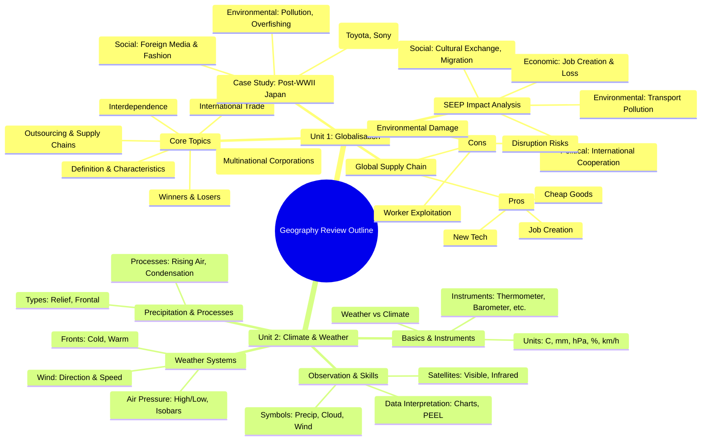

# Geography Review Outline

## Unit 1: Globalisation

### Core Topics
- **Definition & Characteristics**: Understanding what globalisation is and its key features.
- **Interdependence**: How countries rely on each other.
- **International Trade**: The exchange of goods and services across borders.
- **MNCs (Multinational Corporations)**: Companies operating in multiple countries.
- **Outsourcing & Global Supply Chains**: Moving production abroad and how goods are produced globally.
- **Winners & Losers**: Who benefits and who suffers from globalisation.

### SEEP Impact Analysis
- **Social**: Cultural exchange, Migration.
- **Economic**: Job creation vs. Job loss.
- **Environmental**: Pollution from long-distance transport.
- **Political**: Cooperation through international organizations.

### Global Supply Chain
- **Pros**:
    - Cheap goods.
    - New technology.
    - Job creation.
- **Cons**:
    - Worker exploitation.
    - Environmental damage.
    - Supply chain disruption risks.

### Case Study: Post-WWII Japan
- **Economic**: Famous brands (Toyota, Sony) going global.
- **Social**: Introduction of foreign movies, music, and fashion.
- **Environmental**: Pollution from fossil fuels, overfishing issues.

---

## Unit 2: Climate & Weather

### Basics & Instruments
- **Difference between Weather & Climate**: Short-term state vs. Long-term average.
- **Measuring Instruments**:
    - Thermometer (Temperature)
    - Barometer (Air Pressure)
    - Rain Gauge (Precipitation)
    - Anemometer (Wind Speed)
    - Hygrometer (Humidity)
- **Units**: °C, mm, hPa, %, km/h.

### Weather Systems
- **Air Pressure**:
    - High Pressure vs. Low Pressure (Cyclones).
    - Isobars (Lines of equal pressure).
- **Fronts**:
    - Cold Front.
    - Warm Front.
- **Wind**: Wind Direction & Wind Speed.

### Precipitation & Processes
- **Precipitation Types**:
    - Relief Rainfall (Orographic).
    - Frontal Rainfall (Cyclonic).
- **Physical Processes**:
    - Air rising and sinking.
    - Condensation.

### Observation & Skills
- **Weather Symbols**: Symbols for precipitation, cloud cover, and wind speed.
- **Weather Satellites**:
    - Visible Imagery (Cloud thickness).
    - Infrared Imagery (Temperature/Height).
- **Data Interpretation**:
    - Interpreting rainfall charts (hyetographs).
    - Writing PEEL paragraphs (Point, Evidence, Explanation, Link).

---

## Mind Map Structure

