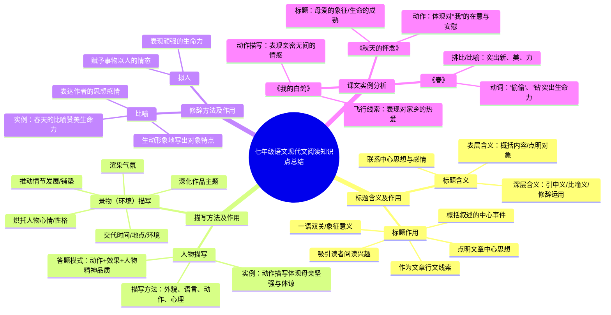

# 七年级语文现代文阅读知识点总结

## 标题含义及作用

### 标题含义
- **表层含义**：概括内容 / 点明对象
- **深层含义**：引申义 / 比喻义 / 修辞运用
- **联系中心思想与感情**

### 标题作用
- 概括叙述的中心事件
- 作为文章行文线索
- 点明文章中心思想
- 吸引读者阅读兴趣
- 一语双关 / 象征意义

## 描写方法及作用

### 人物描写
- **描写方法**：外貌、语言、动作、心理
- **答题模式**：动作 + 效果 + 人物精神品质
- **实例**：动作描写体现母亲坚强与体谅

### 景物（环境）描写
- 渲染气氛
- 烘托人物心情 / 性格
- 推动情节发展 / 铺垫
- 深化作品主题
- 交代时间 / 地点 / 环境

## 修辞方法及作用

### 比喻
- 生动形象地写出对象特点
- 表达作者的思想感情
- **实例**：春天的比喻赞美生命力

### 拟人
- 赋予事物以人的情态
- 表现顽强的生命力

## 课文实例分析

### 《秋天的怀念》
- **标题**：母爱的象征 / 生命的成熟
- **动作**：体现对“我”的在意与安慰

### 《我的白鸽》
- **动作描写**：表现亲密无间的情感
- **飞行线索**：表现对家乡的热爱

### 《春》
- **动词**：“偷偷”、“钻”突出生命力
- **排比/比喻**：突出新、美、力

---

## 思维导图 (Mermaid)

