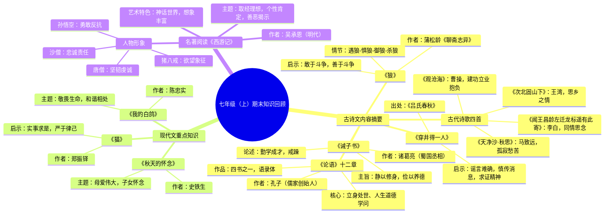

# 七年级（上）期末知识回顾

## 一、古诗文内容摘要

### 1. 古代诗歌四首
*   **《观沧海》**
    *   作者：曹操
    *   主旨：建功立业抱负
*   **《次北固山下》**
    *   作者：王湾
    *   主旨：思乡之情
*   **《闻王昌龄左迁龙标遥有此寄》**
    *   作者：李白
    *   主旨：同情思念
*   **《天净沙·秋思》**
    *   作者：马致远
    *   主旨：孤寂愁苦

### 2. 《论语》十二章
*   **作者**：孔子（儒家创始人）
*   **作品**：四书之一，语录体
*   **核心**：立身处世、人生道德学问

### 3. 《诫子书》
*   **作者**：诸葛亮（蜀国丞相）
*   **主旨**：静以修身，俭以养德
*   **论述**：勤学成才，戒躁

### 4. 《狼》
*   **作者**：蒲松龄《聊斋志异》
*   **情节**：遇狼 -> 惧狼 -> 御狼 -> 杀狼
*   **启示**：敢于斗争，善于斗争

### 5. 《穿井得一人》
*   **出处**：《吕氏春秋》
*   **启示**：谣言难确，慎传消息，求证精神

## 二、现代文重点知识

### 1. 《秋天的怀念》
*   **作者**：史铁生
*   **主题**：母爱伟大，子女怀念

### 2. 《猫》
*   **作者**：郑振铎
*   **启示**：实事求是，严于律己

### 3. 《我的白鸽》
*   **作者**：陈忠实
*   **主题**：敬畏生命，和谐相处

## 三、名著阅读《西游记》

*   **作者**：吴承恩（明代）
*   **主题**：取经理想，个性肯定，善恶揭示
*   **艺术特色**：神话世界，想象丰富
*   **人物形象**：
    *   **唐僧**：坚韧虔诚
    *   **孙悟空**：勇敢反抗
    *   **猪八戒**：欲望象征
    *   **沙僧**：忠诚责任

## 思维导图

