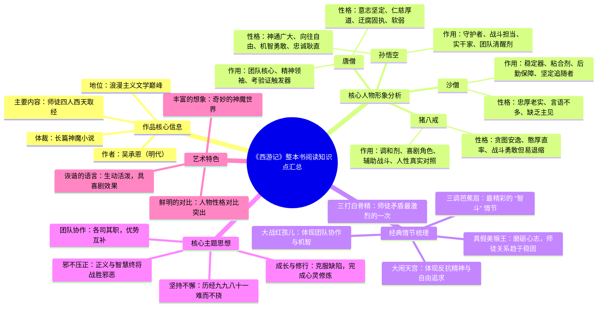

# 《西游记》整本书阅读知识点汇总

## 作品核心信息

- **作者**：吴承恩（明代）
- **体裁**：长篇神魔小说
- **地位**：浪漫主义文学巅峰
- **主要内容**：师徒四人西天取经

## 核心人物形象分析

### 唐僧
- **性格**：意志坚定、仁慈厚道、迂腐固执、软弱
- **作用**：团队核心、精神领袖、考验证触发器

### 孙悟空
- **性格**：神通广大、向往自由、机智勇敢、忠诚耿直
- **作用**：守护者、战斗担当、实干家、团队清醒剂

### 猪八戒
- **性格**：贪图安逸、憨厚直率、战斗勇敢但易退缩
- **作用**：调和剂、喜剧角色、辅助战斗、人性真实对照

### 沙僧
- **性格**：忠厚老实、言语不多、缺乏主见
- **作用**：稳定器、粘合剂、后勤保障、坚定追随者

## 经典情节梳理

- **大闹天宫**：体现反抗精神与自由追求
- **三打白骨精**：师徒矛盾最激烈的一次
- **大战红孩儿**：体现团队协作与机智
- **三调芭蕉扇**：最精彩的“智斗”情节
- **真假美猴王**：磨砺心志，师徒关系趋于稳固

## 核心主题思想

- **成长与修行**：克服缺陷，完成心灵修炼
- **团队协作**：各司其职，优势互补
- **坚持不懈**：历经九九八十一难而不挠
- **邪不压正**：正义与智慧终将战胜邪恶

## 艺术特色

- **丰富的想象**：奇妙的神魔世界
- **鲜明的对比**：人物性格对比突出
- **诙谐的语言**：生动活泼，具喜剧效果

---

## 思维导图 (Mermaid)

