# 培训强化三大板块与学分制带教计划

本文件记录了公司新员工培训流程（三大板块）及学分制带教计划的详细流程。

## 核心流程概览

流程主要分为两个部分：
1.  **培训强化三大板块**（左侧橙色背景）：涵盖入职初期的基础培训、针对主管级以上的小灶培训以及新员工训练营。
2.  **学分制带教计划**（右侧蓝色背景）：涵盖三个阶段的深入带教（通用技能、专业知识、岗位实操）。

## 流程详解

### 第一板块：入职培训三天
*   **新员工报到**
*   **HR**: 公司制度 / 合同 / 手册
*   **上司**: MBO / 责任田 / 经销商 / 框架 / 政策 / 产品 / 月会
*   **助理**: CRM / 报销 / 会议 / 战略报告
*   **参观 + HR 总监面谈**

### 判定节点
*   **身份是主管以上的一线员工？**
    *   **是** -> 进入 [第二步：小灶培训](#第二板块小灶培训)
    *   **否** -> 直接进入 [阶段 1：通用技能培训](#阶段-1通用技能培训)

### 第二板块：小灶培训 (仅限主管及以上)
*   渠道管理
*   市场政策
*   招标数字管理
*   客户管理
*   团队管理
*   逻辑与批判性思维
*   -> **进入通用技能培训**

### 第三板块：新员工训练营
*   扫盲考自学 + 考试通过
*   新人训练营课程 3 天集训
*   结业考试 + 反馈

---

### 学分制带教计划 (三个阶段)

#### 阶段 1: 通用技能培训
1.  上司 (生免) / 大客户带教
2.  学习企业文化
3.  通识扫盲考
4.  **考核**: ≥ 80分?
    *   **是** -> 进入 [阶段 2: 专业知识培训](#阶段-2专业知识培训)
    *   **否** -> 导师补强 -> 重考

#### 阶段 2: 专业知识培训
1.  上司 (生免) / 大客户带教
2.  产品 & 标准解读
3.  提交知识测试
4.  **考核**: ≥ 80分?
    *   **是** -> 通知阶段完成 -> 进入 [阶段 3: 岗位实操](#阶段-3岗位实操)
    *   **否** -> 额外辅导 -> 重考

#### 阶段 3: 岗位实操
1.  安排实操任务
2.  实践操作
3.  现场指导
4.  提交实训报告
5.  **考核通过?**
    *   **是** -> 正式录用
    *   **否** -> 终止

---

## Mermaid 流程图

```mermaid
graph TD
    %% 样式定义
    classDef orange fill:#fff5e6,stroke:#ffcc80,color:#333;
    classDef blue fill:#e6f2ff,stroke:#80b3ff,color:#333;
    classDef diamond fill:#fff,stroke:#333,color:#333;

    %% 培训强化三大板块
    subgraph Training_Blocks [培训强化三大板块]
        direction TB
        Step1_Start(新员工报到) --> Step1_HR(HR: 公司制度/合同/手册)
        Step1_HR --> Step1_Boss(上司: MBO/责任田/经销商/框架/政策/产品/月会)
        Step1_Boss --> Step1_Assist(助理: CRM/报销/会议/战略报告)
        Step1_Assist --> Step1_Tour(参观+HR总监面谈)
        
        Step1_Tour --> Decision_Role{身份是主管以上的一线员工?}
        
        %% 小灶培训
        Decision_Role -- 是 --> Step2_Start(渠道管理)
        Step2_Start --> Step2_Market(市场政策)
        Step2_Market --> Step2_Bid(招标数字管理)
        Step2_Bid --> Step2_Client(客户管理)
        Step2_Client --> Step2_Team(团队管理)
        Step2_Team --> Step2_Logic(逻辑与批判性思维)
        Step2_Logic --> Link_To_Phase1(进入通用技能培训)
        
        Decision_Role -- 否 --> Link_To_Phase1
        
        %% 新员工训练营 (独立板块)
        Step3_Start(扫盲考自学+考试通过) --> Step3_Camp(新人训练营课程3天集训)
        Step3_Camp --> Step3_End(结业考试+反馈)
    end

    %% 学分制带教计划
    subgraph Mentorship_Plan [学分制带教计划]
        direction TB
        
        %% 阶段1
        Link_To_Phase1 --> Phase1_Start(上司 生免 / 大客户带教)
        Phase1_Start --> Phase1_Culture(学习企业文化)
        Phase1_Culture --> Phase1_Exam(通识扫盲考)
        Phase1_Exam --> Phase1_Check{≥80分?}
        Phase1_Check -- 是 --> Phase1_Pass(进入专业知识培训)
        Phase1_Check -- 否 --> Phase1_Fail(导师补强)
        Phase1_Fail --> Phase1_Exam
        
        %% 阶段1 -> 阶段2 衔接
        Phase1_Pass --> Link_Phase1_End(第一段结束)
        Link_Phase1_End --> Link_Phase2_Start(衔接第一段结束)
        
        %% 阶段2
        Link_Phase2_Start --> Phase2_Start(上司 生免 / 大客户带教)
        Phase2_Start --> Phase2_Product(产品&标准解读)
        Phase2_Product --> Phase2_Test(提交知识测试)
        Phase2_Test --> Phase2_Check{≥80分?}
        Phase2_Check -- 是 --> Phase2_Pass(通知阶段完成)
        Phase2_Check -- 否 --> Phase2_Fail(额外辅导)
        Phase2_Fail --> Phase2_Test
        
        %% 阶段2 -> 阶段3 衔接
        Phase2_Pass --> Link_Phase2_End(衔接第二段结束)
        
        %% 阶段3
        Link_Phase2_End --> Phase3_Start(安排实操任务)
        Phase3_Start --> Phase3_Action(实践操作)
        Phase3_Action --> Phase3_Guide(现场指导)
        Phase3_Guide --> Phase3_Report(提交实训报告)
        Phase3_Report --> Phase3_Check{考核通过?}
        Phase3_Check -- 是 --> Phase3_Pass(正式录用)
        Phase3_Check -- 否 --> Phase3_Fail(终止)
        Phase3_Pass --> Phase3_End(第三段结束)
    end
    
    %% 应用样式
    class Step1_Start,Step1_HR,Step1_Boss,Step1_Assist,Step1_Tour,Step2_Start,Step2_Market,Step2_Bid,Step2_Client,Step2_Team,Step2_Logic,Step3_Start,Step3_Camp,Step3_End orange;
    class Phase1_Start,Phase1_Culture,Phase1_Exam,Phase1_Pass,Phase1_Fail,Phase2_Start,Phase2_Product,Phase2_Test,Phase2_Pass,Phase2_Fail,Phase3_Start,Phase3_Action,Phase3_Guide,Phase3_Report,Phase3_Pass,Phase3_Fail blue;
    class Decision_Role,Phase1_Check,Phase2_Check,Phase3_Check diamond;
```

