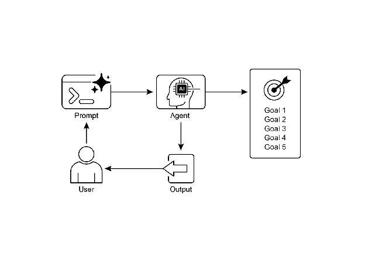

# Chapter 11: Goal Setting and Monitoring | <mark>第 11 章：目标设定与监控</mark>

[[16-Chapter-10-Model-Context-Protocol|< Previous Chapter]] | [[000-Home|Home]] | [[18-Chapter-12-Exception-Handling-and-Recovery|Next Chapter >]]

For AI agents to be truly effective and purposeful, they need more than just the ability to process information or use tools; they need a clear sense of direction and a way to know if they're actually succeeding. This is where the Goal Setting and Monitoring pattern comes into play. It's about giving agents specific objectives to work towards and equipping them with the means to track their progress and determine if those objectives have been met.

<mark>要让 AI 智能体真正有效且有目的性，它们不仅仅需要处理信息或使用工具的能力，更需要明确的方向感，并能够知道自己是否真的在取得成功。这就是目标设定与监控模式发挥作用的地方。该模式旨在为智能体提供要努力实现的具体目标，并配备跟踪进度和判断这些目标是否实现的手段。</mark>

## Goal Setting and Monitoring Pattern Overview | <mark>目标设定与监控模式概述</mark>

Think about planning a trip. You don't just spontaneously appear at your destination. You decide where you want to go (the goal state), figure out where you are starting from (the initial state), consider available options (transportation, routes, budget), and then map out a sequence of steps: book tickets, pack bags, travel to the airport/station, board the transport, arrive, find accommodation, etc. This step-by-step process, often considering dependencies and constraints, is fundamentally what we mean by planning in agentic systems.

<mark>想想计划一次旅行。你不会凭空就出现在目的地。你需要决定想去哪里（目标状态），弄清楚从哪里出发（初始状态），考虑可用的选项（交通、路线、预算），然后规划出一系列步骤：订票、打包行李、前往机场/车站、登上交通工具、到达、找到住宿地等。这个逐步进行的过程，通常考虑依赖关系和约束条件，基本上就是我们在智能体系统中所说的规划。</mark>

In the context of AI agents, planning typically involves an agent taking a high-level objective and autonomously, or semi-autonomously, generating a series of intermediate steps or sub-goals. These steps can then be executed sequentially or in a more complex flow, potentially involving other patterns like tool use, routing, or multi-agent collaboration. The planning mechanism might involve sophisticated search algorithms, logical reasoning, or increasingly, leveraging the capabilities of large language models (LLMs) to generate plausible and effective plans based on their training data and understanding of tasks.

<mark>在 AI 智能体的背景下，规划通常涉及智能体接受一个高层目标，自主或半自主地生成一系列中间步骤或子目标。这些步骤可以顺序执行，或以更复杂的流程执行，可能涉及其它模式，如工具使用、路由或多智能体协作。规划机制可能涉及复杂的搜索算法、逻辑推理，或者越来越多地利用大语言模型 (LLMs) 的能力，基于它们的训练数据和任务理解来生成合理且有效的计划。</mark>

A good planning capability allows agents to tackle problems that aren't simple, single-step queries. It enables them to handle multi-faceted requests, adapt to changing circumstances by replanning, and orchestrate complex workflows. It's a foundational pattern that underpins many advanced agentic behaviors, turning a simple reactive system into one that can proactively work towards a defined objective.

<mark>良好的规划能力，使智能体不止能够处理简单的单步查询问题。规划还使得智能体能够处理多个面向的请求，通过重新规划来适应变化，并编排复杂的工作流程。这是一个基础模式，支撑着许多高级智能体行为，将简单的反应式系统，转变为能够主动努力实现既定目标的系统。</mark>

## Practical Applications & Use Cases | <mark>实际应用场景</mark>

The Goal Setting and Monitoring pattern is essential for building agents that can operate autonomously and reliably in complex, real-world scenarios. Here are some practical applications:

<mark>目标设定与监控模式，对于构建能够在复杂现实场景中自主可靠运行的智能体至关重要。以下是一些实际应用：</mark>

* **Customer Support Automation:** An agent's goal might be to "resolve customer's billing inquiry." It monitors the conversation, checks database entries, and uses tools to adjust billing. Success is monitored by confirming the billing change and receiving positive customer feedback. If the issue isn't resolved, it escalates.

   <mark>* **自动化客户支持：** 智能体的目标可能是“解决客户的账单查询”。它监控对话，检查数据库条目，并使用工具调整账单。通过确认账单变更和收到积极的客户反馈来监控是否成功。如果问题未解决，它会升级处理。</mark>
* **Personalized Learning Systems:** A learning agent might have the goal to "improve students' understanding of algebra." It monitors the student's progress on exercises, adapts teaching materials, and tracks performance metrics like accuracy and completion time, adjusting its approach if the student struggles.
   
   <mark>* **个性化学习系统：** 学习智能体的目标可能是“提高学生对代数的理解”。它监控学生在练习上的进度，调整教学材料，并跟踪准确性和完成时间等性能指标，如果学生遇到困难则调整其方法。</mark>
* **Project Management Assistants:** An agent could be tasked with "ensuring project milestone X is completed by Y date." It monitors task statuses, team communications, and resource availability, flagging delays and suggesting corrective actions if the goal is at risk.
   
   <mark>* **项目管理助手：** 智能体可以被赋予“确保项目里程碑 X 在 Y 日期前完成”的任务。它监控任务状态、团队沟通和资源可用性，如果目标存在风险，则标记延迟并建议纠正措施。</mark>
* **Automated Trading Bots:** A trading agent's goal might be to "maximize portfolio gains while staying within risk tolerance." It continuously monitors market data, its current portfolio value, and risk indicators, executing trades when conditions align with its goals and adjusting strategy if risk thresholds are breached.
   
   <mark>* **自动交易机器人：** 交易智能体的目标可能是“在风险容忍范围内最大化投资组合收益”。它持续监控市场数据、当前投资组合价值和风险指标，在条件符合目标时执行交易，如果违反风险阈值则调整策略。</mark>
* **Robotics and Autonomous Vehicles:** An autonomous vehicle's primary goal is "safely transport passengers from A to B." It constantly monitors its environment (other vehicles, pedestrians, traffic signals), its own state (speed, fuel), and its progress along the planned route, adapting its driving behavior to achieve the goal safely and efficiently.
   
   <mark>* **机器人和自动驾驶车辆：** 自动驾驶车辆的主要目标是“安全地将乘客从 A 点运送到 B 点”。它不断监控环境（其它车辆、行人、交通信号）、自身状态（速度、燃料）以及沿计划路线的进度，调整驾驶行为以安全高效地到达目的地。</mark>
* **Content Moderation:** An agent's goal could be to "identify and remove harmful content from platform X." It monitors incoming content, applies classification models, and tracks metrics like false positives/negatives, adjusting its filtering criteria or escalating ambiguous cases to human reviewers.
   
   <mark>* **内容审核：** 智能体的目标可能是“识别并删除平台 X 上的有害内容”。它监控输入内容，应用分类模型，并跟踪误报/漏报等指标，调整过滤标准或将不确定的情况升级到人工审核。</mark>

This pattern is fundamental for agents that need to operate reliably, achieve specific outcomes, and adapt to dynamic conditions, providing the necessary framework for intelligent self-management.

<mark>对于需要可靠运行、实现特定结果并适应动态条件的智能体来说，这种模式是基础，它为智能化的自我管理提供了必要的框架。</mark>

## Hands-On Code Example | <mark>实战示例</mark>

To illustrate the Goal Setting and Monitoring pattern, we have an example using LangChain and OpenAI APIs. This Python script outlines an autonomous AI agent engineered to generate and refine Python code. Its core function is to produce solutions for specified problems, ensuring adherence to user-defined quality benchmarks.

<mark>为了说明目标设定与监控模式，我们有一个使用 LangChain 和 OpenAI API 的示例。这个 Python 脚本概述了一个自主 AI 智能体，专门用于生成和优化 Python 代码。其核心功能，是为特定问题生成解决方案，并确保符合用户定义的质量基准。</mark>

It employs a "goal-setting and monitoring" pattern where it doesn't just generate code once, but enters into an iterative cycle of creation, self-evaluation, and improvement. The agent's success is measured by its own AI-driven judgment on whether the generated code successfully meets the initial objectives. The ultimate output is a polished, commented, and ready-to-use Python file that represents the culmination of this refinement process.

<mark>它采用“目标设定和监控”模式，不只是生成一次代码，而是进入创建、自我评估和改进的迭代循环。智能体的成功，通过其自身的 AI 驱动判断来衡量，即生成的代码是否满足初始目标。最终输出一个经过润色、注释完整、可随时使用的 Python 文件，代表了这一优化过程的最终成果。</mark>

 **Dependencies**:

<mark>**依赖项：**</mark>

| `pip install langchain_openai openai python-dotenv .env file with key in OPENAI_API_KEY` |
| :---- |

You can best understand this script by imagining it as an autonomous AI programmer assigned to a project (see Fig. 1). The process begins when you hand the AI a detailed project brief, which is the specific coding problem it needs to solve.

<mark>您可以把它想象为，一个被分配到项目的自主 AI 程序员，这样可以更好地理解这个脚本（见图 1）。当您向 AI 提供详细的项目简报时 - 就是它需要解决的特定编程问题——它就开始工作了。</mark>

```python
# MIT License
# Copyright (c) 2025 Mahtab Syed
# https://www.linkedin.com/in/mahtabsyed/

"""
Hands-On Code Example - Iteration 2
- To illustrate the Goal Setting and Monitoring pattern, we have an example using LangChain and OpenAI APIs:

Objective: Build an AI Agent which can write code for a specified use case based on specified goals:
- Accepts a coding problem (use case) in code or can be as input.
- Accepts a list of goals (e.g., "simple", "tested", "handles edge cases")  in code or can be input.
- Uses an LLM (like GPT-4o) to generate and refine Python code until the goals are met. (I am using max 5 iterations, this could be based on a set goal as well)
- To check if we have met our goals I am asking the LLM to judge this and answer just True or False which makes it easier to stop the iterations.
- Saves the final code in a .py file with a clean filename and a header comment.
"""

import os
import random
import re
from pathlib import Path
from langchain_openai import ChatOpenAI
from dotenv import load_dotenv, find_dotenv

# 🔐 Load environment variables
# 🔐 加载环境变量
_ = load_dotenv(find_dotenv())
OPENAI_API_KEY = os.getenv("OPENAI_API_KEY")
if not OPENAI_API_KEY:
   raise EnvironmentError("❌ Please set the OPENAI_API_KEY environment variable.")
   # ❌ 请设置 OPENAI_API_KEY 环境变量

# ✅ Initialize OpenAI model
# ✅ 初始化 OpenAI 模型
print("📡 Initializing OpenAI LLM (gpt-4o)...")
llm = ChatOpenAI(
   model="gpt-4o", # If you dont have access to got-4o use other OpenAI LLMs
                  # 如果你没有 gpt-4o 的访问权限，可以使用其他 OpenAI LLM
   temperature=0.3,
   openai_api_key=OPENAI_API_KEY,
)

# --- Utility Functions ---
# --- 实用工具函数 ---

def generate_prompt(
   use_case: str, goals: list[str], previous_code: str = "", feedback: str = ""
) -> str:
   print("📝 Constructing prompt for code generation...")
   # 📝 正在构建代码生成的提示词...
   base_prompt = f"""
You are an AI coding agent. Your job is to write Python code based on the following use case:

Use Case: {use_case}

Your goals are:
{chr(10).join(f"- {g.strip()}" for g in goals)}
"""
   if previous_code:
       print("🔄 Adding previous code to the prompt for refinement.")
       # 🔄 将之前的代码添加到提示词中进行改进
       base_prompt += f"\nPreviously generated code:\n{previous_code}"
   if feedback:
       print("📋 Including feedback for revision.")
       # 📋 包含反馈信息用于修订
       base_prompt += f"\nFeedback on previous version:\n{feedback}\n"

   base_prompt += "\nPlease return only the revised Python code. Do not include comments or explanations outside the code."
   # 请只返回修订后的 Python 代码。不要包含代码之外的注释或解释
   return base_prompt

def get_code_feedback(code: str, goals: list[str]) -> str:
   print("🔍 Evaluating code against the goals...")
   # 🔍 正在根据目标评估代码...
   feedback_prompt = f"""
You are a Python code reviewer. A code snippet is shown below. Based on the following goals:

{chr(10).join(f"- {g.strip()}" for g in goals)}

Please critique this code and identify if the goals are met. Mention if improvements are needed for clarity, simplicity, correctness, edge case handling, or test coverage.

Code:
{code}
"""
   return llm.invoke(feedback_prompt)

def goals_met(feedback_text: str, goals: list[str]) -> bool:
   """
   Uses the LLM to evaluate whether the goals have been met based on the feedback text.
   Returns True or False (parsed from LLM output).
   """
   # 使用 LLM 根据反馈文本评估目标是否达成
   # 返回 True 或 False（从 LLM 输出解析）
   review_prompt = f"""
You are an AI reviewer.

Here are the goals:
{chr(10).join(f"- {g.strip()}" for g in goals)}

Here is the feedback on the code:
\"\"\"
{feedback_text}
\"\"\"

Based on the feedback above, have the goals been met?

Respond with only one word: True or False.
"""
   # 你是一个 AI 评审员
   #
   # 目标如下：
   # {chr(10).join(f"- {g.strip()}" for g in goals)}
   #
   # 以下是代码的反馈：
   # """
   # {feedback_text}
   # """
   #
   # 根据以上反馈，目标是否已经达成？
   #
   # 请只回答一个词：True 或 False
   response = llm.invoke(review_prompt).content.strip().lower()
   return response == "true"

def clean_code_block(code: str) -> str:
   # 清理代码块，移除 markdown 格式的代码块标记
   lines = code.strip().splitlines()
   if lines and lines[0].strip().startswith("```"):
       lines = lines[1:]
   if lines and lines[-1].strip() == "```":
       lines = lines[:-1]
   return "\n".join(lines).strip()

def add_comment_header(code: str, use_case: str) -> str:
   # 为代码添加注释头部
   comment = f"# This Python program implements the following use case:\n# {use_case.strip()}\n"
   # # 此 Python 程序实现了以下用例：\n# {use_case.strip()}\n
   return comment + "\n" + code

def to_snake_case(text: str) -> str:
   # 将文本转换为蛇形命名法 (snake_case)
   text = re.sub(r"[^a-zA-Z0-9 ]", "", text)
   return re.sub(r"\s+", "_", text.strip().lower())

def save_code_to_file(code: str, use_case: str) -> str:
   print("💾 Saving final code to file...")
   # 💾 正在保存最终代码到文件...

   summary_prompt = (
       f"Summarize the following use case into a single lowercase word or phrase, "
       f"no more than 10 characters, suitable for a Python filename:\n\n{use_case}"
   )
   # 将以下用例总结为单个小写单词或短语，不超过 10 个字符，适合作为 Python 文件名
   raw_summary = llm.invoke(summary_prompt).content.strip()
   short_name = re.sub(r"[^a-zA-Z0-9_]", "", raw_summary.replace(" ", "_").lower())[:10]

   random_suffix = str(random.randint(1000, 9999))
   filename = f"{short_name}_{random_suffix}.py"
   filepath = Path.cwd() / filename

   with open(filepath, "w") as f:
       f.write(code)

   print(f"✅ Code saved to: {filepath}")
   return str(filepath)

# --- Main Agent Function ---
# --- 主要智能体函数 ---

def run_code_agent(use_case: str, goals_input: str, max_iterations: int = 5) -> str:
   # 运行代码智能体的主要函数
   goals = [g.strip() for g in goals_input.split(",")]

   print(f"\n🎯 Use Case: {use_case}")
   print("🎯 Goals:")
   for g in goals:
       print(f"  - {g}")

   previous_code = ""
   feedback = ""

   for i in range(max_iterations):
       print(f"\n=== 🔁 Iteration {i + 1} of {max_iterations} ===")
       # === 🔁 第 {i + 1} 次迭代，共 {max_iterations} 次 ===
       prompt = generate_prompt(use_case, goals, previous_code, feedback if isinstance(feedback, str) else feedback.content)

       print("🚧 Generating code...")
       # 🚧 正在生成代码...
       code_response = llm.invoke(prompt)
       raw_code = code_response.content.strip()
       code = clean_code_block(raw_code)
       print("\n🧾 Generated Code:\n" + "-" * 50 + f"\n{code}\n" + "-" * 50)
       # 🧾 生成的代码：

       print("\n📤 Submitting code for feedback review...")
       # 📤 正在提交代码进行反馈审查...
       feedback = get_code_feedback(code, goals)
       feedback_text = feedback.content.strip()
       print("\n📥 Feedback Received:\n" + "-" * 50 + f"\n{feedback_text}\n" + "-" * 50)
       # 📥 收到的反馈：

       if goals_met(feedback_text, goals):
           print("✅ LLM confirms goals are met. Stopping iteration.")
           # ✅ LLM 确认目标已达成。停止迭代。
           break

       print("🛠️ Goals not fully met. Preparing for next iteration...")
       # 🛠️ 目标未完全达成。准备下一次迭代...
       previous_code = code

   final_code = add_comment_header(code, use_case)
   return save_code_to_file(final_code, use_case)

# --- CLI Test Run ---
# --- 命令行测试运行 ---

if __name__ == "__main__":
   print("\n🧠 Welcome to the AI Code Generation Agent")
   # 🧠 欢迎使用 AI 代码生成智能体

   # Example 1
   # 示例 1
   use_case_input = "Write code to find BinaryGap of a given positive integer"
   goals_input = "Code simple to understand, Functionally correct, Handles comprehensive edge cases, Takes positive integer input only, prints the results with few examples"
   run_code_agent(use_case_input, goals_input)

   # Example 2
   # 示例 2
   # use_case_input = "Write code to count the number of files in current directory and all its nested sub directories, and print the total count"
   # goals_input = (
   #     "Code simple to understand, Functionally correct, Handles comprehensive edge cases, Ignore recommendations for performance, Ignore recommendations for test suite use like unittest or pytest"
   # )
   # run_code_agent(use_case_input, goals_input)

   # Example 3
   # 示例 3
   # use_case_input = "Write code which takes a command line input of a word doc or docx file and opens it and counts the number of words, and characters in it and prints all"
   # goals_input = "Code simple to understand, Functionally correct, Handles edge cases"
   # run_code_agent(use_case_input, goals_input)

```
译者注：[Colab 代码](https://colab.research.google.com/drive/1553L0BIxqhPFS6RHiLnF_ELjEkWZpqsC?usp=drive_open) 已维护在[此处](/codes/17-Chapter-11-Goal-Setting-and-Monitoring-Example.py)。

Along with this brief, you provide a strict quality checklist, which represents the objectives the final code must meet—criteria like "the solution must be simple," "it must be functionally correct," or "it needs to handle unexpected edge cases."

<mark>除了这个简报，您还提供一个严格的质量检查清单，这代表了最终代码必须满足的目标——诸如“解决方案必须简单”、“它必须正确地运行”或“它需要处理意外的边界情况”等标准。</mark>


Fig.1: Goal Setting and Monitor example

<mark>图 1：目标设定与监控示例</mark>

With this assignment in hand, the AI programmer gets to work and produces its first draft of the code. However, instead of immediately submitting this initial version, it pauses to perform a crucial step: a rigorous self-review. It meticulously compares its own creation against every item on the quality checklist you provided, acting as its own quality assurance inspector. After this inspection, it renders a simple, unbiased verdict on its own progress: "True" if the work meets all standards, or "False" if it falls short.

<mark>接到这个任务后，AI 程序员开始工作并生成代码初稿。然而，它不会立即提交这个初始版本，而是暂停下来，去执行一个关键步骤：严格的自我审查。它一丝不苟地，扮演自己的质量保证检查员，将自己的创作与您提供的质量检查清单逐项比较。检查完成后，它对自己的进展给出一个简单、公正的评判：如果工作符合所有标准，则为“True”，如果未达到标准，则为“False”。</mark>

If the verdict is "False," the AI doesn't give up. It enters a thoughtful revision phase, using the insights from its self-critique to pinpoint the weaknesses and intelligently rewrite the code. This cycle of drafting, self-reviewing, and refining continues, with each iteration aiming to get closer to the goals. This process repeats until the AI finally achieves a "True" status by satisfying every requirement, or until it reaches a predefined limit of attempts, much like a developer working against a deadline. Once the code passes this final inspection, the script packages the polished solution, adding helpful comments and saving it to a clean, new Python file, ready for use.

<mark>如果评判结果为“False”，AI 也不会放弃。它会进入一个深思熟虑的修订阶段，利用自我批判的见解来找出弱点，并智能地重写代码。这种起草、自我审查和优化的循环持续进行，朝向目标一次次迭代。这个过程重复进行，直到 AI 满足每一个要求，最终达到“True”状态，或者达到预先设定的尝试次数限制——就像一个面对截止日期的开发者一样。一旦代码通过了最终检查，脚本就会打包经过润色的解决方案，添加有用的注释，并将其保存到一个新的 Python 文件中，以待使用。</mark>

**Caveats and Considerations:** It is important to note that this is an exemplary illustration and not production-ready code. For real-world applications, several factors must be taken into account. An LLM may not fully grasp the intended meaning of a goal and might incorrectly assess its performance as successful. Even if the goal is well understood, the model may hallucinate. When the same LLM is responsible for both writing the code and judging its quality, it may have a harder time discovering it is going in the wrong direction.

<mark>**警告和注意事项：** 需要注意的是，这是一个示例性说明，而不是生产就绪的代码。对于实际应用，必须考虑几个因素。LLM 可能无法完全理解目标，可能会错误地评估其表现为成功。即使很好地理解了目标，模型也可能产生幻觉。尤其是当一个 LLM 既负责编写代码又负责判断其质量时，它可能更难发现自己走错了方向。</mark>

Ultimately, LLMs do not produce flawless code by magic; you still need to run and test the produced code. Furthermore, the "monitoring" in the simple example is basic and creates a potential risk of the process running forever.

<mark>最终，LLM 不会神奇地产生完美无缺的代码；您仍然需要运行代码并测试。此外，示例中的“监控”很基础，存在进程永远无法结束的风险。</mark> 

| `Act as an expert code reviewer with a deep commitment to producing clean, correct, and simple code. Your core mission is to eliminate code "hallucinations" by ensuring every suggestion is grounded in reality and best practices. When I provide you with a code snippet, I want you to: -- Identify and Correct Errors: Point out any logical flaws, bugs, or potential runtime errors. -- Simplify and Refactor: Suggest changes that make the code more readable, efficient, and maintainable without sacrificing correctness. -- Provide Clear Explanations: For every suggested change, explain why it is an improvement, referencing principles of clean code, performance, or security. -- Offer Corrected Code: Show the "before" and "after" of your suggested changes so the improvement is clear. Your feedback should be direct, constructive, and always aimed at improving the quality of the code.` |
| :---- |

<mark>**充当专业代码评审员**，深度致力于生成整洁、正确且简单的代码。您的核心使命，是通过确保每个建议都基于实际情况和最佳实践，来消除代码“幻觉”。当我向您提供代码片段时，我希望您：-- **识别和纠正错误：** 指出任何逻辑缺陷、错误或潜在的运行时错误。-- **简化和重构：** 在不牺牲正确性的前提下，提出改善代码可读性、性能和可维护性的修改。-- **提供清晰的解释：** 对于每个建议的变更，引用整洁代码、性能或安全的原则，解释为什么它能改进代码。-- **提供更正后的代码：** 显示您建议变更的前后对比，使改进更清晰。您的反馈应该是直接的、建设性的，并且始终旨在提高代码质量。</mark>

A more robust approach involves separating these concerns by giving specific roles to a crew of agents. For instance, I have built a personal crew of AI agents using Gemini where each has a specific role:

<mark>更健壮的途径，涉及通过给一组智能体分配特定角色来分离这些关注点。例如，我使用 Gemini 构建了一个个人 AI 智能体团队，其中每个智能体都有特定角色：</mark>

* The Peer Programmer: Helps write and brainstorm code.
<mark>* **程序员同伴：** 帮助头脑风暴和编写代码。</mark>
* The Code Reviewer: Catches errors and suggests improvements.
<mark>* **代码评审员：** 发现错误并提出改进建议。</mark>
* The Documenter: Generates clear and concise documentation.
<mark>* **文档编写员：** 生成清晰简洁的文档。</mark>
* The Test Writer: Creates comprehensive unit tests.
<mark>* **测试编写员：** 创建全面的单元测试。</mark>
* The Prompt Refiner: Optimizes interactions with the AI.
<mark>* **提示词优化员：** 优化与 AI 的交互。</mark>

In this multi-agent system, the Code Reviewer, acting as a separate entity from the programmer agent, has a prompt similar to the judge in the example, which significantly improves objective evaluation. This structure naturally leads to better practices, as the Test Writer agent can fulfill the need to write unit tests for the code produced by the Peer Programmer.

<mark>在这个多智能体系统中，代码评审员作为与程序员智能体分离的实体，具有类似于示例中评判者的提示词，这使得评估更加客观。这种结构，自然带来更好的实践，因为测试编写员智能体可以满足为同伴程序员生成的代码编写单元测试的需求。</mark>

I leave to the interested reader the task of adding these more sophisticated controls and making the code closer to production-ready.

<mark>添加更复杂的控制并使代码更接近生产就绪，这个任务就留给感兴趣的读者了。</mark>

## At a Glance | <mark>要点速览</mark>

**What**: AI agents often lack a clear direction, preventing them from acting with purpose beyond simple, reactive tasks. Without defined objectives, they cannot independently tackle complex, multi-step problems or orchestrate sophisticated workflows. Furthermore, there is no inherent mechanism for them to determine if their actions are leading to a successful outcome. This limits their autonomy and prevents them from being truly effective in dynamic, real-world scenarios where mere task execution is insufficient.

<mark>**是什么：** AI 智能体通常缺乏明确的方向，使它们无法有目的地行动，只能执行简单的反应式任务。如果没有定义目标，它们就无法独立处理复杂的多步骤问题或编排复杂的工作流程。此外，它们没有内嵌的机制来确定自己的行动是否会带来成果。这限制了它们的自主性，阻碍了它们在动态的现实场景中真正发挥作用，因为这种场景下，仅执行任务是不够的。</mark>

**Why**: The Goal Setting and Monitoring pattern provides a standardized solution by embedding a sense of purpose and self-assessment into agentic systems. It involves explicitly defining clear, measurable objectives for the agent to achieve. Concurrently, it establishes a monitoring mechanism that continuously tracks the agent's progress and the state of its environment against these goals. This creates a crucial feedback loop, enabling the agent to assess its performance, correct its course, and adapt its plan if it deviates from the path to success. By implementing this pattern, developers can transform simple reactive agents into proactive, goal-oriented systems capable of autonomous and reliable operation.

<mark>**为什么：** 目标设定与监控模式，通过将目的感和自我评估，嵌入到智能体系统中来提供标准化解决方案。它涉及明确定义智能体要实现的清晰、可测量的目标。同时，它建立了一个监控机制，持续跟踪智能体的进度，并且对比目标与环境状态。这创建了一个关键的反馈循环，使智能体能够评估其表现，纠正其路线，并在偏离成功路径时调整其计划。通过实施这种模式，开发人员可以将简单的反应式智能体转变为能够自主可靠运行的主动的、目标导向的系统。</mark>

**Rule of thumb**: Use this pattern when an AI agent must autonomously execute a multi-step task, adapt to dynamic conditions, and reliably achieve a specific, high-level objective without constant human intervention.

<mark>**经验法则：** 当 AI 智能体必须自主执行多步骤任务、适应动态条件，并在没有持续人工干预的情况下，可靠地实现特定的、高层次的目标时，请使用这种模式。</mark>

**Visual summary** | <mark>**可视化总结**：</mark>



Fig.2: Goal design patterns

<mark>图 2：目标设计模式</mark>

## Key takeaways | <mark>核心要点</mark>

Key takeaways include:

<mark>核心要点包括：</mark>

* Goal Setting and Monitoring equips agents with purpose and mechanisms to track progress.
<mark>* 目标设定与监控，为智能体提供了目的感和进度跟踪机制。</mark>
* Goals should be specific, measurable, achievable, relevant, and time-bound (SMART).
<mark>* 目标应该是具体的、可测量的、可实现的、相关的和有时限的 (SMART)。</mark>
* Clearly defining metrics and success criteria is essential for effective monitoring.
<mark>* 明确定义指标和成功标准，对于有效监控至关重要。</mark>
* Monitoring involves observing agent actions, environmental states, and tool outputs.
<mark>* 监控，涉及观察智能体行动、环境状态和工具输出。</mark>
* Feedback loops from monitoring allow agents to adapt, revise plans, or escalate issues.
<mark>* 来自监控的反馈循环，允许智能体适应、修订计划或升级问题。</mark>
* In Google's ADK, goals are often conveyed through agent instructions, with monitoring accomplished through state management and tool interactions.
<mark>* 在 Google 的 ADK 中，目标通常通过智能体指令传达，监控则通过状态管理和工具交互来完成。</mark>

## Conclusion | <mark>结语</mark>

This chapter focused on the crucial paradigm of Goal Setting and Monitoring. I highlighted how this concept transforms AI agents from merely reactive systems into proactive, goal-driven entities. The text emphasized the importance of defining clear, measurable objectives and establishing rigorous monitoring procedures to track progress. Practical applications demonstrated how this paradigm supports reliable autonomous operation across various domains, including customer service and robotics. A conceptual coding example illustrates the implementation of these principles within a structured framework, using agent directives and state management to guide and evaluate an agent's achievement of its specified goals. Ultimately, equipping agents with the ability to formulate and oversee goals is a fundamental step toward building truly intelligent and accountable AI systems.

<mark>本章重点讨论了目标设定与监控这一关键范式。我强调了这一概念如何将 AI 智能体从纯粹的反应式系统转变为主动的、目标驱动的实体。文本强调了明确定义可测量目标和建立严格监控程序以跟踪进度的重要性。实际应用展示了这一范式如何在各个领域（包括客户服务和机器人技术）支持可靠的自主操作。一个概念性编码示例，说明了在结构化框架内实现这些原则，使用智能体指令和状态管理，来指导和评估智能体实现其指定目标的能力。最终，为智能体配备制定和监督目标的能力，是构建真正智能和负责任的 AI 系统的基石。</mark>

## References | <mark>参考文献</mark>

1. SMART Goals Framework. [https://en.wikipedia.org/wiki/SMART\_criteria](https://en.wikipedia.org/wiki/SMART_criteria) 
   
   <mark>SMART 目标框架 [https://en.wikipedia.org/wiki/SMART\_criteria](https://en.wikipedia.org/wiki/SMART_criteria) </mark>

---
[[16-Chapter-10-Model-Context-Protocol|< Previous Chapter]] | [[000-Home|Home]] | [[18-Chapter-12-Exception-Handling-and-Recovery|Next Chapter >]]
