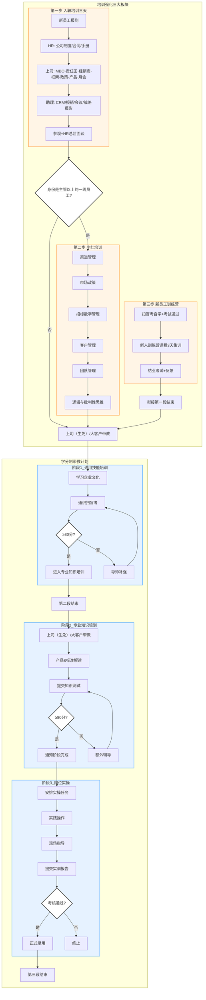

```mermaid
graph TD
    %% Define styles
    classDef orange fill:#fff5e6,stroke:#ffb366,stroke-width:2px;
    classDef blue fill:#e6f2ff,stroke:#66b3ff,stroke-width:2px;
    classDef diamond fill:#ffffff,stroke:#333,stroke-width:2px;

    subgraph "培训强化三大板块"
        direction TB

        %% Step 1
        subgraph Step1["第一步 入职培训三天"]
            S1_1["新员工报到"]
            S1_2["HR: 公司制度/合同/手册"]
            S1_3["上司: MBO·责任田·经销商·框架·政策·产品·月会"]
            S1_4["助理: CRM/报销/会议/战略报告"]
            S1_5["参观+HR总监面谈"]

            S1_1 --> S1_2
            S1_2 --> S1_3
            S1_3 --> S1_4
            S1_4 --> S1_5
        end

        %% Decision
        Decision1{"身份是主管以上的一线员工?"}
        S1_5 --> Decision1

        %% Step 2 (Small Stove)
        subgraph Step2["第二步 小灶培训"]
            S2_1["渠道管理"]
            S2_2["市场政策"]
            S2_3["招标数字管理"]
            S2_4["客户管理"]
            S2_5["团队管理"]
            S2_6["逻辑与批判性思维"]

            S2_1 --> S2_2
            S2_2 --> S2_3
            S2_3 --> S2_4
            S2_4 --> S2_5
            S2_5 --> S2_6
        end

        %% Step 3 (Training Camp)
        subgraph Step3["第三步 新员工训练营"]
            S3_1["扫盲考自学+考试通过"]
            S3_2["新人训练营课程3天集训"]
            S3_3["结业考试+反馈"]

            S3_1 --> S3_2
            S3_2 --> S3_3
        end

        %% Connections for Left Side
        Decision1 -- 是 --> S2_1
        Decision1 -- 否 --> Phase1_Start
        S2_6 --> Phase1_Start
        S3_3 --> Connection1[衔接第一段结束]
        Connection1 --> Phase1_Start
    end

    subgraph "学分制带教计划"
        direction TB

        %% Phase 1
        subgraph Phase1["阶段1_通用技能培训"]
            Phase1_Start["上司（生免）/大客户带教"]
            P1_2["学习企业文化"]
            P1_3["通识扫盲考"]
            P1_Decision{"≥80分?"}

            Phase1_Start --> P1_2
            P1_2 --> P1_3
            P1_3 --> P1_Decision

            P1_Decision -- 是 --> P1_Yes["进入专业知识培训"]
            P1_Decision -- 否 --> P1_No["导师补强"]
            P1_No --> P1_3
        end

        P1_Yes --> Phase2_End[第二段结束]
        Phase2_End --> Phase2_Start

        %% Phase 2
        subgraph Phase2["阶段2_专业知识培训"]
            Phase2_Start["上司（生免）/大客户带教"]
            P2_2["产品&标准解读"]
            P2_3["提交知识测试"]
            P2_Decision{"≥80分?"}

            Phase2_Start --> P2_2
            P2_2 --> P2_3
            P2_3 --> P2_Decision

            P2_Decision -- 是 --> P2_Yes["通知阶段完成"]
            P2_Decision -- 否 --> P2_No["额外辅导"]
            P2_No --> P2_3
        end

        P2_Yes --> Phase3_Start

        %% Phase 3
        subgraph Phase3["阶段3_岗位实操"]
            Phase3_Start["安排实操任务"]
            P3_2["实践操作"]
            P3_3["现场指导"]
            P3_4["提交实训报告"]
            P3_Decision{"考核通过?"}

            Phase3_Start --> P3_2
            P3_2 --> P3_3
            P3_3 --> P3_4
            P3_4 --> P3_Decision

            P3_Decision -- 是 --> P3_Yes["正式录用"]
            P3_Decision -- 否 --> P3_No["终止"]
        end

        P3_Yes --> Phase3_End[第三段结束]
    end

    %% Apply Styles
    class Step1,Step2,Step3 orange;
    class Phase1,Phase2,Phase3 blue;
    class Decision1,P1_Decision,P2_Decision,P3_Decision diamond;
```
