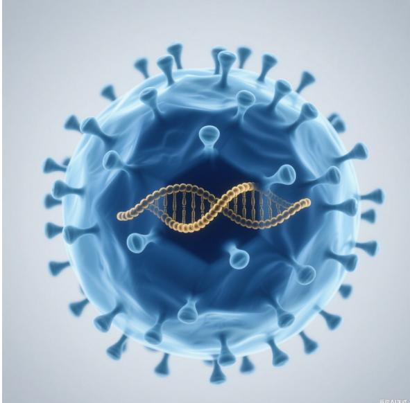
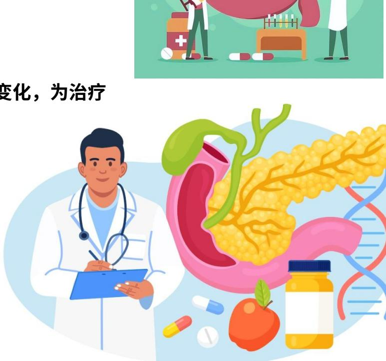
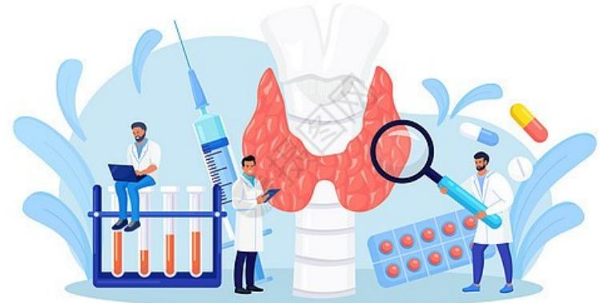
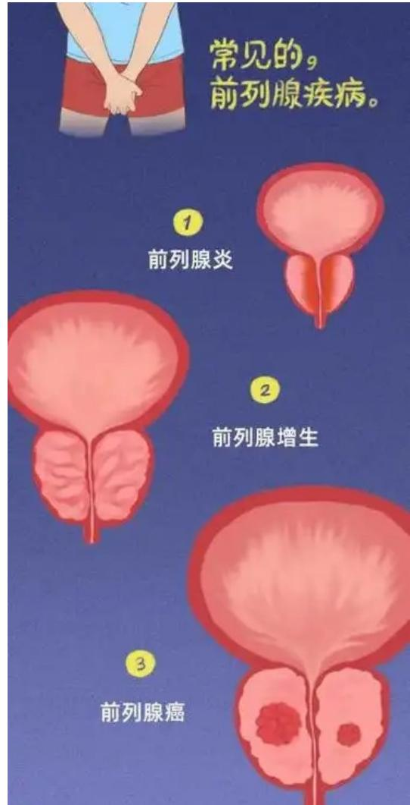
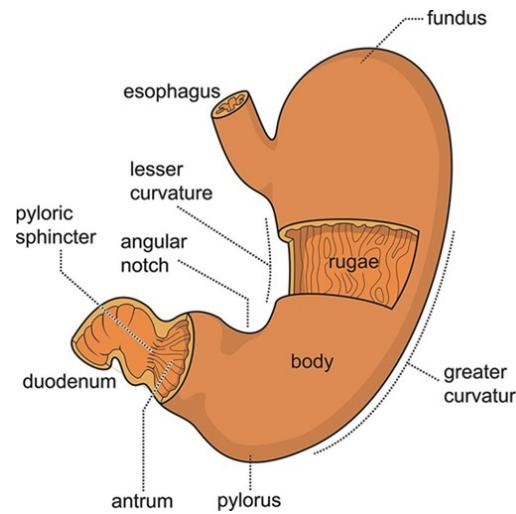
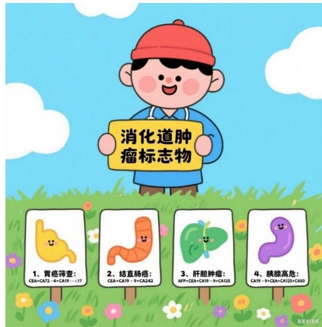
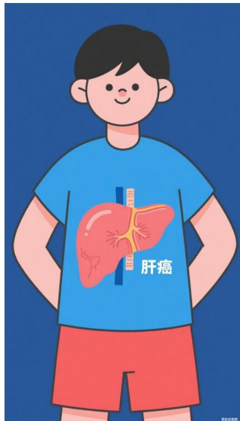
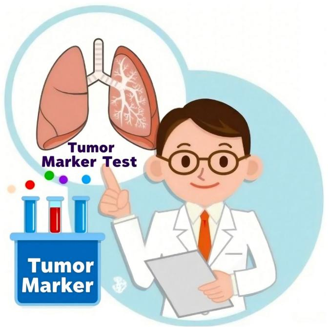
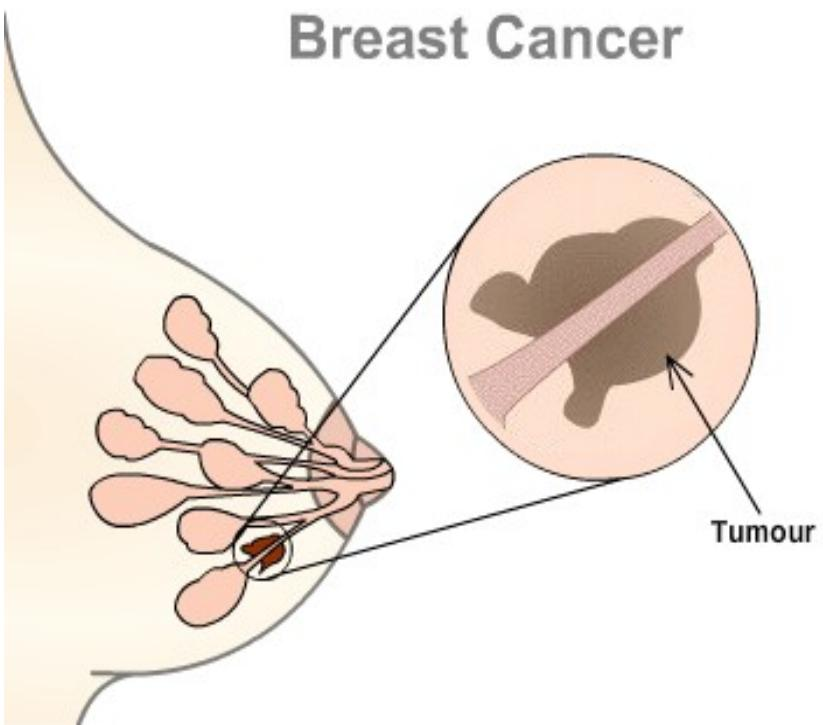
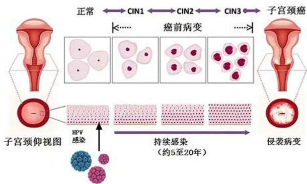

# 

希森美康医用电子（上海）有限公司学术应用部

# 目录

背景

HISCL® 项目检测菜单

乙肝标志物开单建议

胰岛素C肽开单建议

甲状腺功能开单建议

肿瘤标志物开单建议

# 目录

# 背景

HISCL® 项目检测菜单

乙肝标志物开单建议

胰岛素C肽开单建议

甲状腺功能开单建议

肿瘤标志物开单建议

# 集采背景

  
首页>医保新闻>医保动态

# 国家医保局等八部门印发《关于开展国家组织高值医用耗材集中带量采购和使用的指导意见》

经国务院同意，国家医保局联合国家发展改革委、工业和信息化部、财政部、国家卫生健康委、市场监管总局、国家药监局、中央军委后勤保障部印发《关于开展国家组织高值医用耗材集中带量采购和使用的指导意见》（以下称《意见》），为开展国家组织高值医用耗材集中带量采购提供总体规范和要求。

《意见》强调，以习近平新时代中国特色社会主义思想为指导，全面贯彻党的十九大和十九届二中、三中、四中、五中全会精神，坚持以人民为中心，按照国家组织、联盟采购、平台操作的总体思路，探索完善集采政策，逐步扩大覆盖范围，促进高值医用耗材价格回归合理水平，减轻患者负担，降低企业交易成本，净化流通环境，引导医疗机构规范使用，更好保障人民群众病有所医。

一是明确覆盖范围。重点将部分临床用量较大、采购金额较高、临床使用较成熟、市场竞争较充分、同质化水平较高的高值医用耗材纳入采购范围。所有公立医疗机构均应参与集中采购。在质量标准、生产能力、供应稳定性、企业信用等方面达到集中带量采购要求的企业均可参与集采。

2021年该文件强调通过集中带量采购，实现高值医用耗材价格回归合理水平，虽未直接针对医学检验项目进行详细阐述，但作为高值医用耗材集采的纲领性文件，为医学检验项目集采奠定了政策基调。

<table><tr><td>名称：</td><td colspan="3">国家医疗保障局办公室关于加强区域协同做好2024年医药集中采购提质扩面的通知</td></tr><tr><td>索引号：</td><td>2024-02-00010</td><td>发文字号：</td><td>医保办发〔2024〕8号</td></tr><tr><td>发布日期：</td><td>2024-05-20</td><td>发布机构：</td><td></td></tr></table>

<table><tr><td>日期：2024-05-20</td><td>访问次数：110216</td><td>字号：[大中小]</td></tr></table>

医保办发〔2024〕8号

# （二）深入推进高值医用耗材集中采购。

关节全国统一接续采购。国家医保局重点指导如下全国联采工作：江西牵头开展生化类体外诊断试剂联盟采购；安徽牵头开展肿瘤标志物等体外诊断试剂联盟采购；广东牵头开展超声刀头联盟采购；浙江牵头开展乳房旋切针联盟采购；福建牵头开展血管组织闭合用结扎夹联盟采购；河南牵头开展冠脉切割球囊等联盟采购；河北牵头开展血管介入等耗材联盟采购。各省份要抓紧“补缺”，对止血材料、补片、体外诊断试剂等已有多个省份开展的品种，通过带量价格联动等方式纳入集采范围。到2024年底，各省份至少完成1批医用耗材集采。

2024年该文件对医学检验项目集采做出了更为具体的部署。在采购行动安排上，按照“一品一策”原则，明确指定了多个省份牵头开展不同类别医学检验项目的联盟采购。

# 检验项目套餐解绑背景

# 国家卫生健康委员会办公厅国家中医药管理局综合司国家疾病预防控制局综合司

国卫办医政函[2025]169号

# 关于进一步规范医疗机构临床检查检验工作的通知

各省、自治区、直辖市卫生健康委、中医药局、疾控局，新疆生产建设兵团卫生健康委、疾控局：

# 2025年国家卫健委要求：

依据：临床诊疗指南、技术操作规范、临床路径等，结合临床诊疗工作进行项目、组套开展梳理

原则：最少够用

重点关注：血、尿、便、生化、凝血、免疫、肿瘤标志物、基因检测

# 一、严格临床检查检验项目管理

各二级以上医疗机构（其他医疗机构参照执行，下同）要严格落实主体责任，建立健全内部管理机制，由院领导牵头负责、统筹协调本机构相关管理部门和临床、医技科室，依据临床诊疗指南、技术操作规范、临床路径等，结合临床诊疗工作实际，对本机构目前正在开展的检查检验项目和项目组套（检查检验包）进行全面梳理论证。严禁将临床意义不足、缺少循证支持的项目用于临床诊疗。要加强对各临床科室的指导，在满足诊疗需求的前提下，按照“最少够用”的原则科学设计本科室检查检验项目组套，不断优化组合方式。重点关注血尿便三大常规，血液生化、凝血、免疫、肿瘤标志物、人体基因检测等检验项目组套中是否存在必要性不强或重复的项目，以及X线、CT、核磁共振、核医学等检查项目中是否存在必要性不强或大部位套小部位等重复检查问题并及时予以纠正。

<table><tr><td>国家卫生健康委办公厅</td><td>2025年4月29日印发</td></tr></table>

# 集采、套餐解绑带来的问题

在集采政策深化及《关于进一步规范医疗机构临床检查检验工作的通知》推动行业变革的背景下，集采、解绑、降价虽在控费、规范市场等方面发挥积极作用，但医学检验企业与检验科面临的针对性问题仍突出：

# 检验科：运营、效率与管理多重挑战

① 成本价格倒挂，运营承压：集采后检验项目收费大幅下调，但科室运营成本（设备折旧、人员薪酬、耗材损耗等）呈刚性增长，出现“收费降、成本升”的价格倒挂现象，日常运营压力显著加大。

② 工作效率下降，适配节奏滞后：“检验套餐解绑”后，检验科需从“按套餐批量检测”转向“按单项逐一核对检测”，需匹配医嘱与检测项目，原有高效检测流程被打破，工作效率明显下降。

③ 绩效体系失配，管理陷入困境：传统绩效体系多与“套餐检测数量、收费金额”挂钩，解绑后绩效核算基数大幅减少，检验人员工作积极性受挫，科室管理陷入被动。

# 企业：盈利、创新与质量三重压力

① 盈利空间骤缩，成本管控难：集采导致价格大幅下调，企业成本管控难度陡增，部分企业陷入“中选即亏损”的困境。

② 创新动力不足，市场格局失衡：为缓解短期盈利压力，企业不得不缩减研发投入，导致常规检验技术迭代放缓、新型检测项目研发周期延长；同时，大型企业凭借规模与供应链优势占据主导，中小企业因产能有限、议价能力弱，生存空间被严重挤压，行业竞争格局失衡。

③ 质量风险上升，监管衔接不足：部分企业为控制成本降低原材料标准（如降低抗体浓度），而质量监管未能同步跟进，产品质量风险显著增加，可能影响临床检测准确性。

# 目录

背景

HISCL® 项目检测菜单

乙肝标志物开单建议

胰岛素C肽开单建议

甲状腺功能开单建议

肿瘤标志物开单建议

HISCL 项目检测菜单  

<table><tr><td colspan="4">肿瘤标志物(21)</td><td colspan="2">传染病(8)</td><td colspan="2">心肌标志物(4)</td></tr><tr><td>甲胎蛋白</td><td>AFP</td><td>人附睾蛋白4</td><td>HE4</td><td>乙型肝炎病毒表面抗原</td><td>HBsAg</td><td>氨基末端脑利钠肽前体</td><td>NT-proBNP</td></tr><tr><td>癌胚抗原</td><td>CEA</td><td>异常凝血酶原</td><td>PIVKA II</td><td>乙型肝炎病毒表面抗体</td><td>HBsAb</td><td>高敏肌钙蛋白T</td><td>hsTNT</td></tr><tr><td>总前列腺特异抗原</td><td>t-PSA</td><td>胃泌素17</td><td>G-17</td><td>乙型肝炎病毒e抗原</td><td>HBeAg</td><td>肌红蛋白</td><td>MYO</td></tr><tr><td>游离前列腺特异抗原</td><td>f-PSA</td><td>组织多特异性抗原</td><td>TPS</td><td>乙型肝炎病毒e抗体</td><td>HBeAb</td><td>肌酸激酶同工酶</td><td>CK-MB</td></tr><tr><td>糖类抗原125</td><td>CA125</td><td colspan="2">激素(12)</td><td>乙型肝炎病毒核心抗体</td><td>HBcAb</td><td colspan="2">血栓四项(4)</td></tr><tr><td>糖类抗原15-3</td><td>CA15-3</td><td>人绒毛膜促性腺激素</td><td>T-hCGβ</td><td>丙型肝炎病毒抗体</td><td>HCVAb</td><td>凝血酶-抗凝血酶Ⅲ复合物</td><td>TAT</td></tr><tr><td>糖类抗原19-9</td><td>CA19-9</td><td>游离人绒毛膜促性腺激素β亚单位</td><td>F-hCGβ</td><td>梅毒螺旋体抗体</td><td>TPAb</td><td>纤溶酶-c2纤溶酶抑制物复合物</td><td>PIC</td></tr><tr><td>糖类抗原72-4</td><td>CA72-4</td><td>睾酮</td><td>T</td><td>人类免疫缺陷病毒抗原抗体</td><td>HIV Ag+Ab</td><td>血栓调节蛋白</td><td>TM</td></tr><tr><td>糖类抗原50</td><td>CA50</td><td>促黄体生成素</td><td>LH</td><td colspan="2">甲状腺功能(8)</td><td>组织纤溶酶原激活物/纤溶酶原激活物抑制剂-1复合物</td><td>tPAI.c</td></tr><tr><td>糖类抗原242</td><td>CA242</td><td>促卵泡生成素</td><td>FSH</td><td>总三碘甲状腺原氨酸</td><td>TT3</td><td colspan="2">糖 尿 病(2)</td></tr><tr><td>铁蛋白</td><td>FER</td><td>雌二醇</td><td>E2</td><td>游离三碘甲状腺原氨酸</td><td>FT3</td><td>胰岛素</td><td>Insulin</td></tr><tr><td>胃蛋白酶原I</td><td>PGI 1</td><td>泌乳素</td><td>PRL</td><td>总甲状腺素</td><td>TT4</td><td>C肽</td><td>C-P</td></tr><tr><td>胃蛋白酶原II</td><td>PGII</td><td>孕酮</td><td>P</td><td>游离甲状腺素</td><td>FT4</td><td colspan="2">感 染(2)</td></tr><tr><td>神经元特异性烯醇化酶</td><td>NSE</td><td>性激素结合球蛋白</td><td>SHBG</td><td>促甲状腺激素</td><td>TSH</td><td>降钙素原</td><td>PCT</td></tr><tr><td>胃泌素释放肽前体</td><td>ProGRP</td><td>生长激素</td><td>hGH</td><td>抗甲状腺球蛋白抗体</td><td>TGAb</td><td>白介素6</td><td>IL-6</td></tr><tr><td>鳞状上皮细胞癌抗原</td><td>SCC</td><td>硫酸脱氢表雄酮**</td><td>DHEA-S</td><td>抗甲状腺过氧化物酶抗体</td><td>TPOAb</td><td colspan="2">间质性肺炎(1)</td></tr><tr><td>细胞角蛋白19片段</td><td>CYFRA211</td><td>抗缪勒管激素</td><td>AMH</td><td>促甲状腺激素受体抗体</td><td>TRAb</td><td>涎液化物链抗原</td><td>KL-6</td></tr></table>

# 目录

背景

HISCL® 项目检测菜单

乙肝标志物开单建议

胰岛素 C 肽开单建议

甲状腺功能开单建议

肿瘤标志物开单建议

# 乙肝标志物检测开单建议

# 1、乙肝表面抗原单项检测应用场景：

主诉乙肝表面抗原阴性的住院患者筛查  内科需要手术的患者

2、乙肝表面抗原  $^+$  表面抗体  $^+$  核心抗体检测应用场景：

重点高危人群（育龄期妇女、糖尿病患者、HBV感染者家人、侵入性诊疗的患者、HIV感染者、HCV感染者、静脉吸毒者、同性或多个性伴者，以及性传播疾病患者）

3、乙肝五项联合检测应用场景：

慢性HBV感染疾病评估  乙肝抗病毒治疗中的监测  乙肝疫苗接种后监测抗体产生情况  抗病毒治疗预防HBV母婴传播的指标

# 4、适用科室：

内分泌科、皮肤性病科、妇产科、外科、预防保健科、肝病科

# 5、收费：

参考各省当地的收费目录

# 目录

背景

HISCL® 项目检测菜单

乙肝标志物开单建议

胰岛素C肽开单建议

甲状腺功能开单建议

肿瘤标志物开单建议

# 胰岛素、C肽开单建议

# 1、胰岛素、C肽检测应用场景：

C肽（C- P）胰岛素（InsuLin）

1型糖尿病诊断中2型糖尿病治疗和评估中胰岛素瘤辅助诊断

# 2、为什么胰岛素、C肽检测要联合检测？

胰岛素和C肽分泌极低或检测不到，低C肽水平是1型糖尿病重要诊断依据胰岛β细胞功能评估，C肽水平随之下降，通过检测C肽，可动态监测患者β细胞功能变化，为治疗方案调整提供依据排除外源性胰岛素干扰，准确反映患者自身剩余的胰岛素分泌功能胰岛素和C肽水平异常升高，辅助诊断胰岛素瘤

# 3、适用科室：

内分泌科、消化科、肿瘤科

4、HIS/LIS胰岛素、C肽开单推荐：糖尿病辅助诊断：胰岛素、C肽糖尿病评估：胰岛素、C肽释放试验

# 5、收费：

参考各省当地的收费目录

# 目录

背景

HISCL® 项目检测菜单

乙肝标志物开单建议

胰岛素 C 肽开单建议

甲状腺功能开单建议

肿瘤标志物开单建议

# 甲功腺功能开单建议

# 1、甲功项目检测应用场景：

有甲亢临床症状：怕热、多汗、易饥、食欲亢进，但体重明显下降、情绪易激动、烦躁、焦虑，甚至出现失眠、注意力不集中

有甲减临床症状：怕冷、体重变增加、乏力、疲劳、嗜睡、注意力不集中、记忆力减退、食欲减退

已明确甲状腺疾病患者治疗监测时、桥本氏亚甲炎辅助诊断和治疗、Graves病辅助诊断和治疗

备孕时和怀孕期间甲状腺功能监测

新生儿甲亢辅助诊断和治疗时

桥本氏亚甲炎辅助诊断和治疗时

# 2、为什么甲功项目要联合检测？

TT3、TT4检测可用于甲亢、原发性和继发性甲减的诊断和疗效监测TT3、TT4是先天性甲状腺功能减退症的诊断TPO- Ab、TG- Ab在桥本氏亚甲炎可预防有轻度甲亢症状，阻止发展成甲减并逐渐加重TR- Ab用于Graves病诊断以及治疗方案的确定

3、适用科室：内分泌科、新生儿科、妇产科、神经内科、心身科

# 4、HIS/LIS甲功项目开单推荐：

新生儿甲亢辅助诊断：TSH、FT3、FT4、TT3、TT4备孕和怀孕：TSH、FT3、FT4、TT3、TT4桥本氏亚甲炎：TSH、FT3、FT4、TT3、TT4、TPO- Ab、TG- AbGraves病：TSH、FT3、FT4、TT3、TT4、TPO- Ab、TG- Ab、TR- Ab

总三碘甲状腺原氨酸(TT3)游离三碘甲状腺原氨酸(FT3)总甲状腺素(TT4)游离甲状腺素(FT4)促甲状腺激素(TSH)

抗甲状腺球蛋白抗体(TGAb) 抗甲状腺过氧化物酶抗体 (TPOAb) 促甲状腺激素受体抗体(TRAb)

# 目录

背景HISCL® 项目检测菜单- 乙肝标志物开单建议- 胰岛素 C 肽开单建议- 甲状腺功能开单建议- 肿瘤标志物开单建议

# 前列腺癌肿瘤标志物开单建议

# 1、前列腺肿瘤标志物检测应用场景：

首次筛查：一般男性（≥50岁）、或有家族史人群（≥45岁）前列腺癌的辅助诊断前列腺癌的临床分期疗效后随访：定期检测TPSA，监测复发和疗效

# 2、为什么要同时检测TPSA和FPSA？

血清TPSA浓度在  $4.0\mu \mathrm{g} / \mathrm{L}\sim 10.0\mu \mathrm{g} / \mathrm{L}$  的灰区，若DRE阳性，则应进一步做前列腺穿刺活组织检查，以明确诊断若DRE阴性，宜做游离PSA百分比(%fPSA)检测。若%fPSA<10%，则应考虑做前列腺穿刺活组织检查，以明确诊断经科学分析、严格筛选的前提下，推荐肿瘤标志物联合检测

# 3、适用科室：

泌尿科、肿瘤科、体检科

# 4、HIS/LIS前列腺肿瘤标志物开单推荐：

前列腺癌：TPSA、FPSA、FPSA/TPSA

# 5、收费：

参考各省当地的收费目录

# 胃癌肿瘤标志物开单建议

# 1、胃癌肿瘤标志物检测应用场景：

胃癌高危人群：年龄40岁以上，男女不限；幽门螺旋杆菌感染者；存在胃癌其他高危因素（高盐、腌制饮食、吸烟、重度饮酒等）  胃癌疗效评价和及预后预测

2、胃癌肿瘤标志物相较于胃镜对高危人群筛查有哪些优势？

内镜活检是胃癌筛查的金标准，但用于胃癌普查需要消耗大量的人力、物力资源，且患者接受度低  肿瘤标志物广泛应用于临床诊断，而且肿瘤标志物的联合检测为我们提供了动态观察肿瘤发生发展及临床疗效评价和患者的预后，从而提高了检出率和鉴别诊断准确度  可根据血清PGI、PGII的检测和幽门螺杆菌抗体检测结果对胃癌患病风险进行分层，下一步策略  胃泌素17（G- 17）：血清G- 17浓度检测可以诊断胃窦（G- 17水平降低）或仅局限于胃体（G- 17水平升高）的萎缩性胃炎

# 3、适用科室：

消化科、肿瘤科、体检科

4、HIS/LIS胃癌肿瘤标志物开单推荐：

胃癌：CEA、CA72- 4、CA19- 9、PGI、PGII、G- 17

胃蛋白酶原I(PGI) 癌胚抗原（CEA）  胃蛋白酶原 糖类抗原72-  ⅢI(PGII) 4(CA724)  胃泌素17(G- 17) 糖类抗原19- 9(CA199)

# 5、收费：

# 消化道肿瘤标志物开单建议

# 1、消化道肿瘤标志物应用场景：

# 场景一、肿瘤筛查

高危监测：有肿瘤家族史、慢性消化道疾病史、长期不良生活习惯者

# 场景二、辅助与鉴别诊断

辅助诊断：肿瘤标志物升高可为临床诊断提供线索。例如，AFP显著升高  $(\geq 400\mathsf{ng} / \mathsf{ml})$  结合超声发现肝脏占位，可高度提示原发性肝癌鉴别诊断：鉴别恶性疾病。胰腺炎患者CA19- 9可短暂升高，但若持续升高需警惕胰腺癌

# 场景三、疗效与评估监测

疗效判断：例如，结直肠癌患者化疗后，CEA水平下降至正常，提示治疗有效；若下降不明显

显或升高，可能提示治疗耐药，需调整方案

治疗方案调整：例如，肝癌患者经介入治疗后，AFP持续升高可能提示肿瘤残留或复发，需

进一步调整治疗方案

# 2、适用科室：

消化科、肿瘤科、体检科、肝病科、感染科、肝胆科

# 3、HIS/LIS消化道肿瘤标志物开单推荐：

胃癌筛查：CEA、CA72- 4、CA19- 9、PGI/II、G17  结直肠癌：CEA、CA19- 9、CA242  肝胆肿瘤：AFP、CEA、CA19- 9、CA125、PIVKA- II

胃蛋白酶原I(POI) 糖类抗原72- 4（CA724)  胃蛋白酶原II(PGII) 糖类抗原19- 9(CA199)  胃泌素17(G- 17) 糖类抗原  甲胎蛋白（AFP） 242（CA242）  癌胚抗原(CEA) 糖类抗原  异常凝血酶原（PIVKA- II） 125（CA125）  糖类抗原50（CA50）

# 肝癌肿瘤标志物开单建议

# 1、AFP单独检测面临的问题：

对于  $\mathsf{AFP}\geq 400\mathsf{ng} / \mathsf{mL}$  ，需排除妊娠、活动性肝病、生殖腺胚胎源性肿瘤等情况，结合肝脏超声发现占位性病变时，方可提示原发性肝癌（HCC）对于AFP轻度升高（20- 400ng/mL）的患者，需结合影像学（如增强CT、MRI）和动态监测结果综合判断 $30\%$  肝癌患者AFP始终正常，需结合影像学（CT/MRI）、病理检查等综合判断

# 2、为什么要检测PIVKA-II？

AFP阴性的肝癌患者诊断价值显著，约  $40\% - 50\%$  的AFP阴性肝癌患者PIVKA- II升高联合检测AFP和PIVKA- II可将肝癌诊断灵敏度提高至  $80\%$  以上，尤其适用于早期小肝癌（直径  $< 2cm$  ）的检出对于术后患者需每3- 6个月检测AFP、PIVKA- II，若指标再次升高（尤其是持续升高），可能提示肿瘤复发，并结合影像学确认

# 3、适用科室：

肿瘤科、肝病科、感染科、肝胆科

# 4、HIS/LIS肝癌肿瘤标志物开单推荐：

AFP、PIVKA- II

# 5、收费：

参照各省当地的收费目录

甲胎蛋白（AFP）异常凝血酶原（PIVKA- II）

# 肺癌肿瘤标志物开单建议

# 1、肺癌肿瘤标志物检测应用场景：

高危人群筛查： $\geq 45$  岁；吸烟  $\geq 20$  包年；二手烟或环境油烟吸入史；职业致癌物质暴露史；个人肿瘤史；一二级亲属肺癌家族史；慢性肺部疾病史。肺癌的辅助与鉴别诊断并预测肺癌病理类型肺癌的疗效监测、随访和复发监测

# 2、肺癌肿瘤标志物检测的优势？

肺癌诊断常需影像学与病理学检查结合，但血清肿瘤标志物升高有时早于临床症状。单一的标志物并不能鉴别SCLC和NSCLC。约  $10\%$  的NSCLC对神经内分泌标志物中至少1种存在免疫反应。若联合检测，可提高鉴别准确率。

# 3、适用科室：

呼吸科、肿瘤科、体检科

# 4、HIS/LIS肺癌肿瘤标志物开单推荐：

高危人群筛查：NSE、CYFRA21- 1、CEA、ProGRP、SCC、TPS鉴别诊断：NSE、ProGRP（小细胞肺癌）；CYFRA21- 1、CEA、SCC（非小细胞肺癌）疗效监测与预后评估：NSE、CYFRA21- 1、CEA、ProGRP、SCC、TPS

胃泌素释放肽前体（ProGRP）鳞状细胞癌抗原（SCC）神经元特异性烯醇化酶（NSE）细胞角蛋白十九片段（CYFRA21- 1）癌胚抗原（CEA）组成多种异性抗原（TPS）

# 5、收费：

# 乳腺癌肿瘤标志物开单建议

# 1、乳腺癌肿瘤标志物检测应用场景：

≥40岁或高危人群  乳腺癌的辅助诊断  乳腺癌的疗效和复发监测

# 2、为什么要检测乳腺癌肿瘤标志物？

CA15- 3、癌胚抗原是乳腺癌中应用价值较高的肿瘤标志物，主要用于转移性乳腺癌患者的病程监测  CA15- 3和癌胚抗原联合应用可显著提高检测肿瘤复发和转移的敏感性  研究发现，TPS、CEA、CA15- 3联合检测可明显提高乳腺癌的诊断效率

# 3、适用科室：

妇科、肿瘤科、体检科

4、HIS/LIS乳腺癌肿瘤标志物开单推荐：

乳腺癌：CEA、CA15- 3、TPS

# 5、收费：

参考各省当地的收费目录

糖类抗原15- 3(CA153)  癌胚抗原(CEA)  组织多特异性抗原（TPS)

# 宫颈癌肿瘤标志物开单建议

# 1、宫颈癌肿瘤标志物检测应用场景：

高危人群：≥25岁或高危型HPV持续感染；存外源性的行为性危险因素  宫颈鳞状细胞癌的辅助诊断  宫颈鳞状细胞癌的疗效监测、随访和复发监测

# 2、为什么要检测宫颈癌肿瘤标志物？

肿瘤标志物异常升高可以协助诊断、疗效评价、病情监测和治疗后的随访监测，尤其在随访监测中具有重要作用  鳞癌相关抗原是宫颈鳞状细胞癌的重要标志物，血清鳞癌相关抗原水平超过1.5ng/ml被视为异常  因宫颈癌以鳞状细胞癌最为常见，所以鳞癌相关抗原是子宫颈癌诊治过程中最常被检测的血清学肿瘤标志物  宫颈腺癌可以有癌胚抗原、糖类抗原CA125或CA19- 9的升高

# 3、适用科室：

妇科、皮肤性病科、肿瘤科、体检科

4、HIS/LIS宫颈癌肿瘤标志物开单推荐：

宫颈癌：CEA、CA125、CA19- 9、SCC

# 5、收费：

参考各省当地的收费目录

糖类抗原125（CA125）  糖类抗原19- 9(CA199)  鳞状细胞癌抗原（SCC）  癌胚抗原（CEA）

# 卵巢癌肿瘤标志物开单建议

# 1、卵巢癌肿瘤标志物检测应用场景：

高危人群：有卵巢癌家族史、存在卵巢癌相关的遗传易感基因  新发或经常出现卵巢癌相关的临床症状者  卵巢癌的辅助诊断  卵巢癌的疗效监测、随访和复发监测

2、为什么要HE4和CA125的联合检测？TPS项目的优势是什么？

HE4对卵巢癌的诊断特异性高于CA125，HE4水平不受月经周期及绝经状态的影响  有研究发现，CA125在绝经后人群的应用价值更高  HE4联合CA125提供ROMA，可以改善卵巢癌早期诊断的敏感性，HE4联合CA125可以更好检出I/II期卵巢癌  40例卵巢恶性肿瘤中  $90\%$  的病人血清TPS超过正常值，诊断敏感性为  $90.0\%$  ，特异性为  $71.2\%$

糖类抗原125（CA125）  人附睾蛋白4(HE4)  癌胚抗原（CEA）  组织多特异性抗原（TPS）

# 3、适用科室：

妇科、肿瘤科、体检科

4、HIS/LIS卵巢癌肿瘤标志物开单推荐：

卵巢癌：CEA、CA125、HE4、TPS

# 5、收费：

参考各省当地的收费目录

# Together for a better healthcare journey