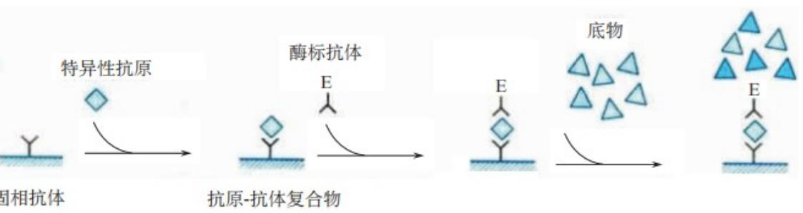
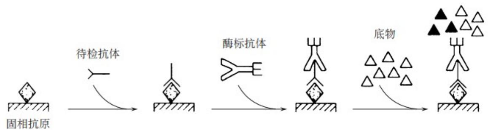

# 免疫基础培训

希森美康医用电子（上海）有限公司学术应用部

# 目录

- 免疫系统、抗原、免疫球蛋白与单克隆抗体- 免疫检验技术与方法- 化学发光法的分类和特点- HISCL 检测平台介绍- 品峰生化和生免流水线的优势

# 目录

- 免疫系统、抗原、免疫球蛋白与单克隆抗体- 免疫检验技术与方法- 化学发光法的分类和特点- HISCL 检测平台介绍- 品峰生化和生免流水线的优势

# 免疫系统

# 免疫系统

- 由免疫器官和组织、免疫细胞及免疫分子组成，机体执行免疫应答和免疫功能的组织系统。

# 免疫器官和组织

中枢免疫器官：胸腺、骨髓和法氏囊（禽类），

- 能造血干细胞在这些部位产生、分化、发育、成熟为免疫细胞，并通过血液循环运送至外周免疫器官。

外周免疫器官：淋巴结、脾脏及黏膜相关淋巴组织等，

- 成熟免疫细胞定居在这些部位，并在此接受抗原刺激产生免疫应答。

黏膜相关淋巴组织：肠相关淋巴组织、鼻相关淋巴组织和支气管相关淋巴组织等，

- 它们在肠道、呼吸道及泌尿生殖道等黏膜局部发挥重要的抗感染作用。

# 免疫细胞

- 淋巴细胞、抗原提呈细胞、粒细胞、肥大细胞、血小板等。

# 免疫分子

- 补体、免疫球蛋白、各种细胞因子等。

# 抗原

# 抗原

抗原- 一类能诱导免疫应答，并与其产物发生特异结合的物质。

# 抗原的特性

抗原的特性- 免疫原性、免疫反应性；蛋白质类抗原免疫原性最强，脂类、糖类较弱，核酸一般无免疫原性。- 不同抗原若有共同抗原表位，会发生交叉反应，这由抗原异质性和共同表位引起，可能导致血清学检测结果假阳性。

# 抗原类型

按与宿主亲缘相关性：

抗原类型按与宿主亲缘相关性：- 异种抗原（与宿主不同种属，免疫原性强，包括病原微生物、细菌外毒素和类毒素、抗毒素、异嗜性抗原等）- 同种异型抗原（同种不同个体的特异性抗原，如血型抗原等，可引起输血、移植排斥反应等）- 自身抗原（能诱导自身应答的物质，正常时免疫系统对其耐受，受外伤、感染或免疫系统异常等刺激时，可诱发自身免疫病）。

# 免疫球蛋白和抗体

# 免疫球蛋白

具有抗体活性或化学结构与抗体相似的球蛋白

# 抗体

B 淋巴细胞在接受抗原物质刺激后，产生的浆细胞所分泌的能与相应抗原发生特异性结合的免疫球蛋白

# 免疫球蛋白的结构

Ig 的基本单位都是四条肽链的对称结构。两条重链（H）和两条轻链（L），其结构分为可变区和恒定区。每条重链和轻链分为氨基端和羧基端。

# 免疫球蛋白的功能与类型

# 免疫球蛋白功能

特异性结合抗原、活化补体、结合Fc受体、通过胎盘；体液免疫应答中发挥免疫功能的主要分子抗体

# 免疫球蛋白的类型

免疫球蛋白分为五类，包括IgG、IgM、IgA、IgD和IgE，各类具有不同的特点和功能。

$\spadesuit$  IgG：血清中含量最高（  $75\%$  左右），半衰期长，唯一能通过胎盘屏障的免疫球蛋白。可作为远期感染指标。

$\spadesuit$  IgM：分子量最大的免疫球蛋白，血清含量  $5\% \sim 10\%$  ，是接触抗原首先发生反应的第一抗体，维持时间短，消失快，可作为近期感染指标。

$\spadesuit$  IgA：血清中含量  $10\% \sim 20\%$  ，分泌型IgA分布于黏膜分泌物中，是防止病原体入侵的第一道防线。

$\spadesuit$  IgD：血清中含量  $0.2\%$  ，升高见于多发性高IgD血症或单纯性高IgD血症。

$\spadesuit$  IgE：血清中含量  $0.002\%$  ，与I型变态反应有关，升高提示过敏体质或存在I型变态反应。

# 单克隆抗体

# 单克隆抗体

- 由单一克隆 B 细胞杂交瘤产生的，只识别抗原分子某一特定抗原决定簇的特异性抗体免疫球蛋白的类型

# 单克隆抗体的应用

诊断试剂

- 诊断方面，可检测病原微生物、肿瘤等多种抗原及激素等活性物质，推动检测试剂盒商品化。

肿瘤的导向治疗和放射免疫显像技术

- 肿瘤治疗与诊断上，能结合药物或放疗物质靶向杀瘤细胞，也可结合放射性标记物辅助肿瘤显像诊断。

蛋白质的提纯

- 蛋白质提纯时，作为亲和层析配体，可特异性结合并纯化抗原。

机体内微量成分的测定

- 通过放射免疫分析技术，测定酶、激素等体内微量成分，辅助健康评估与疾病诊疗。

# 目录

- 免疫系统、抗原、免疫球蛋白与单克隆抗体- 免疫检验技术与方法  
- 化学发光法的分类和特点  
- HISCL 检测平台介绍  
- 品峰生化和生免流水线的优势

# 抗原抗体反应原理、特点及应用

# 抗原-抗体反应基本原理

抗原与抗体结合形成抗原- 抗体复合物的过程

抗原- 抗体反应特点特异性、可逆性、敏感性高

# 抗原-抗体反应应用

免疫沉淀反应、免疫凝集反应、免疫标记技术等

# 免疫检测技术的发展

1、早期传统免疫方法学（20世纪初－20世纪50年代）：凝集反应、沉淀反应

特点：无需复杂仪器，依赖手工操作；仅能判断“有无”，无法精准定量；受干扰因素多（如非特异性凝集），适用范围窄（仅限颗粒性或可溶性大分子抗原）。

3、单克隆抗体推动技术革新（20世纪80年代－20世纪90年代）：单克隆抗体与ELISA、放射免疫、免疫荧光结合、免疫印迹法（WesternBlot，1979年）

特点：抗体特异性极大提升，检测假阳性率显著降低；推动免疫试剂的标准化生产；为后续“靶向检测”与“靶向治疗”奠定基础。

2、标记免疫技术兴起（20世纪50年代－20世纪80年代）：免疫荧光技术（1941年）、放射免疫分析（1959年）

特点：引入“标记物－信号放大”机制，灵敏度大幅提升；实现微量物质定量；部分技术（如ELISA）开始走向标准化与半自动化；但仍存在局限（如RIA有放射性危害、ELISA受酶活性与底物稳定性影

4、现代高通量与超灵敏技术（21世纪初至今）：化学发光免疫分析（CLIA）、电化学发光免疫分析（ECLIA）、时间分辨荧光免疫分析（TRFIA）、高敏化学发光HISCL：

特点：检测灵敏度高，实现微量物质分析；自动化与高通量，满足大规模样本检测；技术融合性强（如免疫－分子生物学结合）；应用场景拓展至POCT、活体成像、多组学研究。

# 化学发光免疫试验

化学发光免疫试验(chemiluminescence immunoassay,CLIA)是继放射免疫试验、酶免疫试验、荧光免疫试验之后发展起来的一种新型标记免疫技术，由抗原抗体免疫反应系统和产生信号的标记物系统两部分组成，标记物是化学发光剂，检测信号是光子强度。

随着新型标记物和标记技术、磁颗粒等新型固相材料以及免疫测定的自动化的发展，CLIA已成为临床实验室的重要常规免疫检验技术。

<table><tr><td>分类依据</td><td>类型</td></tr><tr><td>根据待测分子的大小可设计成多种反应模式</td><td>夹心法、竞争法</td></tr><tr><td>根据游离物和结合物是否需要分离</td><td>均相、非均相</td></tr><tr><td>根据化学发光试验中标记物的不同及反应原理</td><td>直接化学发光免疫试验、化学发光酶免疫试验、电化学发光免疫试验、发光氧通道免疫试验</td></tr></table>

# 免疫反应模式

  
双抗体夹心法测抗原，适用于大分子抗原

# 竞争法可测抗原或抗体，显色程度与待测物含量成反比

# 间接法测定抗体

# 捕获法 用于特异性测定 IgM 类抗体

# HOOK效应

钩状效应即HOOK效应，是指由于抗原抗体比例不合适而导致假阴性的现象，其中抗体过量叫做前带效应；抗原过量叫做后带效应。

  
图1 免疫复合物（IC）沉淀量与抗原抗体量关系

从图中可见，曲线的高峰部分是抗原抗体分子比例合适的范围，称为抗原抗体反应的等价带（zone of equivalence）。在此范围内，抗原抗体充分结合，形成的沉淀物最多，表明抗原与抗体浓度的比例最为合适，称为最适比（optimal ratio）。在等价带前后分别为抗体、抗原过剩则影响沉淀物的形成，这种现象称为带现象（zone phenomenon）。

# HAMA 效应

HAMA 是 human anti- mouse antibody(人血清中的抗小鼠异嗜性抗体) 的略称。由于单克隆抗体是小鼠免疫球蛋白，因此使用了单克隆抗体的检验试剂，如 TSH、LH、FSH 等下垂体激素和 CEA、CA19- 9、CA125 等肿瘤标志物，以及 HBsAg、HBsAb 等病毒抗原抗体测定体系，经常呈现非特异性反应，显示假阳性或假高值。也存在于健康人中，只是程度不同而已。

  
HAMA 的假阳性反应模式图

存在 HAMA 时，除了正常的抗原抗体复合物之外，还会形成 HAMA 介导的固相抗体 / 标记抗体复合物，检测结果变为高值。现在为尽可能避免嗜异性抗体的影响，在免疫检验试剂中添加了吸收异种抗体的成分，吸收正常浓度的嗜异性抗体，避免出现假高值、假阳性。

# 目录

- 免疫系统、抗原、免疫球蛋白与单克隆抗体- 免疫检验技术与方法- 化学发光法的分类和特点- HISCL 检测平台介绍- 品峰生化和生免流水线的优势

化学发光法的分类和特点  

<table><tr><td>方法学</td><td>核心原理</td><td>特点</td><td>关键标记物</td><td>代表品牌与型号</td></tr><tr><td>直接化学发光</td><td>标记物（如吖啶酯、鲁米诺衍生物）直接与氧化剂反应，释放光子，发光强度与待测物浓度正相关</td><td>检测原理直接，操作相对简便，但信号放大效应较弱，对低浓度待测物检测灵敏度不足。</td><td>吖啶酯、鲁米诺、过氧化氢（氧化剂）</td><td>雅培（Architect i2000SR）、贝克曼（Access 2）</td></tr><tr><td>电化学发光</td><td>三联吡啶钌（标记物）在电极表面被氧化，与电子供体（三丙胺）反应，产生电化学发光，信号由电极捕获</td><td>检测特异性和稳定性较好，不过仪器设备依赖度高、成本高，电极维护校准要求也高。</td><td>三联吡啶钌、三丙胺（电子供体）</td><td>罗氏（Cobas e601）、西门子（ADVIA Centaur XP）</td></tr><tr><td>酶促化学发光</td><td>酶（如碱性磷酸酶AP、辣根过氧化物酶HRP）标记抗体/抗原，酶催化底物（如AMPPD、鲁米诺）发光，信号放大效应更强</td><td>信号放大效应强，能提升检测灵敏度，适用范围广，然而酶活性易受环境因素影响，检测结果稳定性和重复性可能受干扰。</td><td>碱性磷酸酶（AP）、AMPPD（底物）；HRP、鲁米诺</td><td>迈瑞（Chemray 800）、新产业（Maglumi X8）</td></tr><tr><td>高敏化学发光</td><td>酶（如碱性磷酸酶ALP）标记抗体/抗原，酶催化底物（如CDP-Star®）发光，信号放大效应更强</td><td>信号放大效应更强，检测灵敏度极高，适合微量生物标志物检测</td><td>CDP-Star®</td><td>希森美康（HISCL 系列）</td></tr></table>

# 目录

- 免疫系统、抗原、免疫球蛋白与单克隆抗体- 免疫检验技术与方法- 化学发光法的分类和特点- HISCL 检测平台介绍- 品峰生化和生免流水线的优势

# Sysmex 免疫事业的发展历史

# 高敏发光 HISCL® 系列仪器

<table><tr><td>检测原理</td><td colspan="2">化学发光酶免疫测定法（CLEIA：ChemiLuminescence Enzyme ImmunoAssay）</td></tr><tr><td>检测时间</td><td colspan="2">17分钟</td></tr><tr><td>通量</td><td>200 测试/小时</td><td>100 测试/小时</td></tr><tr><td>试剂位</td><td>24</td><td>24</td></tr><tr><td>样本用量</td><td colspan="2">10,20,30μL</td></tr><tr><td>吸样区</td><td colspan="2">一次性加样头，过滤薄膜</td></tr><tr><td>系统</td><td colspan="2">连续加载系统</td></tr></table>

# 共通的检测原理、 检测试剂， 确保结果的一致性

# 高敏发光 HISCL® 核心价值

# High Sensitivity CLEIA = HISCL®

高敏发光体系，致力于全方位提升实验室的检测质量和效率

# 1、仅需 10-30uL 微样本用量：高灵敏吸样压力监测系统

- 高灵敏压力传感吸样监控系统及配套特制的 TIP 头和反应杯，确保微量样本的分注准确性；

1. 轻松应对检验科 “多项目使用一管血” 的需求  
2. 减少因样本量少造成的重采血复测损耗

# 2、杜绝技术灰区结果：脱磁清洗分离技术

1. 降低假阳性带来的医疗风险  
2. 提升科室 TAT 效率  
3. 降低复查带来的成本浪费

# 3、杜绝携带污染干扰：一次性TIP头 + 自动过滤薄膜擦拭

- 独家专利的过滤薄膜在吸样后擦拭吸样嘴

第1代：不锈钢针

第2代：一次性TIP头

第3代：一次性TIP头 + 过滤薄膜

- 雅培 i2000- 贝克曼 Dxl 系列- 西门子 immulite 系列- 索灵 LIAISON- 新产业- 安图- 科美- 迈瑞- 新波

- 罗氏 cobas 系列- 强生 vitros 系列- 西门子 Centaur CP/XP- 索灵 LIAISON XL

1. 杜绝携带污染保证结果准确2. 减少错借带来的复查成本及医疗风险

- 希森美康 HISCL 独家

# 4、降低假阴性漏检带来的医疗风险：高敏发光底物 CDP-Star®

4* AMPPD

CDP- Star® 检测灵敏度：10- 21mol/L

1. 提高灵敏度，减少漏检发生  
2. 结果稳定性更好

（金钢烷）- 1,2- 二氧乙烷及其衍生物[9- 15]

（金钢烷）- 1,2- 二氧乙烷及其衍生物[9- 15]

# 5、杜绝 HAMA 效应干扰：全人源化单克隆抗体

1. 四代试剂 HIV Ag+Ab 联合检测

2. 独家使用全人源化单克隆抗体

1. 避免 HAMA 效应干扰，减少错检复检成本及医疗风险  
2. 四代试剂缩短 ‘窗口期’

# 6、线性范围宽： 滤镜切换技术

# （光强度）

1. 提升科室 TAT 效率  
2. 减少了稀释复测的隐形成本

# 滤镜切换技术演示

HISCL 项目检测菜单  

<table><tr><td colspan="4">肿瘤标志物(21)</td><td colspan="2">传染病(8)</td><td colspan="2">心肌标志物(4)</td></tr><tr><td>甲胎蛋白</td><td>AFF</td><td>人附睾蛋白4</td><td>HE4</td><td>乙型肝炎病毒表面抗原</td><td>HBsAg</td><td>氨基末端脑利钠肽前体</td><td>NT-proBNP</td></tr><tr><td>癌胚抗原</td><td>CEA</td><td>异常凝血酶原</td><td>PIVKA II</td><td>乙型肝炎病毒表面抗体</td><td>HBsAb</td><td>高敏感钙蛋白T</td><td>hsTNT</td></tr><tr><td>总前列腺特异抗原</td><td>t-PSA</td><td>胃泌素17</td><td>G-17</td><td>乙型肝炎病毒e抗原</td><td>HBeAg</td><td>肌红蛋白</td><td>MYO</td></tr><tr><td>游离前列腺特异抗原</td><td>f-PSA</td><td>组织多特异性抗原</td><td>TPS</td><td>乙型肝炎病毒e抗体</td><td>HBeAb</td><td>肌激激酶同工酶</td><td>CK-MB</td></tr><tr><td>糖类抗原125</td><td>CA125</td><td colspan="2">激素(12)</td><td>乙型肝炎病毒核心抗体</td><td>HBcAb</td><td colspan="2">血栓四项(4)</td></tr><tr><td>糖类抗原15-3</td><td>CA15-3</td><td>人绒毛膜促性腺激素</td><td>T-hCGβ</td><td>丙型肝炎病毒抗体</td><td>HCVAb</td><td>凝血酶-抗凝血酶Ⅲ复合物</td><td>TAT</td></tr><tr><td>糖类抗原19-9</td><td>CA19-9</td><td>游离人绒毛膜促性腺激素β亚单位</td><td>F-hCGβ</td><td>梅毒螺旋体抗体</td><td>TPAb</td><td>纤溶酶-α2纤溶酶抑制物复合物</td><td>PIC</td></tr><tr><td>糖类抗原72-4</td><td>CA72-4</td><td>睾酮</td><td>T</td><td>人类免疫缺陷病毒抗原抗体</td><td>HIV Ag+Ab</td><td>血栓调节蛋白</td><td>TM</td></tr><tr><td>糖类抗原50</td><td>CA50</td><td>促黄体生成素</td><td>LH</td><td colspan="2">甲状腺功能(8)</td><td>组织纤溶酶原激活物/纤溶酶原激活抑制制剂-1复合物</td><td>tPAI.c</td></tr><tr><td>糖类抗原242</td><td>CA242</td><td>促卵泡生成素</td><td>FSH</td><td>总三碘甲状腺原氨酸</td><td>TT3</td><td colspan="2">糖 尿 病(2)</td></tr><tr><td>铁蛋白</td><td>FER</td><td>雌二醇</td><td>E2</td><td>游离三碘甲状腺原氨酸</td><td>FT3</td><td>胰岛素</td><td>Insulin</td></tr><tr><td>胃蛋白酶原I</td><td>PGI 1</td><td>泌乳素</td><td>PRL</td><td>总甲状腺素</td><td>TT4</td><td>C肽</td><td>C-P</td></tr><tr><td>胃蛋白酶原II</td><td>PGII</td><td>孕酮</td><td>P</td><td>游离甲状腺素</td><td>FT4</td><td colspan="2">感 染(2)</td></tr><tr><td>神经元特异性烯醇化酶</td><td>NSE</td><td>性激素结合球蛋白</td><td>SHBG</td><td>促甲状腺激素</td><td>TSH</td><td>降钙素原</td><td>PCT</td></tr><tr><td>胃泌素释放肽前体</td><td>ProGRP</td><td>生长激素</td><td>hGH</td><td>抗甲状腺球蛋白抗体</td><td>TGAb</td><td>白介素6</td><td>IL-6</td></tr><tr><td>鳞状上皮细胞癌抗原</td><td>SCC</td><td>硫酸脱氢表雄酮**</td><td>DHEA-S</td><td>抗甲状腺过氧化物酶抗体</td><td>TPOAb</td><td colspan="2">间质性肺炎(1)</td></tr><tr><td>细胞角蛋白19片段</td><td>CYFRA211</td><td>抗缪勒管激素</td><td>AMH</td><td>促甲状腺激素受体抗体</td><td>TRAb</td><td>涎液化糖链抗原</td><td>KL-6</td></tr></table>

# 目录

- 免疫系统、抗原、免疫球蛋白与单克隆抗体- 免疫检验技术与方法- 化学发光法的分类和特点- HISCL 检测平台介绍- 品峰生化和生免流水线的优势

# 品峰 KunLun c2800 模块式生化分析仪

  
体积小巧的高速生化分析仪

1．光学2000，ISE600，高速生化分析仪；

2．占地面积小，2.3平米，较其他品牌低  $30 - 40\%$  ，节约空间；

3．稳定耐用，项目重复性好；

4．低交叉污染率，结果精准：  $\pm 0.1^{\circ}C$  ，水浴孵育更稳定，清洗更彻底，交叉污染率  $\leq 0.05\%$  ；

5．人性化设计，仪器使用更便捷：最大415样本位，智能调度，急诊优先，9秒到达吸样位，双前置试剂盘，在线试剂装卸载让仪器使用更便捷；

6．使用成本低，经济又环保：最小反应体积为80ul，  $97\%$  试剂的R1&R2组分同步完成消耗；

7．模块化设计，轻松扩展多模块、一体机和流水线；

8．试剂位204，单机可开展项目102个，一台机器满足项目开展需要；

# 生免整体解决方案助力实验室发展

# -- 占地最小、前处理一体化的开放式流水线

# Sysmex-Inpeco FlexLab X 超级流水线

1. 开放兼容 + 一线贯通：科室可自主选择连接流水线的分析系统品牌；2. 降低流水线建设成本：避免硬件（前后处理）重复投资；3. 实现真正的“T” LA：建设一流实验室，实现真正的智慧化、自动化、标准化实验室；

4. 节省并优化人力资源。

# Together for a better healthcare journey