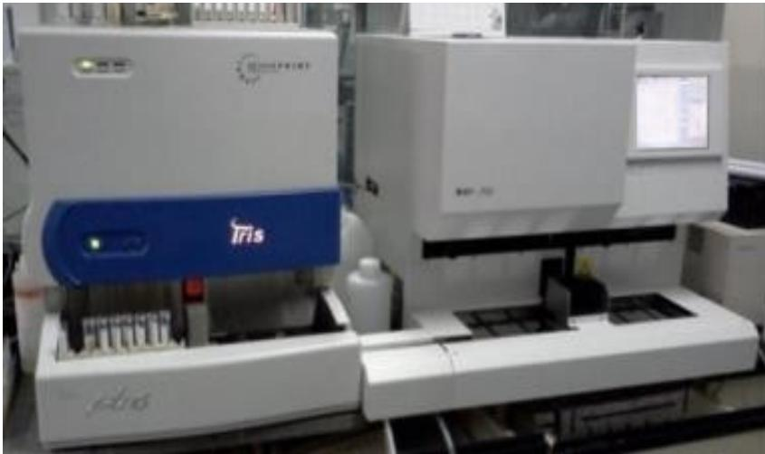

# 

希森美康医用电子（上海）有限公司学术应用部 曹文静

# 目录：

# 行业背景

泌尿系统介绍

尿干化学检测

有形成份检查

尿干化学和有形成份联合检测

尿液特定蛋白分析仪应用及介绍

# 背景1：检验试剂面临集采

# 安徽省医疗保障局

附件

# 安徽省凝血类、心梗类临床检验试剂集中带量采购中选产品目录

# 二十五省（区、兵团）体外诊断试剂省际联盟集中带量采购拟中选企业公示

各相关单位：

二十五省（区、兵团）体外诊断试剂省际联盟集中带量采购信息公开大会于2023年12月20日召开（线下公开形式），现依据《2023年体外诊断试剂省际联盟集中带量采购文件（采购文件编号：IVDLM—2023—01）》对拟中选规则一、拟中选规则二产生的拟中选企业和拟调平企业名单（见附件）进行公示。

在公示期间如有异议，请于公示截止日前向体外诊断试剂省际联盟采购办公室提出申诉并提供合法有效证据材料，逾期不再受理。未提供相应证据材料的，联盟采购办公室不予受理。

公示时间：2023年12月22日至12月26日电话：0551- 69029729 0551- 69029746

附件：二十五省（区、兵团）体外诊断试剂省际联盟集中带量采购拟中选企业名单

一、凝血类临床检验试剂集中带量采购中选产品  

<table><tr><td colspan="3">凝血类临床检验试剂</td></tr><tr><td>投标企业</td><td>申报大项</td><td>申报小项</td></tr><tr><td>希森美康医用电子（上海）有限公司</td><td>凝血大项产品</td><td>凝血酶原时间（PT）</td></tr><tr><td>希森美康医用电子（上海）有限公司</td><td>凝血大项产品</td><td>凝血酶时间（TT）</td></tr><tr><td>希森美康医用电子（上海）有限公司</td><td>凝血大项产品</td><td>活化部分凝血活酶时间（APTT）</td></tr><tr><td>希森美康医用电子（上海）有限公司</td><td>凝血大项产品</td><td>纤维蛋白原（FIB）</td></tr><tr><td>希森美康医用电子（上海）有限公司</td><td>凝血大项产品</td><td>D-二聚体（D-Dimer）</td></tr><tr><td>希森美康医用电子（上海）有限公司</td><td>凝血大项产品</td><td>纤维蛋白（原）降解产物（FDP）</td></tr><tr><td>思塔高诊断技术（天津）有限公司</td><td>凝血大项产品</td><td>凝血酶原时间（PT）</td></tr><tr><td>思塔高诊断技术（天津）有限公司</td><td>凝血大项产品</td><td>凝血酶时间（TT）</td></tr><tr><td>思塔高诊断技术（天津）有限公司</td><td>凝血大项产品</td><td>活化部分凝血活酶时间（APTT）</td></tr><tr><td>思塔高诊断技术（天津）有限公司</td><td>凝血大项产品</td><td>纤维蛋白原（FIB）</td></tr><tr><td>思塔高诊断技术（天津）有限公司</td><td>凝血大项产品</td><td>D-二聚体（D-Dimer）</td></tr><tr><td>思塔高诊断技术（天津）有限公司</td><td>凝血大项产品</td><td>纤维蛋白（原）降解产物（FDP）</td></tr><tr><td>北京赛科希德科技股份有限公司</td><td>凝血大项产品</td><td>凝血酶原时间（PT）</td></tr><tr><td>北京赛科希德科技股份有限公司</td><td>凝血大项产品</td><td>凝血酶时间（TT）</td></tr><tr><td>北京赛科希德科技股份有限公司</td><td>凝血大项产品</td><td>活化部分凝血活酶时间（APTT）</td></tr><tr><td>北京赛科希德科技股份有限公司</td><td>凝血大项产品</td><td>纤维蛋白原（FIB）</td></tr><tr><td>北京赛科希德科技股份有限公司</td><td>凝血大项产品</td><td>D-二聚体（D-Dimer）</td></tr><tr><td>北京赛科希德科技股份有限公司</td><td>凝血大项产品</td><td>纤维蛋白（原）降解产物（FDP）</td></tr><tr><td>安徽大千生物工程有限公司</td><td>凝血大项产品</td><td>纤维蛋白原（FIB）</td></tr></table>

# 继药品集采后，各省检验试剂也面临集采

# 背景2：检验项目解绑

# 医保认定为违规的案例：

在做尿液分析检查时，将尿沉渣定量加收中的一项或者多项打包在尿液分析中进行常规检查

# 违规说明：

尿沉渣定量主要用于泌尿系统疾病、泌尿系统手术等尿液内易出现相关疾病的检查，在尿沉渣相关疾病或者尿液分析检查时才需要进一步检查以上项目

# 背景3：检验项目收费下降

# C45 江苏省医疗保障局

<table><tr><td>首页</td><td>资讯中心</td><td>服务大厅</td><td>信息公开</td><td>政策知识库</td><td>互动交流</td></tr><tr><td colspan="6">当前位置：首页&amp;gt;信息公开&amp;gt;政府信息公开目录&amp;gt;政策法规&amp;gt;公开价格招采</td></tr></table>

<table><tr><td>索 引 号</td><td>MB1846877/2025-00018</td><td>分  类</td><td>医保价格招采</td></tr><tr><td>发布机构</td><td>江苏省医疗保障局</td><td>发文日期</td><td>2025-05-23</td></tr><tr><td>标 题</td><td colspan="3">江苏省医疗保障局 江苏省卫生健康委员会 关于调整部分医疗服务项目价格的通知</td></tr><tr><td>文 号</td><td colspan="3">苏医保发〔2025〕18号</td></tr><tr><td>时 效</td><td colspan="3"></td></tr></table>

附件

# 调整部分检验检查类医疗服务项目价格表

（一）调价项目  

<table><tr><td>编码</td><td>项目名称</td><td>项目内涵</td><td>除外内容</td><td>计价单位</td><td>价格（元）</td><td>说明</td></tr><tr><td>230200055-a</td><td>骨密度测定</td><td></td><td></td><td>次</td><td>120</td><td>双能X线骨密度仪检测</td></tr><tr><td>250102022-a</td><td>卵泡刺激素（LH）快速测定</td><td></td><td></td><td>次</td><td>10</td><td>金标法</td></tr><tr><td>250104014-a</td><td>细菌性阴道炎检查</td><td>包括唾液酸苷酶、弱细胞酶、过氧化氢浓度、凝固酶、β葡萄糖醛酸苷酶、链氨酰氨基肽酶、乙酰氨基葡萄糖苷酶</td><td></td><td></td><td>项</td><td>11</td></tr><tr><td>250200215</td><td>蛇毒因子溶血试验</td><td></td><td></td><td>项</td><td>10</td><td></td></tr><tr><td>250203025</td><td>活化部分凝血活酶时间测定（APTT）</td><td></td><td></td><td>项</td><td>15</td><td>仪器法</td></tr><tr><td>250203047</td><td>血浆抗凝血酶Ⅲ活性测定（AT—ⅢA）</td><td></td><td></td><td>项</td><td>30</td><td>仪器法</td></tr><tr><td>250203049</td><td>凝血酶抗凝血酶Ⅲ复合物测定（TAT）</td><td></td><td></td><td>项</td><td>20</td><td></td></tr></table>

# 收费下降带来的问题，对科室的影响：

科室收入锐减，成本压力巨大

预算紧缩，设备更新与研发受阻

停做“亏本”项目，选择性开展项目

# 面临问题：

如何合理临床开单是我们面临的问题！

与其降低收费，不如增加对检验科有帮助的新项目

# 目录：

行业背景

# 泌尿系统介绍

尿干化学检测

有形成份检查

尿干化学和有形成份联合检测

尿液特定蛋白分析仪应用及介绍

# 人体泌尿系统的组成

肾脏 (形成尿液)

输尿管 (运输尿液)

膀胱 (储存尿液)

尿道 (排出尿液)

备注：肾是泌尿系统主要器官

# 尿液的生成

概念：尿液从血液中滤出、分解、排泄出体外的相关连的器官总称

# 尿液的生成：

  
Copyright  $\mathbb{C}$  Sysmex Corporation

  
Copyright© 2004 Pearson Education, Inc. publishing as Benjamin Cummings.

# 目录：

行业背景

泌尿系统介绍

尿干化学检测

有形成份检查

尿干化学和有形成份联合检测

尿液特定蛋白分析仪应用及介绍

# 尿干化学检测通用方法：

# 透射光法：

- 测量光线穿透已经发生化学反应的尿干化学试纸条试剂垫后的光强度衰减，来定量测定尿液中各种化学成分的浓度。易受污染，尿渍或化学物质残留会严重影响结果准确性

# 反射光法：

- 是测量尿干化学试纸条上各个试剂垫在发生化学反应后，对特定波长光的反射率的变化，来定量测定尿液中各种化学成分的浓度，是目前最主流、最广泛应用的技术

# 比色法：

- 将试纸条浸入尿液样本后，尿液中的特定化学成分与试剂垫上的试剂发生化学反应，从而产生颜色变化或形成浊度。通过与标准色卡进行比色，可半定量地测出尿液中各成分的浓度

  
Copyright  $15$  Sysmex Corporation

  
a:着色试纸

尿干化学常规检测方法及临床意义：  

<table><tr><td>分类</td><td>英文</td><td>中文</td><td>检测原理</td><td>临床意义</td></tr><tr><td rowspan="4">理学</td><td>pH</td><td>pH</td><td>pH 指示剂法</td><td>碱性：膀胱炎，感染
酸性：糖尿病，痛风，发热</td></tr><tr><td>COLOR</td><td>颜色</td><td>比色法</td><td>感染或肾损伤颜色发生改版</td></tr><tr><td>COULD</td><td>浊度</td><td>比色法</td><td>浑浊的尿液</td></tr><tr><td>S.G</td><td>尿比重</td><td>试纸条法</td><td>尿液浓度，反应肾脏浓缩稀释</td></tr><tr><td rowspan="7">化学</td><td>GLU</td><td>尿糖</td><td>酶法（GOD,POD 法）</td><td>糖尿病患者或者肾糖阈减低</td></tr><tr><td>PRO</td><td>尿蛋白</td><td>pH 指示剂的蛋白质误差法</td><td>肾脏疾病</td></tr><tr><td>BLD</td><td>隐血</td><td>过氧化物酶</td><td>膀胱癌，炎症，尿路结石或者肾
脏疾病引起的出血</td></tr><tr><td>URO</td><td>尿胆原</td><td>重氮偶合法</td><td>肝脏疾病</td></tr><tr><td>KET</td><td>酮体</td><td>碱性硝普钠法</td><td>腹泻，饥饿</td></tr><tr><td>BIL</td><td>尿胆红素</td><td>重氮偶合法</td><td>肝炎</td></tr><tr><td>NIT</td><td>亚硝酸盐</td><td>Griess 法</td><td>尿路感染</td></tr><tr><td colspan="5">尿常规试
条无微量白
蛋白细胞
酮项目,白
和
肥
的
脂
酶
活
性
酸
症
服
用
比
A/C!
Copyright© Sysmex Corporation</td></tr></table>

Copyright@ Sysmex Corporation

# UC-3500 差异化特点

11A 纸质条提供 Cre（肌酐）、Alb（微量白蛋白）参数，可以计算出 A/C（微量白蛋白 / 肌酐比）、P/C（蛋白肌酐比）

比重项目采用金标准折射仪法

胆红素项目具有异常显色纠正功能，避免胆红素项目假阳性

  
Sysmex Corporation

<table><tr><td rowspan="2">Bottle Name</td><td colspan="12">Parameters</td></tr><tr><td>UR</td><td>BLD</td><td>PRO</td><td>GLU</td><td>KET</td><td>BIL</td><td>NIT</td><td>LEU</td><td>PH</td><td>CRE</td><td>ALB</td><td>SG</td></tr><tr><td>UC-MEDITAPE 9A</td><td>✓</td><td>✓</td><td>✓</td><td>✓</td><td>✓</td><td>✓</td><td>✓</td><td>✓</td><td>✓</td><td></td><td></td><td>※</td></tr><tr><td>UC-MEDITAPE 11A</td><td>✓</td><td>✓</td><td>✓</td><td>✓</td><td>✓</td><td>✓</td><td>✓</td><td>✓</td><td>✓</td><td>✓</td><td>✓</td><td>※</td></tr></table>

# UC-3500 优势 1：解决 24h 尿蛋白留尿困难

肌酐的排泄是恒定的，肌酐的高值意味着尿液是浓缩的，低值表示尿液被稀释

尿蛋白和白蛋白受尿液浓缩与否有关（即受到饮水影响）

可以用来推测每日排泄蛋白 / 白蛋白量

A/C 比值是评价 CKD 严重程度的重要指标

解决 24h 尿蛋白留尿困难，排除摄入水的影响

Prognosis of CKD by GFR and albuminuria category  
  
Green:low risk (if no other markers of kidney disease, no CKD); Yellow: moderately increased risk Orange:high riskRed,very high risk.

# 微量白蛋白 / 肌酐在相关诊断指南中的意义

指南与共识DOI: 10.19538/jnk2017010108

# 慢性肾脏病筛查诊断及防治指南

# KDIGO 2012 Clinical Practice Guideline for the Evaluation and Management of Chronic Kidney Disease

CKD的蛋白尿分级  

<table><tr><td></td><td>AER</td><td colspan="2">ACR（大致等同）</td><td></td></tr><tr><td>级别</td><td>(mg/24 hours)</td><td>(mg/mmol)</td><td>(mg/g)</td><td>描述</td></tr><tr><td>A1</td><td>&amp;lt;30</td><td>&amp;lt;3</td><td>&amp;lt;30</td><td>正常或轻度升高</td></tr><tr><td>A2</td><td>30-300</td><td>3-30</td><td>30-300</td><td>中度升高*</td></tr><tr><td>A3</td><td>&amp;gt;300</td><td>&amp;gt;30</td><td>&amp;gt;300</td><td>重度升高**</td></tr></table>

# UC-3500 优势 2：比重检测优势

干扰小：这是折射仪法相对于干化学试纸条法最核心的优势，

干化学法易受多种物质影响

结果准确性高：折射仪法，和参考方法一致，受化学干扰极

少，三个水平比重校准品，保证结果准确性

检测精度高：每0.001数值递增/递减，更准确反应肾脏浓

缩稀释功能

# UC-3500 优势 3：BIL 异常显色的识别优势

# 异常显色的常见原因

异常显色的常见原因- 和药物反应所产生的异常的着色- 尿色异常的异常着色- 由于吸湿和高温等导致试纸本身变色等

# UC-3500 优势：

样本检测模式下，对异常显色（药物导致的胆红素项目假阳标本进行识别并标记），避免胆红素项目假阳性

<table><tr><td>异常显色程度</td><td>显示结果</td></tr><tr><td>Normal 正常</td><td>1+, 2+, 3+</td></tr><tr><td>Abnormal color (weak) 颜色异常（弱）</td><td>? flag and 1+, 2+, 3+</td></tr><tr><td>Abnormal color (strong) 颜色异常（强）</td><td>! flag and 1+, 2+, 3+</td></tr><tr><td>Abnormal color→negative correction 异常颜色→修改为阴性（只有 BIL 时）</td><td>? flag and 一（修改）</td></tr></table>

Copyright  $15$  Sysmex Corporation

异常显色的提示：彩色传感器图像分析系统会比较并识别与通常着色的色调平衡，并显示「？」「！」标志

# 目录：

背景

泌尿系统介绍

尿干化学检测

# 有形成份检查

尿干化学和有形成份联合检测

尿液特定蛋白分析仪应用及介绍

# 尿有形成份检测常见方法

# 流式法：

Sysmex UF- 3000/4000/5000

# 图像法：

平面层流 + 影像法：IQ、迪瑞

甩片 + 影像法：科宝、朗迈、罗氏

静置影像法：爱威、迈瑞

# UF检测原理

  
采用消偏振侧向散射光（DSS）分类红细胞和结晶的示意图

# 使用半导体激光

FCM: Flow Cyto Metry

FSC: 前向散射光（细胞体积大小）  SSC: 侧向散射光（内容物复杂程度）  FL: 侧向荧光（核酸含量多少）  DSS: 消偏振的侧向散射光  优势：降低结晶干扰红细胞

# UF5000 检测参数

报告项目  

<table><tr><td colspan="3">定量</td></tr><tr><td>RBC</td><td>Red blood cells</td><td>红细胞</td></tr><tr><td>WBC</td><td>White blood cells</td><td>白细胞</td></tr><tr><td>EC</td><td>Epithelial cells</td><td>上皮细胞</td></tr><tr><td>Squa.EC</td><td>Squamous epithelial cells</td><td>扁平上皮细胞</td></tr><tr><td>CAST</td><td>Casts</td><td>管型</td></tr><tr><td>BACT</td><td>Bacteria</td><td>细菌</td></tr></table>

<table><tr><td colspan="3">半定量和定性</td></tr><tr><td>WBC Clumps</td><td>WBC clumps</td><td>白细胞聚集块</td></tr><tr><td>Non SEC</td><td>Non-Squamous epithelial cells</td><td>非扁平上皮细胞</td></tr><tr><td>Hy.CAST</td><td>Hyaline casts</td><td>透明管型</td></tr><tr><td>Path.CAST</td><td>Non-hyaline casts</td><td>非透明管型</td></tr><tr><td>X&#x27;TAL</td><td>Crystals</td><td>结晶</td></tr><tr><td>YLC</td><td>Yeast-like cells</td><td>酵母样真菌</td></tr><tr><td>SPERM</td><td>Spermatozoa</td><td>精子</td></tr><tr><td>MUCUS</td><td>Mucus</td><td>粘液丝</td></tr></table>

Copyright  $10$  Sysmex Corporation

研究项目  

<table><tr><td colspan="3">定量</td></tr><tr><td>NL RBC</td><td>Non lysed RBC</td><td>非溶血性红细胞</td></tr><tr><td>Lysed RBC</td><td>Lysed RBC</td><td>溶血性红细胞</td></tr><tr><td>Trans. EC</td><td>Transitional epithelial cells</td><td>尿路上皮细胞</td></tr><tr><td>RTEC</td><td>Renal tubular epithelial cells</td><td>肾小管上皮细胞</td></tr><tr><td>SRC</td><td>Small round cells</td><td>小圆上皮细胞</td></tr><tr><td>Atyp.C</td><td>Atypical cells</td><td>非典型细胞等</td></tr><tr><td>DEBRIS</td><td>Debris</td><td>碎片</td></tr><tr><td>Cond.</td><td>Conductivity</td><td>尿液电导率</td></tr><tr><td>Osmo.</td><td>Osmolality</td><td>渗透压</td></tr></table>

Research Information 临床提示信息  

<table><tr><td>RBC Information</td><td>红细胞形态信息提示</td></tr><tr><td>BACT Information</td><td>细菌革兰氏染色信息提示</td></tr><tr><td>UTI Information</td><td>疑似细菌性尿路感染性疾病</td></tr></table>

<table><tr><td colspan="6">UF</td></tr><tr><td>2017/05/22</td><td>10:58:45,115:00</td><td>0002/2</td><td></td><td></td><td></td></tr><tr><td>R</td><td>项目名</td><td>结果值</td><td>单位</td><td>LH</td><td>M</td></tr><tr><td>RBC</td><td></td><td>22.9/μl</td><td></td><td></td><td>*</td></tr><tr><td>WBC</td><td></td><td>241.1/μl</td><td></td><td></td><td>*</td></tr><tr><td>WBC Clumps</td><td></td><td>-</td><td></td><td></td><td>*</td></tr><tr><td>EC</td><td></td><td>107.1/μl</td><td></td><td></td><td>*</td></tr><tr><td>Squa.EC</td><td></td><td>88.9/μl</td><td></td><td></td><td>*</td></tr><tr><td>Non SEC</td><td></td><td>+</td><td></td><td></td><td>*</td></tr><tr><td>CAST</td><td></td><td>1.53/μl</td><td></td><td></td><td>*</td></tr><tr><td>Hy.CAST</td><td></td><td>2+</td><td></td><td></td><td>*</td></tr><tr><td>Path.CAST</td><td></td><td>-</td><td></td><td></td><td>*</td></tr><tr><td>BACT</td><td></td><td>5917.7/μl</td><td></td><td></td><td>*</td></tr><tr><td>X&#x27;TAL</td><td></td><td>-</td><td></td><td></td><td>*</td></tr><tr><td>YLC</td><td></td><td>-</td><td></td><td></td><td>*</td></tr><tr><td>SPERM</td><td></td><td>-</td><td></td><td></td><td>*</td></tr><tr><td>MUCUS</td><td></td><td>+</td><td></td><td></td><td>*</td></tr><tr><td></td><td></td><td></td><td></td><td></td><td></td></tr><tr><td></td><td></td><td></td><td></td><td></td><td></td></tr><tr><td></td><td></td><td></td><td></td><td></td><td></td></tr><tr><td></td><td></td><td></td><td></td><td></td><td></td></tr></table>

报告参数14项，研究参数9项，临床信息提示3

# 优势1：有效避免经时变化

图像法原理：拍照图像比对

UF原理：核酸荧光染色  $+$  流式细胞技术

# 本质识别只能靠DNA鉴定

尿液细胞形态会受放置时间的影响而变形（皱缩、涨大、破碎），图像比对无法识别变形或破碎了的细胞形态

UF采用核酸荧光染色的原理，染的是细胞内的DNA/RNA，是对细胞本质识别，避免经时性变化

# 优势2：灵敏度高一避免图像法的低值漏检，高值不出结果

# 优势3：快速尿液细菌定性定量检测

# UF5000/4000可实现细菌精确定量、细菌快速革兰分型

<table><tr><td>参数</td><td></td><td>结果</td><td>单位</td></tr><tr><td>RBC</td><td></td><td>7.8</td><td>/</td></tr><tr><td>WBC</td><td></td><td>5.0</td><td>/</td></tr><tr><td>WBC Clumps</td><td></td><td>-</td><td></td></tr><tr><td>EC</td><td></td><td>4.2</td><td>/</td></tr><tr><td>Squa.EC</td><td></td><td>1.0</td><td>/</td></tr><tr><td>Non SEC</td><td></td><td>-</td><td></td></tr><tr><td>CAST</td><td></td><td>0.40</td><td>/</td></tr><tr><td>Hy.CAST</td><td></td><td>-</td><td></td></tr><tr><td>Path.CAST</td><td></td><td></td><td></td></tr><tr><td>BACT</td><td></td><td>43.8</td><td>/</td></tr></table>

# UN检测细菌的优势：

1、细菌定量快速分型，30分钟出报告  2、操作便利：仪器全自动检测

临床抗菌药物使用管理——需要依据

# 优势4：红细胞来源信息提示快速区分肾性血尿

# 红细胞来源提示优势：

均一性和非均一性红细胞来源提示，快速区分肾源性血尿，提示早期肾损伤

<table><tr><td colspan="3">定量</td></tr><tr><td>RBC-P70Fsc*1</td><td>RBC-P70Fsc</td><td>红细胞大小指标</td></tr><tr><td>RBC-Fsc-DW*1</td><td>RBC-Fsc-DW</td><td>红细胞多样性指标</td></tr><tr><td>Large RBC*1</td><td>Large RBC</td><td>大型红细胞</td></tr><tr><td>Small RBC*1</td><td>Small RBC</td><td>小型红细胞</td></tr><tr><td>NL RBC</td><td>Non lysed RBC</td><td>未溶红细胞</td></tr><tr><td>Lysed RBC</td><td>Lysed RBC</td><td>溶解红细胞</td></tr></table>

# 优势5：唯一双水平质控及校准

# UC原厂质控品：

覆盖全部报告参数，阴性阳性各一支

# UF原厂质控品：

覆盖报告参数，且提供灵敏度参数信息，帮助监

测仪器状态

  
Copyright  $15$  Sysmex Corporation

<table><tr><td colspan="68">UC-CONTROL 期望值</td><td></td><td></td><td></td><td></td><td></td><td></td><td></td><td></td><td></td><td></td><td></td><td></td><td></td><td></td><td></td><td></td><td></td><td></td><td></td><td></td><td></td><td></td><td></td><td></td><td></td><td></td><td></td><td></td><td></td><td></td><td></td><td></td><td></td><td></td><td></td><td></td><td></td><td></td><td></td><td></td><td></td><td></td><td></td><td></td><td></td><td></td><td></td><td></td><td></td><td></td><td></td><td></td><td></td><td></td><td></td><td></td><td></td><td></td><td></td><td></td><td></td><td></td><td></td><td></td><td></td><td></td><td></td><td></td><td></td><td></td><td></td><td></td><td></td><td></td><td></td><td></td><td></td><td></td><td></td><td></td><td></td><td></td><td></td><td></td><td></td><td></td><td></td><td></td><td></td><td></td><td></td><td></td><td></td><td></td><td></td><td></td><td></td><td></td><td></td><td></td><td></td><td></td><td></td><td></td><td></td><td></td><td></td><td></td><td></td><td></td><td></td><td></td><td></td><td></td><td></td><td></td><td></td><td></td><td></td><td></td><td></td><td></td><td></td><td></td><td></td><td></td><td></td><td></td><td></td><td></td><td></td><td></td><td></td><td></td><td></td><td></td><td></td><td></td><td></td><td></td><td></td><td></td><td></td><td></td><td></td><td></td><td></td><td></td><td></td><td></td><td></td><td></td><td></td><td></td><td></td><td></td><td></td><td></td><td></td><td></td><td></td><td></td><td></td><td></td><td></td><td></td><td></td><td></td><td></td><td></td><td></td><td></td><td></td><td></td><td></td><td></td><td></td><td></td><td></td><td></td><td></td><td></td><td></td><td></td><td></td><td></td><td></td><td></td><td></td><td></td><td></td><td></td><td></td><td></td><td></td><td></td><td></td><td></td><td></td><td></td><td></td><td></td><td></td><td></td><td></td><td></td><td></td><td></td><td></td><td></td><td></td><td></td><td></td><td></td><td></td><td></td><td></td><td></td><td></td><td></td><td></td><td></td><td></td><td></td><td></td><td></td><td></td><td></td><td></td><td></td><td></td><td></td><td></td><td></td><td></td><td></td><td></td><td></td><td></td><td></td><td></td><td></td><td></td><td></td><td></td><td></td><td></td><td></td><td></td><td></td><td></td><td></td><td></td><td></td><td></td><td></td><td></td><td></td><td></td><td></td><td></td><td></td><td></td><td></td><td></td><td></td><td></td><td></td><td></td><td></td><td></td><td></td><td></td><td></td><td></td><td></td><td></td><td></td><td></td><td></td><td></td><td></td><td></td><td></td><td></td><td></td><td></td><td></td><td></td><td></td><td></td><td></td><td></td><td></td><td></td><td></td><td></td><td></td><td></td><td></td><td></td><td></td><td></td><td></td><td></td><td></td><td></td><td></td><td></td><td></td><td></td><td></td><td></td><td></td><td></td><td></td><td></td><td></td><td></td><td></td><td></td><td></td><td></td><td></td><td></td><td></td><td></td><td></td><td></td><td></td><td></td><td></td><td></td><td></td><td></td><td></td><td></td><td></td><td></td><td></td><td></td><td></td><td></td><td></td><td></td><td></td><td></td><td></td><td></td><td></td><td></td><td></td><td></td><td></td><td></td><td></td><td></td><td></td><td></td><td></td><td></td><td></td><td></td><td></td><td></td><td></td><td></td><td></td><td></td><td></td><td></td><td></td><td></td><td></td><td></td><td></td><td></td><td></td><td></td><td></td><td></td><td></td><td></td><td></td><td></td><td></td><td></td><td></td><td></td><td></td><td></td><td></td><td></td><td></td><td></td><td></td><td></td><td></td><td></td><td></td><td></td><td></td><td></td><td></td><td></td><td></td><td></td><td></td><td></td><td></td><td></td><td></td><td></td><td></td><td></td><td></td><td></td><td></td><td></td><td></td><td></td><td></td><td></td><td></td><td></td><td></td><td></td><td></td><td></td><td></td><td></td><td></td><td></td><td></td><td></td><td></td><td></td><td></td><td></td><td></td><td></td><td></td><td></td></tr><tr><td>尿路素质</td><td>(URO)</td><td>normal</td><td></td><td></td><td></td><td></td><td></td><td></td><td></td><td></td><td></td><td></td><td></td><td></td><td></td><td></td><td></td><td></td><td></td><td></td><td></td><td></td><td></td><td></td><td></td><td></td><td></td><td></td><td></td><td></td><td></td><td></td><td></td><td></td><td></td><td>(34 - 202 μmol/L)</td><td></td><td></td><td></td><td></td><td></td><td></td><td></td><td></td><td></td><td></td><td></td><td></td><td></td><td></td><td></td><td></td><td></td><td></td><td></td><td></td><td></td><td></td><td></td><td></td><td></td><td></td><td></td><td></td><td></td><td></td><td></td><td rowspan="2"></td><td rowspan="2"></td><td rowspan="2">(0.06 - 0.75 mg/dL)</td><td rowspan="2">(8.6 - 34 μmol/L)</td><td rowspan="2"></td><td rowspan="2"></td><td rowspan="2"></td><td rowspan="2"></td><td rowspan="2"></td><td rowspan="2"></td><td rowspan="2"></td><td rowspan="2"></td><td rowspan="2"></td><td rowspan="2"></td><td rowspan="2"></td><td rowspan="2"></td><td rowspan="2"></td><td rowspan="2"></td><td rowspan="2"></td><td rowspan="2"></td><td rowspan="2"></td><td rowspan="2"></td><td rowspan="2"></td><td rowspan="2"></td><td rowspan="2"></td><td rowspan="2"></td><td rowspan="2"></td><td rowspan="2"></td><td rowspan="2"></td><td rowspan="2"></td><td rowspan="2"></td><td rowspan="2"></td><td rowspan="2"></td><td rowspan="2"></td><td rowspan="2"></td><td rowspan="2"></td><td rowspan="2">(8.6 - 34 μmol/L)</td><td rowspan="2"></td><td rowspan="2"></td><td rowspan="2"></td><td rowspan="2"></td><td rowspan="2"></td><td rowspan="2"></td><td rowspan="2"></td><td rowspan="2"></td><td rowspan="2"></td><td rowspan="2"></td><td rowspan="2"></td><td rowspan="2"></td><td rowspan="2"></td><td rowspan="2"></td><td rowspan="2"></td><td rowspan="2"></td><td rowspan="2"></td><td rowspan="2"></td><td rowspan="2"></td><td rowspan="2"></td><td rowspan="2"></td><td rowspan="2"></td><td rowspan="2"></td><td rowspan="2"></td><td rowspan="2"></td><td rowspan="2"></td><td rowspan="2"></td><td rowspan="2">(-2.0 mg/dL)</td><td rowspan="2">(-34 μmol/L)</td><td></td><td></td><td></td><td></td><td></td><td></td><td></td><td></td><td></td><td></td><td></td><td></td><td></td><td></td><td></td><td></td><td></td><td></td><td></td><td></td><td></td><td></td><td></td><td></td><td></td><td></td><td></td><td></td><td></td><td></td><td></td><td></td><td></td><td rowspan="2"></td><td rowspan="2"></td><td rowspan="2"></td><td rowspan="2"></td><td rowspan="2"></td><td rowspan="2"></td><td rowspan="2"></td><td rowspan="2"></td><td rowspan="2"></td><td rowspan="2"></td><td rowspan="2"></td><td rowspan="2"></td><td rowspan="2"></td><td rowspan="2"></td><td rowspan="2"></td><td rowspan="2"></td><td rowspan="2"></td><td rowspan="2"></td><td rowspan="2"></td><td rowspan="2"></td><td rowspan="2"></td><td rowspan="2"></td><td rowspan="2"></td><td rowspan="2"></td><td></td><td></td><td></td><td></td><td></td><td></td><td></td><td></td><td></td><td></td><td></td><td></td><td></td><td></td><td></td><td></td><td></td><td></td><td></td><td></td><td></td><td></td><td></td><td></td><td></td><td></td><td></td><td></td><td></td><td></td><td></td><td></td><td rowspan="2"></td><td rowspan="2"></td><td rowspan="2"></td><td rowspan="2"></td><td rowspan="2"></td><td rowspan="2"></td><td rowspan="2"></td><td rowspan="2"></td><td rowspan="2"></td><td rowspan="2"></td><td rowspan="2"></td><td rowspan="2"></td><td rowspan="2"></td><td rowspan="2"></td><td rowspan="2"></td><td rowspan="2"></td><td rowspan="2"></td><td rowspan="2"></td><td rowspan="2"></td><td rowspan="2"></td><td rowspan="2"></td><td rowspan="2"></td><td rowspan="2"></td><td rowspan="2"></td><td rowspan="2"></td><td rowspan="2"></td><td rowspan="2"></td><td rowspan="2"></td><td rowspan="2"></td><td rowspan="2"></td><td rowspan="2"></td><td rowspan="2"></td><td rowspan="2"></td><td rowspan="2"></td><td rowspan="2"></td><td rowspan="2"></td><td rowspan="2"></td><td rowspan="2"></td><td rowspan="2"></td><td rowspan="2"></td><td rowspan="2"></td><td rowspan="2"></td><td rowspan="2"></td><td rowspan="2"></td><td rowspan="2"></td><td rowspan="2"></td><td rowspan="2"></td><td rowspan="2"></td><td rowspan="2"></td><td rowspan="2"></td><td rowspan="2"></td><td rowspan="2"></td><td rowspan="2"></td><td rowspan="2"></td><td rowspan="2"></td><td rowspan="2"></td><td rowspan="2"></td><td rowspan="2"></td><td rowspan="2"></td><td rowspan="2"></td><td rowspan="2"></td><td rowspan="2"></td><td rowspan="2"></td><td rowspan="2"></td><td rowspan="2"></td><td></td><td></td><td></td><td></td><td></td><td></td><td></td><td></td><td rowspan="2"></td><td rowspan="2"></td><td rowspan="2"></td><td rowspan="2"></td><td rowspan="2"></td><td rowspan="2"></td><td rowspan="2"></td><td rowspan="2"></td><td rowspan="2"></td><td rowspan="2"></td><td rowspan="2"></td><td rowspan="2"></td><td rowspan="2"></td><td rowspan="2"></td><td rowspan="2"></td><td rowspan="2"></td><td rowspan="2"></td><td rowspan="2"></td><td rowspan="2"></td><td rowspan="2"></td><td rowspan="2"></td><td rowspan="2"></td><td rowspan="2"></td><td rowspan="2"></td><td rowspan="2"></td><td rowspan="2"></td><td rowspan="2"></td><td rowspan="2"></td><td rowspan="2"></td><td rowspan="2"></td><td rowspan="2"></td><td rowspan="2"></td><td></td><td></td><td></td><td></td><td></td><td></td><td></td><td></td><td></td><td></td><td></td><td></td><td></td><td></td><td></td><td></td><td></td><td></td><td></td><td></td><td></td><td></td><td></td><td></td><td></td><td></td><td></td><td></td><td rowspan="2"></td><td rowspan="2"></td><td rowspan="2"></td><td rowspan="2"></td><td rowspan="2"></td><td rowspan="2"></td><td rowspan="2"></td><td></td><td></td><td></td><td></td><td></td><td></td><td></td><td></td><td></td><td></td><td></td><td></td><td></td><td></td><td></td><td></td><td></td><td></td><td></td><td></td><td></td><td></td><td></td><td></td><td></td><td rowspan="2"></td><td rowspan="2"></td><td rowspan="2"></td><td rowspan="2"></td><td rowspan="2"></td><td rowspan="2"></td><td rowspan="2"></td><td rowspan="2"></td><td rowspan="2"></td><td rowspan="2"></td><td rowspan="2"></td><td rowspan="2"></td><td rowspan="2"></td><td rowspan="2"></td><td rowspan="2"></td><td rowspan="2"></td><td rowspan="2"></td><td rowspan="2"></td><td rowspan="2"></td><td rowspan="2"></td><td rowspan="2"></td><td rowspan="2"></td><td rowspan="2"></td><td rowspan="2"></td><td rowspan="2"></td><td rowspan="2"></td><td rowspan="2"></td><td rowspan="2"></td><td rowspan="2"></td><td rowspan="2"></td><td rowspan="2"></td><td rowspan="2"></td><td></td><td></td><td></td><td></td><td></td><td></td><td></td><td></td><td></td><td></td><td></td><td></td><td></td><td></td><td></td><td></td><td></td><td></td><td></td><td></td><td></td><td></td><td></td><td></td><td rowspan="2"></td><td rowspan="2"></td><td rowspan="2"></td><td rowspan="2"></td><td rowspan="2"></td><td rowspan="2"></td><td rowspan="2"></td><td rowspan="2"></td><td rowspan="2"></td><td></td><td></td><td></td><td></td><td></td><td></td><td></td><td></td><td></td><td></td><td></td><td></td><td></td><td></td><td></td><td></td><td></td><td></td><td></td><td></td><td></td><td></td><td></td><td></td><td></td><td></td><td></td><td></td><td></td><td></td><td></td><td></td><td></td><td></td><td></td><td></td><td></td><td></td><td></td><td></td><td></td><td></td><td></td><td></td><td></td><td></td><td></td><td></td><td></td><td></td><td></td><td></td><td></td><td></td><td></td><td></td><td></td><td></td></tr><tr><td>灌血（血红素）</td><td>(BLD)</td><td>-</td><td></td><td></td><td></td><td></td><td></td><td></td><td></td><td></td><td></td><td></td><td></td><td></td><td></td><td></td><td></td><td></td><td></td><td></td><td></td><td></td><td></td><td></td><td></td><td></td><td></td><td></td><td></td><td></td><td></td><td></td><td></td><td></td><td></td><td></td><td></td><td></td><td></td><td></td><td></td><td></td><td></td><td></td><td></td><td></td><td></td><td></td><td></td><td></td><td></td><td></td><td></td><td></td><td></td><td></td><td></td><td></td><td></td><td></td><td></td><td></td><td></td><td></td><td></td><td></td><td></td><td>(8.6 - 34 μmol/L)</td><td></td><td></td><td></td><td></td><td></td><td></td><td></td><td></td><td></td><td></td><td></td><td></td><td></td><td></td><td></td><td></td><td></td><td></td><td></td><td></td><td></td><td></td><td></td><td></td><td></td><td></td><td></td><td></td><td></td><td></td><td></td><td></td><td></td><td></td><td></td><td></td><td></td><td></td><td></td><td></td><td></td><td></td><td></td><td></td><td></td><td></td><td></td><td></td><td></td><td></td><td></td><td></td><td></td><td></td><td></td><td></td><td></td><td></td><td></td><td></td><td></td><td></td><td></td><td></td><td></td><td></td><td></td><td></td><td></td><td></td><td></td><td></td><td>(-2.0 mg/dL)</td><td>(-34 μmol/L)</td><td></td><td></td><td></td><td></td><td></td><td></td><td></td><td></td><td></td><td></td><td></td><td></td><td></td><td></td><td></td><td></td><td></td><td></td><td></td><td></td><td></td><td></td><td></td><td></td><td></td><td></td><td></td><td></td><td></td><td></td><td></td><td></td><td></td><td></td><td></td><td></td><td></td><td></td><td></td><td></td><td></td><td></td><td></td><td></td><td></td><td></td><td></td><td></td><td></td><td></td><td></td><td>(8.6 - 34 μmol/L)</td><td></td><td></td><td></td><td></td><td></td><td></td><td></td><td></td><td></td><td></td><td></td><td></td><td></td><td></td><td></td><td></td><td></td><td></td><td></td><td></td><td></td><td></td><td></td><td></td><td></td><td></td><td></td><td></td><td></td><td></td><td></td><td></td><td></td><td></td><td></td><td></td><td></td><td></td><td></td><td></td><td></td><td></td><td></td><td></td><td></td><td></td><td></td><td>(8.6 - 34 μmol /L)</td><td></td><td></td><td></td><td></td><td></td><td></td><td></td><td></td><td></td><td></td><td></td><td></td><td></td><td></td><td></td><td></td><td></td><td></td><td></td><td></td><td></td><td></td><td></td><td></td><td></td><td></td><td></td><td></td><td></td><td></td><td></td><td></td><td></td></tr></table>

# 优势6：SNCS室内质控室间化

# 保证结果准确性手段：

- 实验室建立参考方法，与参考方法进行比对- 使用厂家配套的校准品校正仪器- 参加大规模的室间质评

目前所有全自动尿有形成分分析仪

都没有全项目校准品，因此只有通

过室间比对来验证准确性

SNCS在线质控满足室内结果室间化

# 目录：

行业背景

泌尿系统介绍

尿干化学检测

有形成份检查

尿干化学和有形成份联合检测

尿液特定蛋白分析仪应用及介绍

# 尿液检验行标解读

ICS 11.020  CCS c 50

# WS 中华人民共和国卫生行业标准

WS/T 229—2024 代替WS/T 229—2002

# 尿液理学、化学和有形成分检验  Physical, chemical and morphological urine examination

# 由卫健委2024/5/9发布，11/1实施的尿液检验行标要点：

原文：本标准规定了尿液理学、化学和有形成分（尿液常规）的检验方法与质量管理及结果报告的要求；

解读：再次明确了尿液常规检验包括理学、化学、有形成分检验；

原文：实验室应建立尿液检验的标准操作程序（SOP）文件，该文件至少包括以下信息：自动审核规则、复检规则制定和验证；

解读：无论哪种方法，都需要建立复检和自动审核规则；

原文：当尿液检验采用干化学和有形成分分析仪联合检测，检测结果触发复检规则时，应镜检。

解读：不论使用何种仪器，确认方法都是标准显微镜检；

# 中央纪委国家监委网站：

# 中共中央纪律检查委员会

# 中华人民共和国国家监察委员会

领导活动 信息公开 党纪法规 监督举报 审查调查 巡视巡察 理论学习 历史文化

首页 > 要闻

# 医保飞行检查发现超医保支付限定、过度检查、重复收费 集体“把脉”找问题

来源：中央纪委国家监委网站 发布时间：2022- 08- 29 09:12 分享

中央纪委国家监委网站左翰

“尿沉渣定量检查通常适用于泌尿科、肾病科、产科及肾脏病变患者，但该院所有科室入院患者均做了该项检查，部分患者无指征，涉嫌过度检查，涉及112334人次、疑似违规金额2246740元……”8月26日晚，云南省昆明医科大学第二附属医院会议室灯火通明，国家医保飞行检查组各小组代表逐一汇报检查中发现的问题。

自飞行检查组入驻被检医疗机构以来，这样的集中研讨会已经一连开了3天。

首位上台的心内组代表将当日的检查小结投放到大屏幕上，大家看到，该组发现的疑似问题主要包括尿沉渣定量等无指征检查，I级护理未降低护理级别，重复收取复杂手术特殊刀使用费，DRG分组高靠诊断等，涉及人次、金额与政策依据一目了然。

对甲沟炎患者使用全身麻醉，半髋关节置换术收取全髋关节置换术费用……除大数据筛查出的共性问题外，骨科组代表还介绍了该组翻阅300余份病历后发现的一系列个性问题：“比如病案号90456015的患者，其手术记录显示使用同种异体骨2盒，但记账与标签均显示为3盒，存在明显出入，涉及疑似违规金额3740元。”

尿沉渣检查通常适用于泌尿科、肾病科、产科及肾脏病变患者，云南昆明医科大学第二附属院：所有科室入院患者均做尿沉渣检测，部分患者无指征，涉嫌过度检查

# 为什么要联合检测？

# 37条需复检的规则

# 27条无需复检的规则

<table><tr><td>序号</td><td>需要复检规则</td><td>标本数(份)</td><td>序号</td><td>需要复检规则</td><td>标本数(份)</td></tr><tr><td>6</td><td>WBC+RBC-CAST-LEU-ERY+PRO+</td><td>2</td><td>38</td><td>WBC+RBC-CAST+LEU-ERY+PRO+</td><td>2</td></tr><tr><td>7</td><td>WBC+RBC-CAST-LEU+ERY+PRO+</td><td>6</td><td>39</td><td>WBC+RBC-CAST+LEU+ERY+PRO+</td><td>5</td></tr><tr><td>8</td><td>WBC+RBC+CAST-LEU+ERY+PRO+</td><td>16</td><td>40</td><td>WBC+RBC+CAST+LEU-ERY+PRO+</td><td>35</td></tr><tr><td>9</td><td>WBC+RBC+CAST-LEU-ERY+PRO+</td><td>23</td><td>41</td><td>WBC+RBC+CAST+LEU+ERY+PRO+</td><td>3</td></tr><tr><td>10</td><td>WBC+RBC+CAST-LEU-ERY+PRO+</td><td>0</td><td>43</td><td>WBC+RBC+CAST+LEU-ERY+PRO+</td><td>13</td></tr><tr><td>11</td><td>WBC+RBC+CAST-LEU+ERY+PRO+</td><td>8</td><td>44</td><td>WBC+RBC+CAST+LEU+ERY+PRO+</td><td>0</td></tr><tr><td>12</td><td>WBC+RBC+CAST-LEU+ERY+PRO+</td><td>1</td><td>45</td><td>WBC+RBC+CAST+LEU+ERY+PRO+</td><td>0</td></tr><tr><td>13</td><td>WBC+RBC+CAST+LEU-ERY+PRO+</td><td>0</td><td>47</td><td>WBC+RBC+CAST+LEU+ERY+PRO+</td><td>0</td></tr><tr><td>14</td><td>WBC+RBC+CAST+LEU-ERY+PRO+</td><td>10</td><td>48</td><td>WBC+RBC+CAST+LEU-ERY+PRO+</td><td>13</td></tr><tr><td>15</td><td>WBC+RBC+CAST+LEU+ERY+PRO+</td><td>0</td><td>51</td><td>WBC+RBC+CAST+LEU-ERY+PRO+</td><td>17</td></tr><tr><td>16</td><td>WBC+RBC+CAST+LEU+ERY+PRO+</td><td>0</td><td>54</td><td>WBC+RBC+CAST+LEU-ERY+PRO+</td><td>44</td></tr><tr><td>17</td><td>WBC+RBC+CAST+LEU+ERY+PRO+</td><td>4</td><td>55</td><td>WBC+RBC+CAST+LEU+ERY+PRO+</td><td>40</td></tr><tr><td>18</td><td>WBC+RBC+CAST+LEU+ERY+PRO+</td><td>0</td><td>56</td><td>WBC+RBC+CAST+LEU+ERY+PRO+</td><td>18</td></tr><tr><td>19</td><td>WBC+RBC+CAST+LEU-ERY+PRO+</td><td>26</td><td>59</td><td>WBC+RBC+CAST+LEU-ERY+PRO+</td><td>106</td></tr><tr><td>20</td><td>WBC+RBC+CAST-LEU-ERY+PRO+</td><td>8</td><td>60</td><td>WBC+RBC+CAST+LEU+ERY+PRO+</td><td>6</td></tr><tr><td>21</td><td>WBC+RBC+CAST-LEU-ERY+PRO+</td><td>41</td><td>61</td><td>WBC+RBC+CAST+LEU+ERY+PRO+</td><td>4</td></tr><tr><td>22</td><td>WBC+RBC+CAST+LEU-ERY+PRO+</td><td>33</td><td>62</td><td>WBC+RBC+CAST+LEU+ERY+PRO+</td><td>9</td></tr><tr><td>23</td><td>WBC+RBC+CAST+LEU-ERY+PRO+</td><td>0</td><td>64</td><td>WBC+RBC+CAST+LEU+ERY+PRO+</td><td>5</td></tr><tr><td>24</td><td>WBC+RBC+CAST+LEU+ERY+PRO+</td><td>21</td><td>65</td><td>WBC+RBC+CAST+LEU+ERY+PRO+</td><td>5</td></tr></table>

注：“+”为阳性；“-”为阴性

<table><tr><td>序号</td><td>无需复检规则</td><td>标本数(份)</td><td>序号</td><td>无需复检规则</td><td>标本数(份)</td></tr><tr><td>1</td><td>WBC+RBC-CAST-LEU+ERY+PRO-</td><td>252</td><td>31</td><td>WBC+RBC+CAST-LEU+ERY+PRO+</td><td>49</td></tr><tr><td>2</td><td>WBC+RBC-CAST-LEU+ERY+PRO-</td><td>11</td><td>32</td><td>WBC+RBC+CAST-LEU+ERY+PRO+</td><td>49</td></tr><tr><td>3</td><td>WBC+RBC-CAST-LEU-ERY+PRO-</td><td>14</td><td>36</td><td>WBC+RBC-CAST-LEU+ERY+PRO-</td><td>2</td></tr><tr><td>4</td><td>WBC+RBC-CAST-LEU+ERY+PRO-</td><td>21</td><td>37</td><td>WBC+RBC-CAST+LEU+ERY+PRO-</td><td>18</td></tr><tr><td>5</td><td>WBC+RBC-CAST-LEU+ERY+PRO-</td><td>24</td><td>42</td><td>WBC+RBC-CAST+LEU-ERY+PRO-</td><td>3</td></tr><tr><td>8</td><td>WBC+RBC-CAST-LEU-ERY+PRO-</td><td>79</td><td>46</td><td>WBC+RBC+CAST+LEU-ERY+PRO-</td><td>10</td></tr><tr><td>10</td><td>WBC+RBC+CAST-LEU-ERY+PRO-</td><td>120</td><td>49</td><td>WBC+RBC+CAST+LEU+ERY+PRO-</td><td>20</td></tr><tr><td>12</td><td>WBC+RBC+CAST-LEU+ERY+PRO-</td><td>19</td><td>50</td><td>WBC+RBC+CAST+LEU-ERY+PRO-</td><td>5</td></tr><tr><td>14</td><td>WBC+RBC+CAST-LEU+ERY+PRO-</td><td>84</td><td>52</td><td>WBC+RBC+CAST+LEU+ERY+PRO-</td><td>10</td></tr><tr><td>16</td><td>WBC+RBC+CAST-LEU-ERY+PRO-</td><td>152</td><td>53</td><td>WBC+RBC+CAST+LEU+ERY+PRO+</td><td>13</td></tr><tr><td>24</td><td>WBC+RBC+CAST+LEU-ERY+PRO-</td><td>57</td><td>57</td><td>WBC+RBC+CAST+LEU+ERY+PRO-</td><td>90</td></tr><tr><td>25</td><td>WBC+RBC+CAST-LEU+ERY+PRO-</td><td>62</td><td>58</td><td>WBC+RBC+CAST-LEU+ERY+PRO-</td><td>28</td></tr><tr><td>28</td><td>WBC+RBC+CAST-LEU+ERY+PRO-</td><td>55</td><td>64</td><td>WBC+RBC+CAST-LEU-ERY+PRO-</td><td>1061</td></tr><tr><td>29</td><td>WBC+RBC+CAST-LEU+ERY+PRO+</td><td>12</td><td></td><td></td><td></td></tr></table>

注：“+”为阳性；“-”为阴性

干化学和尿液有形成份检测交叉互认，结果互补

# Sysmex尿流水线整体化检测的优势

一人多机：解决检验科人手不够问题

适配性提高：干化学和沉渣可以选择一拖二、检测效率提升

智能审核：显著提高科室审核报告效率，快速报告，提高TAT时间，将有限时间用于特殊标本复查

# 检验学会审核规则16条

尿液常规智能审核规则验证与改进的多中心研究

王力1 郝晓柯2 杨大平1 蒋黎4 孙成铭5 史伟峰6 伍勇7 吴卫8 刘家云2 徐卫益3 张娟4 杨丽萍1 蒋丽娟6 袁金玲7 金晶8 王刚强2 俞倩3 熊志刚4 王臣玉3 蒋舒娜4 廖金凤9 何贝4 崔巍1 国家癌症中心/国家肿瘤临床医学研究中心/中国医学科学院北京协和医学院肿瘤医院检验科，北京100021；空军军医大学西京医院检验科，西安710000；浙江大学医学院附属第一医院检验科，杭州310000；四川省人民医院检验科，成都610072；烟台毓璜顶医院检验科，烟台264001；苏州大学附属第三医院检验科，常州213000；中南大学湘雅三医院检验科，长沙410013；中国医学科学院北京协和医院检验科，北京100730通信作者：崔巍，Email：wenycuimei@sina.cn

# 检验学会审核规则16条

尿液分析自动审核规则的建立与多中心实践

张慧1 王学军1 樊爱琳2 邢晓柯2 刘家云2 王刚强2 李莉2 李秋晨2 张如霖2 蒋黎4 熊志刚4 何贝4 洪国峰1 赖小华5 蔡梅真1 高辉6 李红燕程云6 陈颖洁周勇杨婧文单洪丽1 宁书晗黄晶续骏吉林大学第一医院检验科，长春130021；空军军医大学西京医院检验科，西安710032；上海市第一人民医院检验科，上海200080；四川省人民医院检验科，成都610072；厦门大学附属第一医院检验科，厦门361003；昆明市延安医院检验科，昆明650051；山东大学第二医院检验科，济南250033通信作者：续薇，Email：xuweifei210@sina.com；黄晶，Email：sjluhuangjing1@126. com

# 尿流式临床开单建议：

# 1.为什么要开尿沉渣 （临床应用场景）

尿干化学有假阴性，对于重点疾病的筛查，需要结合尿沉渣联合筛查  临床有尿频、尿急、尿痛、腰痛等临床典型症状时  疾病监测与随访：CKD患者定期评估，肾移植术后排斥反应的监测  全部镜检不适用的医院（TAT要求）

# 2.尿流式做尿沉渣的好处 （UF技术优势）

血尿线性范围宽，易于动态监测病情  红细胞来源信息：区分肾小球性血尿或非肾小球性血尿  特殊参数提示临床：RTEC提示肾小管损伤，Atyp.C提示疑似尿路上皮癌  尿路感染信息：快速判断是否可能存在尿路感染  细菌分型信息：初步区分革兰阳性菌/阴性菌，辅助抗生素选择

# 3.适用科室：

肾内科、泌尿科、内分泌科、妇产科、儿科、风湿免疫科

4. 收费：各省都有专项收费，参考当地尿常规收费目录 Copyright© Sysmex Corporation

# 目录：

行业背景

泌尿系统介绍

尿干化学检测

有形成份检查

尿干化学和有形成份联合检测

尿液特定蛋白分析仪应用及介绍

# PY-480 品峰特定蛋白分析仪

# 检测速度快

检测速度快- 检测恒速 400T/H，电解质模块 600T/H- 支持直接联机；可拓展到 1600T/H- 轨道直接连接 - - 尿液分析流水线、血液流水线、生化免疫流水线

# 结果准

结果准- 散射多角度检测技术、双光路检测- 智能抗原过量监测- 样本预稀释、阶梯循环稀释- 结果可溯源至国际/国家标准物质

# 项目全

项目全- 功能齐全：样本穿刺功能，集成 ISE 模块- 样本类型全：全血、末梢血、血清、血浆、脑脊液、尿液、粪便溶解物，直接上机- 检测项目全：尿液生物标志物、炎症感染类、免疫功能、类风湿性疾病

Copyright© Sysmex Corporation

<table><tr><td>可检测项目</td><td>项目简写</td></tr><tr><td>尿微量白蛋白</td><td>MA</td></tr><tr><td>肌酐</td><td>CREA</td></tr><tr><td>免疫球蛋白</td><td>IgG</td></tr><tr><td>尿转铁蛋白</td><td>TRF</td></tr><tr><td>视黄醇结合蛋白</td><td>RBP</td></tr><tr><td>β2-微球蛋白</td><td>β2-MG</td></tr><tr><td>α1-微球蛋白</td><td>α1-MG</td></tr><tr><td>N-乙酰-β-D-葡萄糖苷酶</td><td>NAG</td></tr><tr><td>胱抑素C</td><td>Cys-C</td></tr><tr><td>原α2-巨球蛋白</td><td>α2-MG</td></tr><tr><td>游离K轻链</td><td>Kappa</td></tr><tr><td>游离λ轻链</td><td>Lambda</td></tr><tr><td>中性粒细胞明胶酶相关脂质运载蛋白</td><td>NGAL</td></tr><tr><td>尿总蛋白</td><td>UTP</td></tr></table>

# 特定蛋白流水线

# 光学系统：

激光光源- 散射多角度检测技术、双光路检测

# 分析原理：

散射比浊法、比色法、离子选择电极法

检测速度：单模块400T/H；选配ISE后600T/H

抗原过量监测：二次加抗原、二次加抗体、光学动力监测

稀释功能：样本预稀释、阶梯循环稀释

复查功能：单机轨道可自动复查

双样本针：可穿刺进样，

拓展功能：支持4台直联，轨道可连接尿液分析流水线、血液分析流水线，生化免疫流水线

# 实验室尿液检测整体化解决方案

尿干化学检测

尿有形成分检测

尿蛋白检测

尿生化检测

尿电解质检测

# 尿液特定蛋白临床开单建议

# 1.尿液特定蛋白检测：

常用的有尿微量白蛋白（MA)、免疫球蛋白（IgG）、α1- 微球蛋白（α1- MG）、尿α2巨球蛋白（α2- MG）、β2- 微球蛋白(β2- MG)等

项目组合优于单项，五项联检，快速精准定位疾病来源，评估肾脏不同部位损伤

# 2. 主要应用场景：

肾脏疾病相关症状：蛋白尿、血尿、水肿、高血压伴肾功能异常、慢性CKD监测  代谢性疾病症状：糖尿病、痛风/高尿酸血症  免疫性相关症状：系统性红斑狼疮（SLE）、多发性骨髓瘤  妊娠期高血压/子痫前期

# 3.适用科室：

泌尿外科、肾内科、内分泌科、风湿免疫科、妇产科、移植科等

# 4.收费：

各省都有专项收费，参考当地尿特殊蛋白单项收费，建议组合使用

# Together for a better healthcare journey