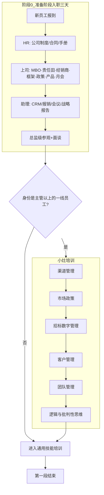
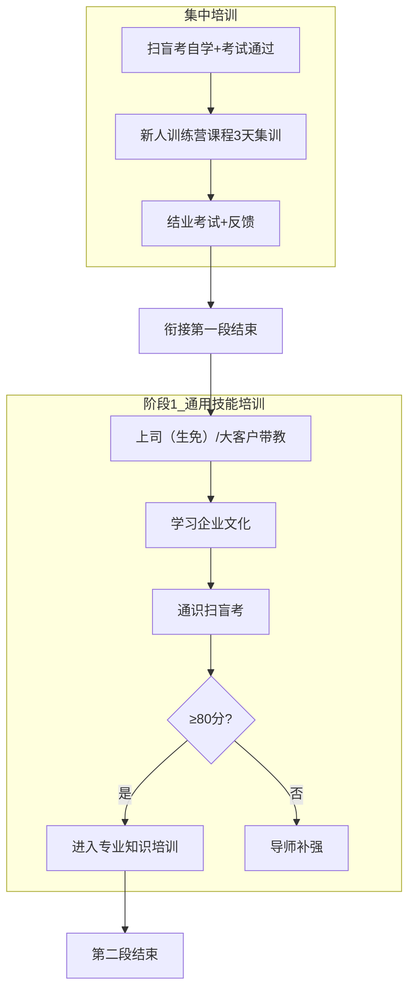
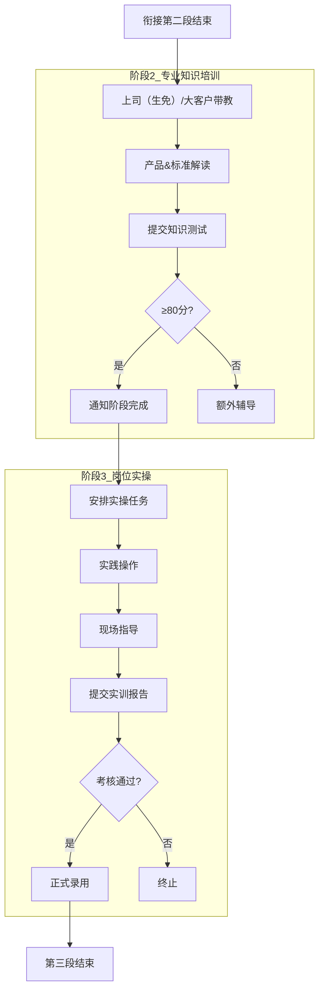

```mermaid
graph TD
    %% =============================================================
    %% 阶段 0：准备阶段（入职 3 天）
    %% =============================================================
    subgraph 阶段0_准备阶段入职三天
        direction LR
        A0[新员工报到] --> B0[HR: 公司制度/合同/手册]
        B0 --> C0[上司: MBO·责任田·经销商·框架·政策·产品·月会]
        C0 --> D0[助理: CRM/报销/会议/战略报告]
        D0 --> E0[总监级参观+面谈]
    end

    %% 身份判断
    E0 --> F0{身份是主管以上的一线员工?}
    F0 -- 是 --> G0[小灶培训]
    F0 -- 否 --> H0[进入通用技能培训]

    %% 小灶培训（围绕三个明白）
    subgraph G0[小灶培训]
        direction LR
        G0_1[渠道管理] 
        G0_2[市场政策]
        G0_3[招标数字管理]
        G0_4[客户管理]
        G0_5[团队管理]
        G0_6[逻辑与批判性思维]

        G0_1 --> G0_2
        G0_2 --> G0_3
        G0_3 --> G0_4
        G0_4 --> G0_5
        G0_5 --> G0_6
    end
    G0_6 --> H0[进入通用技能培训]

    %% 第一段结束节点
    H0 --> I0[第一段结束]
```

```mermaid
graph TD
    %% =============================================================
    %% 集中培训（所有新员工）
    %% =============================================================
    subgraph 集中培训
        direction LR
        Y4[扫盲考自学+考试通过] 
        Z4[新人训练营课程3天集训]
        A5[结业考试+反馈]

        Y4 --> Z4
        Z4 --> A5
    end
    A5 --> L2[衔接第一段结束]

    %% =============================================================
    %% 阶段 1：通用技能培训
    %% =============================================================
    subgraph 阶段1_通用技能培训
        direction LR
        F1[上司（生免）/大客户带教] 
        G1[学习企业文化]
        H1[通识扫盲考]
        I1{≥80分?}
        J1[进入专业知识培训]
        K1[导师补强]

        F1 --> G1
        G1 --> H1
        H1 --> I1
        I1 -- 是 --> J1
        I1 -- 否 --> K1
    end
    L2 --> F1

    %% 第二段结束节点
    J1 --> L0[第二段结束]
```

```mermaid
graph TD
    %% =============================================================
    %% 阶段 2：专业知识培训
    %% =============================================================
    subgraph 阶段2_专业知识培训
        direction LR
        L2[上司（生免）/大客户带教] 
        M2[产品&标准解读]
        N2[提交知识测试]
        O2{≥80分?}
        P2[通知阶段完成]
        Q2[额外辅导]

        L2 --> M2
        M2 --> N2
        N2 --> O2
        O2 -- 是 --> P2
        O2 -- 否 --> Q2
    end
    J1[衔接第二段结束]--> L2
    P2 --> R3

    %% =============================================================
    %% 阶段 3：岗位实操
    %% =============================================================
    subgraph 阶段3_岗位实操
        direction LR
        R3[安排实操任务] 
        S3[实践操作]
        T3[现场指导]
        U3[提交实训报告]
        V3{考核通过?}
        W3[正式录用]
        X3[终止]

        R3 --> S3
        S3 --> T3
        T3 --> U3
        U3 --> V3
        V3 -- 是 --> W3
        V3 -- 否 --> X3
    end

    %% 第三段结束节点
    W3 --> Z0[第三段结束]
```

