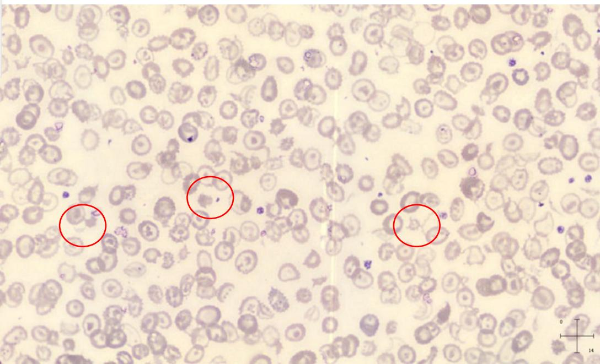

# 血液分析特殊项目开单建议

Sysmex 学术部 李强

Together for a better healthcare journey

# 主要内容

1. WPC 通道检测建议2. HPC 项目开单建议3. PLT-F 通道检测建议4. IPF 项目开单建议5. RET-He 项目开单建议6. 血常规 /CRP/SAA 三联检开单建议

# 1.WPC 通道检验科检测建议

# 临床应用场景：

WPC 通道可初步鉴别髓系白血病和淋系白血病

# WPC临床应用优势：

WPC临床应用优势：- 在镜下不能鉴别原始细胞、异常淋巴细胞、异形淋巴细胞时，WPC通道可以鉴别这三种细胞

# 适用科室：

全部科室

# HIS/LIS开单建议：

HIS/LIS 开单建议：- 遇到 Abn lymph/Blast？报警或触发相关复检规则时，reflex WPC 通道检测

# 收费：

无

# WPC 散点图

  
SSC：侧向散射光

# WPC 通道案例 1：B 淋巴细胞白血病 / 淋巴瘤（B-ALL）

主诉牙龈出血就诊。经血液检查，确认到白细胞增加、查见异常淋巴细胞。

# Flags

# WBC Flag(s)

IG Present

Abn Lympho?

RBC Flag(s)

PLT Flag(s)

PLT Abn Distribution Thrombocytopenia

# 社外密

# WPC 通道案例 2：伴有骨髓增生异常相关改变的急性髓系白血病

李某，男性，49岁。病史：骨髓增生异常综合征的病程观察中，在外周血中确认到原始细胞增加。

# Flags

# WBC Flag(s)

Neutropenia Blasts?

RBC Flag(s) Anisocytosis Anemia

PLT Flag(s)

# 社外密

# 2.XN血液分析仪HPC（造血干祖细胞） 计数临床开单建议

# 应用场景：

- 用于PBSCT供体采集时机的判断- 用于判断PBSCT后，造血功能重建是否成功

# HPC临床应用优势：

- 该方法操作简单快速、结果准确- 并同时提供HPC#、HPC%

# 适用科室：

- 血液科、肿瘤科、急诊科／重症医学科（ICU）、移植科（骨髓／干细胞移植中心）、儿科（儿童血液／肿瘤专科）

# HIS/LIS开单建议：

- 需要监测外周血干细胞浓度时- 干细胞移植后监测造血功能的恢复时

给出WPC检查提示

# 收费：

- 参考血常规和RET的收费

# 外周血造血干细胞移植（PBSCT）的流程

# HPC 标本采集

造血祖细胞与  $\tt CD34+$  细胞在健康供者动员过程中的变化规律：

动员次日WBC开始明显激剧上升，第3- 6天变化不大造血祖细胞与  $\tt CD34+$  细胞：口第4天开始明显上升，口第5天达到高峰，口第6天仍处于较高水平，

造血祖细胞与  $\tt CD34+$  细胞几乎同步变化，接近高峰时造血祖细胞较  $\tt CD34+$  细胞升幅更大，更明显。

# Evaluation of new automated hematopoietic progenitor cell analysis in the clinical management of peripheral blood stem cell collections

Ellinor I. Peerschke, $^{1,2}$  Christine Moung, $^{1}$  Melissa S. Pessin, $^{1}$  and Peter Maslak $^{1,3}$

oratory. This study demonstrates similar performance characteristics for CD34 analysis and XN- HPC counting, supporting the conclusion that the new XN- HPC count would serve as an acceptable surrogate for CD34 analysis.

以临床成功采集外周血干细胞为金标准，统计 HPC 和 CD34+ 细胞的 ROC 曲线，两者曲线下面积几乎一致

HPC 可以作为 CD34+ 细胞的替代指标

# 3.PLT-F 通道检验科检测建议

# 应用场景：

应用场景：- PLT- F 通道避免小红细胞、微小红细胞碎片干扰，同时将微小血小板或巨大血小板纳入血小板计数，得到的血小板计数结果准确，与PLT流式参考方法的结果高度一致

收费：参考血常规收费

适用科室：全部科室

HIS/LIS 开单建议：当样本结果触发复检规则或自动审核规则时，自动Reflex PLT- F 通道的检测

# 社外密

# 三种血小板计数结果与参考方法的比较

Keio University Hospital

Low PLT samples (<50 x 109/L)  
  
XN Conference 2012 Kobe Japan

# PLT-F 案例 - 微小红细胞碎片

微小红细胞碎片可能会影响 PLT- O，仔细看 RET 散点图左下角，如果有微小细胞碎片的干扰，仍然需要 PLT- F 通道进行检测

PLT- I: 312  PLT- O: 274  PLT- F: 156

# PLT-F案例-冷球蛋白

PLT- I: 248（直方图很尖很瘦）PLT- O: 276（散点图很正常）PLT- F: 1（碎片区域有很多散点，且与红细胞碎片的分布不一致）镜检：小于5对策：用P- MFV和PDW设定筛选规则

  
PLT 病人PLT直方图

# 血小板聚集的散点图

<table><tr><td colspan="3">CBC</td></tr><tr><td>项目</td><td>数据</td><td>单位</td></tr><tr><td>WBC</td><td>9.11</td><td>10^9/L</td></tr><tr><td>RBC</td><td>3.98</td><td>10^12/L</td></tr><tr><td>HGB</td><td>128</td><td>g/L</td></tr><tr><td>HCT</td><td>37.0</td><td>%</td></tr><tr><td>MCV</td><td>93.0</td><td>fL</td></tr><tr><td>MCH</td><td>32.2</td><td>pg</td></tr><tr><td>MCHC</td><td>346</td><td>g/L</td></tr><tr><td>PLT</td><td>75</td><td>*</td></tr></table>

<table><tr><td colspan="3">CBC</td></tr><tr><td>项目</td><td>数据</td><td>单位</td></tr><tr><td>WBC</td><td>8.86</td><td>10^9/L</td></tr><tr><td>RBC</td><td>4.00</td><td>10^12/L</td></tr><tr><td>HGB</td><td>127</td><td>g/L</td></tr><tr><td>HCT</td><td>37.1</td><td>%</td></tr><tr><td>MCV</td><td>92.8</td><td>fL</td></tr><tr><td>MCH</td><td>31.8</td><td>pg</td></tr><tr><td>MCHC</td><td>342</td><td>g/L</td></tr><tr><td>PLT &amp;amp;F</td><td>168</td><td>*</td></tr></table>

数值正常不代表结果准确，PLT- F有聚集报警时，仍然需要镜检并采取进一步的纠正措施

# 4.XN血液分析仪IPF（网织血小板比率／未成熟血小板比率）的临床开单建议

# 应用场景：

IPF评估骨髓生成血小板的状态，IPF升高表示骨髓生成功能旺盛，IPF下降表示骨髓生成功能低下或受抑

IPF有助于对血小板减少的原因行快速有效的鉴别诊断抗血小板治疗效果的评估

# 应用优势：

监测移植后骨髓恢复状态：相较于WBC、ANC、PLT等传统指标，IPF可提前3- 5天回升，预测造血功能恢复IPF可确定血小板减少症是由于骨髓衰竭还是外周破坏/丢失增加所致，从而避免了骨髓穿刺的需要。

# 适用科室：

儿科、血液科、肿瘤科以及其他肿瘤放化疗的科室

# 收费：

参考当地的收费目录或通过实验室自建IPF项目申报收费

# 血小板的产生与破坏

# IPF 参数在鉴别诊断各种血小板减少症中的应用

Briggs 研究同发现 TTP 患者和 TTP 患者由于血小板过度消耗，这两组病人 IPF 明显升高；而化疗患者，由于骨髓造血功能受到抑制，骨髓产生的新生血小板减少，IPF 明显下降

# IPF 评价骨髓造血功能的恢复

# IPF 在抗血小板药物治疗评价中的应用

Guthikonda 等研究发现，外周血的 IPF 与血小板的活性密切相关，研究者用 IPF 将 90 例稳定性冠心病患者分组，分为 Lower tertile 组（IPF<1.7%）、Middle tertile 组（1.7%<IPF<15.4%）、Upper tertile 组（IPF>15.4%）。

对阿司匹林的低反应比例，Upper tertile 组为 53% ，明显高于 Middle tertile 组（10%）和 Lower tertile 组（17%）；对氯吡格雷的低反应比例，在 Upper tertile 组也较高为 50%，而其他两个组分别为 20% 和 13%。

# 5.XN血液分析仪RET-He（网织红细胞血红蛋白含量）临床开单建议

# 应用场景：

功能性缺铁的鉴别诊断：功能性缺铁主要是铁利用障碍见于：慢性炎症、感染、肿瘤等的疾病中，主要特征是：血清铁蛋白和骨髓铁的增加，表明铁储备充足，但小细胞低色素性贫血（RET- He降低  $28~\mathrm{pg}$ ），说明铁利用障碍。

缺铁性贫血的早期诊断以及治疗效果的监测。有效补铁后3- 5天内，RET- He就会显著上升，远早于血红蛋白上升所需要的2周或更长时间

# 适用科室：

肾内科、妇产科、血液科及其他有慢性炎症、感染所致的铁利用障碍性贫血的病人的科室

# HIS/LIS开单建议：

遇到RBC、HGB、HCT低于正常范围或病人有贫血症状时，给出RET检查提示

# 收费：

1，自主收费申请，2，RET- He来自RET通道，参考当地的RET收费，RET检测得到RET计数分类项目的同时，额外可以得到RET- He

# RET-He评价铁状态的临床应用

# 肾性贫血诊断与治疗中国专家共识

肾性贫血诊断和治疗共识中国专家组

贫血在慢性肾脏病（CKD）人群中发病率高，对患者的长期存活及生存质量有重要影响，因此，纠正CKD患者的贫血具有重要临床意义。包括中国在内的多个国家或地区及国际组织都曾发布过肾性贫血治疗的专家共识或临床指南，对肾性贫血的评估和管理提出了许多有益的

专家共识·

均红细胞血红蛋白量（MCH）、平均血红蛋白浓度（MCHC）白细胞计数、血小板计数；（2）网织红细胞计数；（3）铁储备和铁利用指标：包括血清铁蛋白浓度、转铁蛋白饱和度；（4）病情需要时，可进行维生素B12、叶酸、骨髓病理等项目的检查。

1. 铁状态的评价及监测频率：(1)常规使用血清铁蛋白(SF)和转铁蛋白饱和度(TSAT)作为铁状态评价指标。有条件的单位可用网织红细胞血红蛋白含量作为血液透析患者铁状态的评价指标，目标值  $>29$  pg/cell。(2)

# RET：网织红细胞反映骨髓红细胞生成数量的指标

RET- He：铁的供应情况的指标（缺铁性），反映血红蛋白的生成

# 改善全球肾脏病预后组织 (KDIGO) 推荐的诊断流程

网织红细胞血红蛋白含量（RET- He），是测量网织红细胞中的血红蛋白含量的一个指标。在缺铁或铁利用障碍的情况下，骨髓会持续产生小的或低色素的网织红细胞。与血红蛋白（HGB）和红细胞压积（HCT）相比，RET- He是较早反映血红蛋白生成减少的指标。

改善全球肾脏病预后组织 (KDIGO) 推荐的诊断流程

AI：炎性贫血（功能性缺铁）

# RET-He 的案例

临床资料：某女性患者，49岁，2017年4月5日下肢浮肿入院肾内科、高血压、面色苍白、伴有食欲减退、恶心和呕吐，其有2型糖尿病5- 6年，长期服用降糖药、临床诊断为糖尿病肾病，治疗方案为小剂量噻嗪类利尿剂、补充铁剂及EPO治疗。

4月5日血常规HGB为63g/L，提示中度贫血，同时MCV、MCH、MCHC均低于正常参考值，提示该病人为小细胞低色素性贫血，此时Ret- He只有16.8pg，SF2.92umol/L。考虑糖尿病肾病合并贫血，鉴别诊断肾性贫血（正细胞正色素）。

# 用 RET-He 连续监测铁剂治疗的效果

4月11日血常规结果，HGB为65g/L变化不大，但是RET- He结果为23pg，相较于入院时的

16.8pg已经有所抬升。

# 用RET-He连续监测铁剂治疗的效果

4月20日血常规HGB结果为80g/L，较之前有所回升，此时仍为中度贫血，RET- He结果为28pg，已接近参考值下限，表示约半个月的铁剂治疗有效。

# 用RET-He连续监测铁剂治疗的效果

1，临床可检测外周血Ret- He来对缺铁性贫血进行诊断和监测铁缺乏的治疗效果，2，采用RET#/%可以评价EPO的治疗效果。3，因此，检测RET对于临床使用EPO联合铁剂治疗有着重要意义。

# 6.C-反应蛋白（CRP、hs-CRP临床开单建议）

# CRP是急性炎症的哨兵，hs-CRP是心血管风险的预警灯

# C-反应蛋白的临床用途：

CRP：常规CRP，主要用于感染性疾病（如细菌感染、术后感染）的诊断、疗效监测及预后判断  hs- CRP：超敏CRP，主要用于心血管疾病（如动脉粥样硬化、冠心病）的风险评估、干预及预后判断

# 适用科室：

CRP：急诊科、呼吸内科、消化内科、肾内科、风湿免疫科、普外科、ICU、骨科、儿科、妇产科、泌尿外科、胸外科、神经外科、肿瘤科、耳鼻喉科、皮肤科等。  hs- CRP：心血管内科、老年科、全科医学科、内分泌科、体检中心等

# 标本类型：血清/血浆均可

收费：参考当地收费目录

# HIS/LIS开单建议：

CRP （常规CRP）：

$=$  快速鉴别细菌感染VS病毒感染 (细菌感染CRP显著升高)

$=$  评估炎症严重程度（如风湿免疫病活动期）

$=$  监测治疗反应（抗生素/抗炎药疗效）

hs- CRP （超敏CRP）：

$=$  预测心脑血管事件风险（hs- CRP>3mg/L为高危）

$=$  辅助健康管理（动脉粥样硬化风险评估）

$=$  ACS患者预后评估

# 6. 血清淀粉样蛋白A（SAA）临床开单建议

# SAA是感染早期的“灵敏雷达”，尤其擅长捕捉病毒侵袭

# 血清淀粉样蛋白A（SAA）的临床用途：

早期感染筛查（尤其病毒/细菌感染早期）炎症活动监测（类风湿关节炎、肿瘤等）移植排斥反应预警

# 适用科室：

儿科、急诊科、感染科、呼吸科、风湿免疫科、器官移植中心等

# 标本类型：血清/血浆均可

收费：参考当地收费目录，均已纳入收费目录

# HIS/LIS开单建议：

感染性鉴别：  $①$  病毒感染：SAA显著升高、CRP正常/微升 $=$  细菌感染：SAA+CRP同步显著升高

动态监测：半衰期短（50分钟），疗效评估更及时（抗生素治疗24小时后下降提示有效)

新生儿败血症筛查：敏感性达  $96\%$  ，优于传统指标

# 6. 血常规 +CRP+SAA 临床开单建议

# CRP+SAA联合检测临床用途：

感染的精准鉴别：快速区分

细菌感染（WBC↑+CRP↑↑+SAA↑↑）病毒感染（WBC↓/正常+SAA↑↑+CRP正常/轻微升高）

炎症反应评估：动态监测感染/非感染性炎症（如风湿病活动期、术后反应）

治疗疗效追踪：三指标同步下降提示治疗有效（尤其SAA半衰期短，反应最灵敏）

为什么做了CRP还要做SAA：

$1 + 1 + 1 > 3$  血常规  $\rightarrow$  初筛感染/贫血  $\mathsf{CRP}\to$  细菌感染特异性 SAA  $\rightarrow$  早期/病毒感染敏感性

# 应用科室：

急诊科，儿科，新生儿科，发热门诊，感染科，呼吸科，ICU，器官移植中心等

标本类型：仅需EDTA抗凝紫管一管血

收费：参考当地收费目录

HIS/LIS开单建议：

# 小结

# WPC 通道：

- 髓系白血病和淋系白血病- 鉴别原始细胞、异常淋巴细胞、异形淋巴细胞

# HPC 项目：

- 用于 PBSCT 供体采集时机的判断

# PLT-F 通道：

- 排除干扰，得到与参考方法的结果高度一致的 PLT 结果

# IPF 项目：

- 帮助临床医生确定血小板减少的原因。- 评价化疗病人和骨髓移植病人骨髓造血能力的恢复情况。- 抗血小板治疗效果的评价

# RET-He 项目：

- 功能性缺铁的诊断，早期判断缺铁或铁利用障碍

# 血常规 /CRP/SAA：

- 快速区分细菌感染和病毒感染

# Together for a better healthcare journey