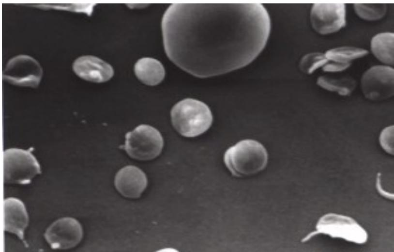
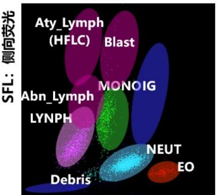
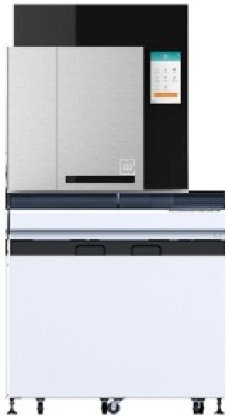

# 血液检验基础自学课件

Sysmex 学术部 李强

Together for a better healthcare journey

# 目录

# 1，血液基本概念：

1.1，组成和作用、

1.2，血细胞生成：红细胞、血小板、白细胞

2，血液学检验基础：

2.1，血常规抗凝剂  2.2，进样检测方式  2.3，检测原理（三分类-五分类）  2.4，检测参数  2.5，XN/XR的机型  2.6，XR的特点（临床价值）  2.7，血液分析流水线的组成

# 1.1，血液的组成和作用

# 组成

1. 血液占我们体重的  $7.7\% \Rightarrow 3.5 - 5L$

2. 血液呈现红色是由血红蛋白的含量决定

3. 血液是在骨髓中产生，主要成分是血浆、血小板、白细胞、红细胞

# 血液的作用

1. 运输…

氧气营养成分激素废物

2. 调节体温3.产生凝固

# 1.2，血细胞的生成与分化

# 红细胞（Erythrocyte, RBC）

形状：两面凹的盘  ·体积：大约80- 100fL  ·1/3的重量是血红蛋白  ·不含细胞核和线粒体  ·传输氧气

细胞寿命：大约120天

每天大概有4- 5万个细胞被胰腺/肝脏破坏

白天：细胞数较多

晚上：细胞数相对较少（大约少几个百分点）

夏天：细胞数更少

冬天：细胞数更多

# 社外密

# 红细胞的作用及参考范围

红细胞是在骨髓中产生的。它将氧气输送到全身，并通过将不必要的二氧化碳排出体外，调节血液的pH值，起到重要作用。

<table><tr><td>参数</td><td>男</td><td>女</td></tr><tr><td>RBC</td><td>4.3-5.8
×1012/L</td><td>3.8-5.1
×1012/L</td></tr><tr><td>HGB</td><td>130-175g/L</td><td>115-150g/L</td></tr></table>

# 血小板（PLT）

- 大小：2 to 4 μm- 生命周期：8 to 10 天- 血小板拥有凝血与止血的作用- 随严重出血而减少

# 血小板的作用和参考范围

血小板在止血中起主要作用。当血管有裂口时，血小板附着在血管壁上。然后他们激活形成一个大的肿块来堵塞裂口和止血。

因此，当血小板数量减少时，我们就容易出血，而且很难阻止。

PLT 参考范围：125- 350×109/L

# 白细胞 (Leukocyte, WBC)

WBC吸收并消灭（吞噬）细菌、病毒或其他异物，以保护身体不受其侵害。

WBC还能产生免疫抗体，杀死细菌、病毒和癌细胞（免疫反应）。

WBC参考范围：3.5- 9.5×10^9/L

# 五种不同的白细胞

# 目录

# 1，血液基本概念：

1.1，组成和作用、1.2，血细胞生成：红细胞、血小板、白细胞

# 2，血液学检验基础：

2，血液学检验基础：2.1，血常规抗凝剂2.2，进样检测方式2.3，检测原理（三分类- 五分类）2.4，检测参数2.5，XN/XR的机型2.6，XR的特点（临床价值）2.7，血液分析流水线的组成

# 社外密

# 2.1，血常规抗凝剂

<table><tr><td>抗凝剂</td><td>检测</td><td>注意</td></tr><tr><td>EDTA-2K</td><td>细胞计数</td><td>金属离子螯合剂</td></tr><tr><td>EDTA-3K</td><td>形态学</td><td>→不适合凝血、血气/pH/电</td></tr><tr><td>EDTA-2Na</td><td></td><td>解质检测</td></tr><tr><td>枸橼酸钠</td><td>凝血</td><td>遇到EDTA依赖性聚集时，可</td></tr><tr><td></td><td>免疫项目</td><td>作为PLT计数的备选抗凝样本</td></tr></table>

# 2.2，XN/XR血液分析仪进样方式

1，静脉全血自动进样

2，静脉全血手动进样

1、全自动进样模式，采集160ul以上末梢全血至RBT试管，试管内预置了EDTA- 2K抗凝剂（抗凝剂最终质量浓度  $2\%$  ），将试管放在RBT试管架，上机自动进样全血模式检测

注：RBT（Raised Bottom Tube，底部抬高的试管），可用于末梢血全血自动进样

RBT试管 样本放在RBT试管架

上机自动进样

末梢全血

2、手动进样模式：采集160ul以上末梢血至微量采血管，试管内预置了EDTA- 2K抗凝剂（抗凝剂最终质量浓度  $2\%$  ），将微量采血管放在仪器上手动进样全血模式检测

3，预稀释模式：20ul全血+120ulDCL稀释液至微量采血管，DCL稀释液中有EDTA- 2K，能起到抗凝的作用，将微量采血管放在仪器上用预稀释模式手动进样检测

20ul全血+120ul

社外密

# 2.3，检测原理——RBC/PLT 通道

# 脉冲组合→直方图绘制

# 2.3，检测原理——HCT

# 参考方法：离心法

$$
\mathsf{HCT} = \mathsf{b} / \mathsf{a}\times 100(\%) \tag{HCT = b/a x 100 (%)}
$$

# 市场上两种 HCT 检测方法：

第一种方法，先检测 MCV，再计算 HCT：平均红细胞体积（MCV）由红细胞直方图得出，它是红细胞直方图中所有细胞的平均脉冲大小，乘以校准因子，得到 MCV。HCT=MCV*RBC/10  代表厂家：贝克曼库尔特、迈瑞等。

第二种方法，直接检测 HCT，然后计算 MCV：累计细胞的脉冲高度来检测 HCT，MCV=HCT/RBC*10  代表厂家：Sysmex

直接检测 HCT 的优点：国际参考方法也是直接检测 HCT，然后计算 MCV，这样便于通过参考方法校正仪器，使得仪器检测结果与国际参考方法一致。

# 2.3，检测原理——HGB

# 2.3，检测原理——WBC 三分类

# 2.3，检测原理——不同厂家WBC五分类

核酸荧光染色原理：利用核酸荧光染料与细胞内的核酸特异性结合，在激光的激发下产生侧向荧光（SFL）侧向散射光（SSC）前向散射光（FSC），通过三种信号，对白细胞进行更精细的分类，同时由于异常细胞荧光更强，可以灵敏地检测异常细胞。

代表仪器品牌：希森美康、迈瑞（高端机）、迈克（高端机）、帝迈（高端机）

过氧化物酶法的原理：利用不同种类的白细胞胞浆内所含的过氧化物酶（Myeloperoxidase, MPO）的含量差异。通过酶促化学反应产生颜色沉淀，再结合光学检测和细胞体积测量，来对白细胞进行初步分类。

代表仪器品牌：西门子等

VCS的原理：对白细胞采用三个截然不同的方法，逐个、分析每一个白细胞的特性，即体积（V）、内部结构（C）、颗粒性和膜表性（S）等，对每个细胞的三项检测值作综合分析，实现白细胞的五分类。

代表仪器品牌：贝克曼库尔特

多角度散射光分析原理：一束激光照射到单个细胞上，由于细胞本身的物理特性（如大小、内部复杂度、核形等），会在不同方向上产生不同强度的散射光。通过检测这些特定角度的散射光强度，就可以推断出该细胞的多种物理特征，从而进行精确分类。

代表仪器品牌：雅培

# 2.3，检测原理——Sysmex XR/XN 仪器

# 使用半导体激光 + 流式细胞术 + 核酸荧光染色

3个激光选用2个用来绘制散点图.

SysmexXR/XN仪器WBC分类通道技术特点  

<table><tr><td>检测通道</td><td>检测原理</td><td>检测项目</td><td>优势</td><td>解决问题</td></tr><tr><td>WNR</td><td rowspan="2">流式细胞技术、核酸荧光染色原理</td><td>WBC、BASO#、BASO%、NRBC#、NRBC%</td><td>NRBC和CBC都在WNR通道出结果，无需专用试剂，因此没有额外的试剂成本</td><td>1.XN通过检测NRBC，能自动修正白细胞计数和分类。
2.NRBC检测为临床提供了一个非常有用的参数：如贫血、白血病、MDS等疾病的诊断上有很高的临床价值。</td></tr><tr><td>WDF</td><td>LYMPH#、LYMPH%、MONO#、MONO%、EO#、EO%、IG#、IG%</td><td>检测异常细胞灵敏度高、LW（低值白细胞）模式复检</td><td>1.该通道检测异常细胞灵敏度高，不漏检。
2.使用低值白细胞模式时，计数的白细胞是全血模式下，计数颗粒的3倍与常规模式，可更准确且高精度的检测低值范围的白细胞。</td></tr><tr><td>WPC
3R复检功能：有异常细胞报警时自动追加WPC模式</td><td>白细胞数量低时由细胞数量低时自动追加WPC模式</td><td>HPC#、HPC%、Abla、Lymph模式检测，2.异端细胞特异性的弱有序致降低</td><td></td><td>1.快速检测HPC，用于干细胞移植供体的外周血干细胞水平检测，确定最佳采集时机
2.异端细胞特异性的弱有序致降低</td></tr></table>

  
SEL：侧向荧光

  
WDF散点图

SSC：侧向散射光WPC散点图（主屏）

  
社外密

# Sysmex XR/XN 仪器 RET 通道共同特点

原理：使用半导体激光器进行流式细胞分析

检测项目：RET#/

<table><tr><td>%</td><td>He</td></tr><tr><td>RET—He可用于功能性缺铁的鉴别诊断；</td><td></td></tr><tr><td>缺铁性贫血的早期诊断以及治疗效果的监测。</td><td></td></tr></table>

优势：RET 通道还可获得研究参数 RBC- O、HGB- O、MCHC- O，为冷凝集、脂血等异常样本提供解决方案

<table><tr><td></td><td>传统方法</td><td>RET 通道纠正</td></tr><tr><td>乳糜样本</td><td>血浆置换、公式校正法操作 繁琐，耗时较长，影响 TAT</td><td>41℃ 孵育核酸荧光染色，无需预处理样本，通过 RET 检测快速获得 HGB-O</td></tr><tr><td>冷凝集样本</td><td>水浴法，37 度温育半小时，耗时费力，影响 TAT</td><td>41℃ 孵育核酸荧光染色，无需预处理样本，通过 RET 检测获得 RBC-O</td></tr></table>

<table><tr><td></td><td>乳糜样本</td><td>冷凝集样本</td></tr><tr><td>纠正公式</td><td>HGB-O 从 RET 通道算出的血红蛋白浓度 MCHC Lipid=MCHC-O = HGB-O/HCT MCH Lipid=RBC-He</td><td>RBC-O 从 RET 通道检测的红细胞计数 R-MFV 近似红细胞平均体积 MCV MCHC_Agg=RBC-He/R-MFV MCH_Agg=RBC-He HCT_Agg=RBC-O*R-MFV</td></tr></table>

  
SFL：侧向荧光

# Sysmex XN/XR 仪器 PLT-F 通道的共同点

<table><tr><td>仪器</td><td>检测原理</td><td>采用染料\染色部位</td><td>检测项目</td><td>解决问题</td></tr><tr><td>XN/XR</td><td>流式细胞技术、核酸荧光染色原理</td><td>染料：噻嗪染色部位：染色线粒体DNA</td><td>PLT-F、IPF</td><td>当冷球蛋白大量存在、经放化疗治疗后标本出现微小红细胞碎片等会对常规血小板检测造成干扰。且PLT-F通道采用核酸荧光染色原理，通过噻嗪染料对线粒体和小胞体DNA进行特异性染色，且通过5倍计数方式，能够特异性的排除此类干扰，同时用于低值血小板的检测，其重复性更好，准确性更高。</td></tr></table>

  
SFL：侧向荧光

# Sysmex XN/XR 血小板三种方法的特点

- 电阻抗法血小板计数（PLT-I）：通过细胞大小区分血小板，但易受小红细胞、红细胞碎片、大血小板等干扰；

- 光学法血小板计数（PLT-O）：采用核酸荧光染色原理，在RET通道染RNA，PLT-O光学法只染色RNA，减少部分干扰，但仍受微小碎片影响；

- 荧光法计数血小板（PLT-F）：采用核酸荧光染色原理，通过噬嗪染料对线粒体DNA进行特异性染色，当存在大量冷球蛋白、或标本来源于经放化疗治疗的患者（此类情况易产生微小红细胞碎片）时，PLT-F可特异性排除其对PLT造成的干扰。同时PLT-F通道可通过“5倍计数+特异性染色血小板”的双重机制，显著提升低值血小板检测的重复性与准确性，为临床提供更可靠的检测结果。

3R复检功能：PLT低或干扰时可自动追加PLT- F模式复检；

  
RET散点图

  
PLT-F散点图  
SFL：侧向荧光

# 2.4，血液学检测中的参数

# CBC参数

CBC参数WBC, RBC, PLTHGBHCTMCVMCHMCHC

# CBC直方图计算参数：

RDW- SD, RDW- CV, PCT, MPV, PCT, P- LCR)

# WBC分类参数

# RET参数

RET%，RET#，LFR，MFR，HFR，IRF，其他参数

NRBC，IG，RET- He，IPF等等

红细胞相关参数的临床意义  

<table><tr><td>项目</td><td>中文名称</td><td>临床意义</td></tr><tr><td>RBC</td><td>红细胞计数</td><td>增高：生理性（高山地区的居民和登山运动员，新生儿儿，感情冲动、兴奋、恐惧）；严重呕吐、腹泻、大面积烧伤及晚期消化道肿瘤患者；原发性红细胞增多性疾病；继发性红细胞增多性疾病；上腺素、糖皮质激素、雄激素、大量失水。
减低：生理性（妊娠中后期，婴幼儿，老年人）；各种贫血（如消化性溃疡、痔疮、十二指肠钩虫病、血型不合输血溶血反应、蚕豆病、遗传性球形红细胞增多症、慢性肾功能衰竭、原发性再生障碍性贫血）；药物使用（异烟肼、硫唑嘌呤、酒精等引起的造血原料不足或抗肿瘤药物、磺胺类药物、保泰松、有机砷、马利兰等）；脾功能亢进、大量失血、肝硬化腹水、严重营养不良、尿毒症、癌症骨髓转移、慢性炎症、结缔组织病等</td></tr><tr><td>HGB</td><td>血红蛋白浓度</td><td>增高：肺气肿、肺心病、先天性心脏病、严重呕吐、腹泻、出汗过多、大面积烧伤、慢性一氧化碳中毒及真性红细胞增多症等。
减低：贫血、白血病、产后、手术后、大量失血、钩虫病等。</td></tr><tr><td>HCT</td><td>红细胞压积</td><td>增高：大量脱水、血液丢失及真性红细胞增多症，均由于血液浓缩而使红细胞压积增高。
减低：各种贫血。</td></tr><tr><td>MCV</td><td>平均红细胞体积</td><td>增高：急性溶血性贫血及巨红细胞性贫血。减低：缺铁性贫血、地中海贫血等小细胞性贫血。</td></tr><tr><td>MCH</td><td>平均血红蛋白含量</td><td>增高：大细胞性贫血。减低：单纯小细胞性贫血和小细胞低色素性贫血。</td></tr><tr><td>MCHC</td><td>平均血红蛋白浓度</td><td>增高：大细胞性贫血。减低：小细胞低色素性贫血。</td></tr><tr><td>RDW-SD</td><td>红细胞体积分布宽度 -SD</td><td rowspan="2">常与 MCV 结合可将贫血分为小细胞均一性与不均一性贫血。其中 RDW-SD 不受 MCV 的影响，RDW-CV 收到 MCV 的影响</td></tr><tr><td>RDW-CV</td><td>红细胞体积分布宽度 -CV</td></tr><tr><td>NRBC“</td><td>在较低级阶段的计数</td><td>常与 MCV 结合可将贫血分为小细胞均一性与不均一性贫血。其中 RDW-SCV 不受 MCV 的影响</td></tr></table>

白细胞相关参数的临床意义  

<table><tr><td>项目</td><td>中文名称</td><td>临床意义</td></tr><tr><td>WBC</td><td>白细胞计数</td><td>增高：新生儿、运动、疼痛、情绪变化、应激、妊娠、分娩等生理性增高。急性感染，组织损伤，恶性肿瘤及白白病骨髓纤维化、真性红细胞增多症、尿毒症、酸中毒、烧伤等病理性增高。
减低：细菌感染（如伤感、副伤寒）；病毒感染（如流感、风疹、麻疹）；血液病（再生障碍性贫血、急性粒细胞缺乏症等）；脾功能亢进；接触放射性物质、X线、某些抗癌药、解热镇痛药等。</td></tr><tr><td>NEUT%</td><td>中性粒细胞百分比</td><td>增高：急性感染和化脓性感染；组织损伤；恶性肿瘤；尿毒症；糖尿病酸中毒等。</td></tr><tr><td>NEUT#</td><td>中性粒细胞绝对值</td><td>减低：传染病（流感、伤寒、副伤寒等）；血液病（再障、粒细胞缺乏症、白细胞减少症等）；化疗或放疗后；抗癌药物；脾功能亢进，自身免疫性疾病等。</td></tr><tr><td>LYMP%</td><td>淋巴细胞百分比</td><td>增高：病毒或细胞所致的传染病（传染性淋巴细胞增多症、传染性单核细胞增多症、传染病恢复期、结核病等）；淋巴细胞性白血病；白血性淋巴肉瘤。</td></tr><tr><td>LYMP#</td><td>淋巴细胞绝对值</td><td>减低：应用肾上腺皮质激素、接触放射线，细胞免疫缺陷病、某些传染病的急性期。</td></tr><tr><td>MONO%</td><td>单核细胞百分比</td><td rowspan="2">增高：感染（伤寒、结核、疟疾、黑热病、亚急性细菌性心内膜炎）；血液病（单核细胞性白血病、淋巴瘤、骨髓异常增殖综合症、恶性组织细胞病）</td></tr><tr><td>MONO#</td><td>单核细胞绝对值</td></tr><tr><td>EO%</td><td>嗜酸性粒细胞百分比</td><td rowspan="2">增高：变态反应性疾病（支气管哮喘、药物过敏、荨麻疹、血管神经性水肿、过敏紫癜）；寄生虫病（蛔虫病、钩虫病、血吸虫病）；皮肤病（湿疹、牛皮癣、剥脱性皮炎等）；血液病（慢粒、恶性淋巴瘤、嗜酸性粒细胞性白血症、多发性骨髓瘤、何杰金氏病等）。</td></tr><tr><td>EO#</td><td>嗜酸性粒细胞绝对值</td></tr><tr><td>BASO%</td><td>嗜碱性粒细胞百分比</td><td>增高：慢性粒细胞性白血病、淋巴网细胞瘤、红细胞增多症、罕见嗜酸性粒细胞性白血病、骨髓纤维化或转移癌等；创伤、中毒、脾切除术后；铅中毒、铋中毒，以及注射疫苗等。</td></tr><tr><td>BASO#</td><td>嗜碱性粒细胞绝对值</td><td>减低：疾病（速发性过敏反应如荨麻疹、过敏性休克等）；用药（促肾上腺皮质激素、肾上腺皮质激素应用过量及应激反应等）</td></tr><tr><td>IG%</td><td>幼稚粒细胞百分比</td><td rowspan="2">外周血中出现IG是骨髓造血功能增强、髓血屏障破坏或出现髓外造血的重要信息，是临床对炎症、血
病、败血症和成人与婴幼儿感染性疾病等进行诊断、治疗监测及预后判断的重要参数；对白血病的临床诊断提供依据。</td></tr><tr><td>IG#</td><td>幼稚粒细胞绝对值</td></tr></table>

血小板相关参数的临床意义  

<table><tr><td>项目</td><td>中文名称</td><td>临床意义</td></tr><tr><td>PLT</td><td>血小板计数</td><td>增高：原发性血小板增多症、慢性粒细胞性白血病、真性红细胞增多症、溶血性贫血、淋巴瘤；手术后、急性失血后、创伤（急性失血性贫血，脾摘除术后等）、骨折、某些恶性肿瘤、感染、缺氧。
减低：骨髓造血功能障碍、再生障碍性贫血、各种急性白血病、骨髓转移瘤、骨髓纤维化、多发性骨髓瘤、巨大血管瘤、全身性红斑狼疮、恶性贫血、巨幼细胞性贫血；特发性血小板减少性紫癜、肝硬化、脾功能亢进、体外循环等；脾肿大、各种原因引起的血液稀释；弥散性血管内凝血、阵发性睡眠血红蛋白尿症、某些感染（如伤寒、黑热病、麻疹、出血热多尿期前、传染性单核细胞增多症、粟粒性结核和败血症）、出血性疾病（如血友病）、坏血病、阻塞性黄疸、过敏性紫癜等；药物中毒或过敏。</td></tr><tr><td>PDW</td><td>平均血小板体积</td><td>增高：原发性血小板减少性紫癜、妊娠后期伴浮肿和蛋白尿者，以及急性失血（外伤）或大手术后的巨大血小板综合征（Bermard Soulier 综合征）。
减低：非免疫性血小板破坏、再障、湿疹和血小板减少反复感染综合征（Wiskolt-Aldrich 综合征）、骨髓移植恢复期、先天性子痫及慢性粒细胞性白血病。</td></tr><tr><td>MPV</td><td>血小板分布宽度</td><td>增高：巨幼红细胞贫血、急性粒细胞白血病、骨髓异常增生综合症（MDS）、原发性血小板减少性紫癜等。</td></tr><tr><td>P-LCR</td><td>大血小板比率</td><td>增高：外周血液血小板破坏增多时，若骨髓造血功能良好，则未成熟血小板比率增高。
减低：血小板增生不良，未成熟血小板减低，提示骨髓造血功能受抑制。</td></tr><tr><td>PCT</td><td>血小板压积</td><td>增高：反应性及原发性血小板增多症、慢性粒细胞白血病早期等。
减低：再生障碍性贫血、化疗后及血小板减少症。</td></tr><tr><td>IPF</td><td>网织血小板比率</td><td>评估骨髓生成血小板的状态，IPF升高表示骨髓生成功能旺盛，IPF下降表示骨髓生成功能低下或受抑；有助于对血小板减少的原因行快速有效的鉴别诊断，外周血血小板破坏增加导致IPF升高，骨髓造血低下新生血小板减少，IPF下降。</td></tr></table>

# 2.5，XN&XR机型和通道

<table><tr><td rowspan="2" colspan="2"></td><td colspan="2">XN-20&amp;amp;XR-20</td><td colspan="4">XN-10&amp;amp;XR-10</td></tr><tr><td>A1</td><td>A2</td><td>B1</td><td>B2</td><td>B3</td><td>B4</td></tr><tr><td rowspan="8">检测通道</td><td>WNR</td><td>○</td><td>○</td><td>○</td><td>○</td><td>○</td><td>○</td></tr><tr><td>RBC/PLT</td><td>○</td><td>○</td><td>○</td><td>○</td><td>○</td><td>○</td></tr><tr><td>HGB</td><td>○</td><td>○</td><td>○</td><td>○</td><td>○</td><td>○</td></tr><tr><td>WDF</td><td>○</td><td>○</td><td>○</td><td>○</td><td>○</td><td>○</td></tr><tr><td>WPC</td><td>○</td><td>○</td><td>×</td><td>×</td><td>×</td><td>×</td></tr><tr><td>RET</td><td>○</td><td>○</td><td>○</td><td>×</td><td>○</td><td>×</td></tr><tr><td>PLT-O</td><td>△</td><td>○</td><td>△</td><td>×</td><td>○</td><td>×</td></tr><tr><td>PLT-F</td><td>○</td><td>×</td><td>○</td><td>○</td><td>×</td><td>×</td></tr><tr><td rowspan="5">检测模式</td><td>WB，PD</td><td>○</td><td>○</td><td>○</td><td>○</td><td>○</td><td>○</td></tr><tr><td>BF</td><td>○</td><td>○</td><td>○</td><td>○</td><td>○</td><td>○</td></tr><tr><td>HsA</td><td>○</td><td>○</td><td>○</td><td>×</td><td>○</td><td>×</td></tr><tr><td>LW</td><td>○</td><td>○</td><td>○</td><td>○</td><td>○</td><td>○</td></tr><tr><td>RBT</td><td>○</td><td>○</td><td>○</td><td>○</td><td>○</td><td>○</td></tr></table>

WNR：WBC&NRBC，白细胞有核红细胞检测通道  RBC/PLT：RBC/PLT计数通道  HGB：hemoglobin，HGB检测通道  WDF：WBC differential count，白细胞分类通道  WPC：WBC Precursor Cells，幼稚白细胞检测通道  RET：Reticulocyte，网织红细胞检测通道  PLT- O：PLT- optical，RET通道检测的光学法血小板计数  PLT- F：PLT- Fluorescence，PLT- F通道检测的荧光法血小板计数  WB：whole blood，全血模式  PD：prediluted，预稀释模式  BF：body fluid，体液模式  HsA：High sensitivity analysis，体液高敏模式  LW：low WBC，低值白细胞模式（3倍计数）  RBT：raised bottom tube，末梢血自动进样模式

○：搭载 ×：未搭载 △：作为参考参数汇报

# XN 主要机型

# XR 主要机型

# 2.6，XR 系列血液分析仪的特点（临床价值）

<table><tr><td>感染参数简写</td><td>感染参数 中文名称</td></tr><tr><td>AS-LYMP#*</td><td>高荧光强度合成抗体的淋巴细胞计数</td></tr><tr><td>AS-LYMP%*</td><td>高荧光强度合成抗体的淋巴细胞百分比</td></tr><tr><td>RE-LYMP#*</td><td>高荧光强度感染反应性淋巴细胞计数</td></tr><tr><td>RE-LYMP%*</td><td>高荧光强度感染反应性淋巴细胞百分比</td></tr><tr><td>NEUT-RI*</td><td>中性粒细胞活化强度</td></tr><tr><td>NEUT-GI*</td><td>中性粒细胞颗粒强度</td></tr><tr><td>AS-LYMP%L*</td><td>高荧光强度合成抗体的淋巴细胞 / 淋巴细胞比</td></tr><tr><td>RE-LYMP%L*</td><td>藩荧光强度感染反应性淋巴细胞 / 淋巴细胞比</td></tr></table>

# 慢性淋巴细胞白血病（CLL）

# XR的3D散点图

- 3D散点图只能在[图形]屏幕上显示- 双击所需的散点图以显示三维散点图。

分类准确性更高（白细胞分类；WBC/PLT报警信息）异常细胞的3D分析，异常细胞区分更准确，6种类型的散点图（WNR，WDF，RET，PLT- F，WPC、体液模式）可以显示3D模式

通过3D散点图，我们可以更清楚地确认Blast（红点）的位置。

# 社外密

# 感染指标的临床价值

<table><tr><td>感染参数简写</td><td>感染参数 中文名称</td></tr><tr><td>AS-LYMP#*</td><td>高荧光强度合成抗体的淋巴细胞计数</td></tr><tr><td>AS-LYMP%*</td><td>高荧光强度合成抗体的淋巴细胞百分比</td></tr><tr><td>RE-LYMP#*</td><td>高荧光强度感染反应性淋巴细胞计数</td></tr><tr><td>RE-LYMP%*</td><td>高荧光强度感染反应性淋巴细胞百分比</td></tr><tr><td>NEUT-RI*</td><td>中性粒细胞活化强度</td></tr><tr><td>NEUT-GI*</td><td>中性粒细胞颗粒强度</td></tr><tr><td>AS-LYMP%L*</td><td>高荧光强度合成抗体的淋巴细胞/淋巴细胞比率</td></tr><tr><td>RE-LYMP%L*</td><td>高荧光强度感染反应性淋巴细胞/淋巴细胞比率</td></tr></table>

# 感染指标临床价值

用药监测，可以作为临床判断是否停药的依据；

区分细菌和病毒感染

可以用于评估活跃性炎症过程中免疫细胞的激活。

确定病原体和感染时免疫反应的状态

提供了关于免疫反应激活的额外信息，并帮助临床医生详细监测炎症情况

# XR 特殊参数可对骨髓再生功能评估

<table><tr><td>PLT-F 通道</td><td>• IPF：造血干细胞移植后的存活指标；快速、灵敏指示骨髓增生，指导血小板输注</td></tr><tr><td>WPC 通道</td><td>• HPC：评价骨髓动员效果，选择最佳采集时间</td></tr><tr><td>RET 通道</td><td>• IRF：反映幼稚RET的比例，对早期骨髓红系增生有指示作用
• RET-He：评价缺铁或铁利用障碍（功能性缺铁）</td></tr></table>

# 2.7，XR流水线家族成员，实现临检全血一管通

# SR-1000 倾倒式血球前处理模块

# 功能和优势

倾倒式前处理：无需人工分拣样本，SR- 1000 替代人工，对不同项

目的样本进行归类

分拣：流水线上不同过检测项目的样本进行分类插入试管架，插批量送入指定分析仪检测，实现最高效率。

归档：完成检测的样本自动归档、生成固定架位号，便于查找。

速度快：分拣 & 归档速度为 800T/H，比人工更快速、更准确。

# BT-50 自动进样模块和冷藏模块——在家质控模块

# 冷藏模块：质控品储藏、自动开关机和自动执行质控程序

# 主要功能和优势

无人值守，自动开机（开机时间、需要开机的设备）

质控品冷藏功能

自定义设置质控检测：质控检测时间、质控频次，需要质控的仪器、选择质控检测水平。实现到岗前自动完成质控检测。

BT- 50 实现质控品标准化检测，排除人为操作失误导致的失控

质控检测结果可通过XQC系统在手机上实时查询，负责人休假中也可远程确认质控结果

一键清洗：内部可存储40支XN清洗液，并能自定义清洗指定仪器清洗完成后也可选择关闭指定模块

# XQC 实时在线管理平台——随时可以了解仪器的准确性

1、一套质控品用于CBC+DIFF+NRBC+RET+PLT- F2、一支校准品即可做RBC、WBC、PLT、RET

1、PLT- O、PLT- F 都有校准，有质控

# Laboman easyAccess 8.0 AI 规则挖掘

# 可实现血液分析正常结果智能审核

融合百亿级医疗大模型参数，赋予AI媲美资深检验专家的诊断思维，实现血液分析结果智能化解读

读

AI规则挖掘、病例模型建立，助力科研

<table><tr><td></td><td>实验规则</td><td>基准规则</td></tr><tr><td>总样本数：</td><td>7237</td><td>7237</td></tr><tr><td>阳性样本数(真实)：</td><td>4800</td><td>4800</td></tr><tr><td>阴性样本数(真实)：</td><td>2437</td><td>2437</td></tr><tr><td>阳性样本数(预测)：</td><td>5241</td><td>182</td></tr><tr><td>阴性样本数(预测)：</td><td>1996</td><td>7055</td></tr><tr><td>假阴率：</td><td>1.55%</td><td>64.46%</td></tr><tr><td>假阳性：</td><td>7.64%</td><td>0.65%</td></tr><tr><td>真阴率：</td><td>26.03%</td><td>33.02%</td></tr><tr><td>真阳性：</td><td>64.78%</td><td>1.87%</td></tr><tr><td>放行率：</td><td>27.58%</td><td>97.49%</td></tr><tr><td>总有效率：</td><td>90.81%</td><td>34.89%</td></tr><tr><td>阳性初示值：</td><td>89.45%</td><td>74.18%</td></tr><tr><td>阴性初示值：</td><td>94.39%</td><td>33.88%</td></tr><tr><td>特异度：</td><td>77.31%</td><td>98.07%</td></tr><tr><td>灵敏度：</td><td>97.67%</td><td>2.81%</td></tr><tr><td>约登规数：</td><td>0.75</td><td>0.01</td></tr><tr><td>假阴率-95%置信区间：</td><td>1.53%~1.56%</td><td>64.46%~64.56%</td></tr><tr><td>(1000次50%随机采样)</td><td></td><td></td></tr><tr><td>卡方检验</td><td>卡方值:120.320; P:0.000</td><td>卡方值:13193.793; P:0.000</td></tr><tr><td>重点肺病例覆盖率：</td><td>0.00%</td><td>0.00%</td></tr></table>

  
Copyright© Sysmex Corporation

# Laboman easyAccess 8.0 基于 DeepSeek 智能报告解读

# RU-20 试剂浓缩系统

实现了不停机更换，提高仪器使用效率；

可以做到一台RU- 20同时供3台血球仪使用，或者两台血球加一个推片机，减少了试剂批次的更换频率；

明显为科室节省了试剂放置空间；

解放了操作老师经常试剂搬运的体力劳动；而且在单机、双机、流水线上均可使用。

# DI-60全自动阅片机

# DI-60的主要功能：

外周血涂片分析

高级红细胞软件

体液涂片分析 (选配件)

远程会诊软件 (选备件)

能力评估软件 (选配件：单机版、网络版)

能为客户解决什么问题：

解决无人看片或看片人员不足

解决形态学分类标准一致性问题

解决形态学人员培训困难问题

解决异常形态细胞没有追溯性问题

解决形态学电子资料存档和查询

# 社外密

# TEST1 2.0 全自动血沉分析仪

- ALIFAX 毛细管分光光度法，在 18.5 秒内将分析测量结果转换为光度量，以毫米 / 小时表示，无需等待样本整个堆叠、沉积的全过程。传统魏氏法，每个标本需 60min 检测时间

- 兼容流水线上 EDTA 试管和试管架，无需专用血沉管

- 最少需血量 30μl

- 不受低 HCT 干扰

- 与魏氏法相关性高

# G11全自动糖化血红蛋白分析仪

·检测速度快：

·检测速度快：标准模式下检测仅需30秒／样本，首个报告仅需60秒，能满足高样本量实验室的需求。

·检测精度高：

·检测精度高：批内CV（变异系数）  $< 0.5\%$  ，批间  $CV< 1\%$  ，精密度优于行业标准，结果准确可靠。

·抗干扰能力强：

·抗干扰能力强：基于HPLC技术，优化了分离柱和流动相，针对高通量实验室设计，抗干扰能力强，适用于常规和大批量检测。

·认证权威：

·认证权威：获得NGSP（美国国家糖化血红蛋白标准化计划）、IFCC（国际临床化学与检验医学联合会）双重认证，确保了检测结果的准确性和可靠性。

# 社外密

# 普门PA990pro全自动特定蛋白仪

# 检测速度快：

- CRP+SAA 全血一站式检测，测速可达 180T/h，能够快速为临床诊断提供结果，满足急诊和批量检测需求。

# 检测精准：

- 采用免疫散射比浊法，支持多点定标，同时运用第三代胶乳增强试剂，有效排除非特异反应，增加反应接触面，灵敏度高，特异性好，结果精准可靠。

# 可扩展性好：

- 可与 Sysmex 血液分析流水线链接，实现“血常规 + CRP+SAA”全血“一管通”检测，无需人工干预，极大缩短临床 TAT 时间，提高筛查效率。

# 社外密

# 整体化智慧化 XR 血液分析流水线

1、模块化组合、全血一管通；2、BT- 50 实现在家质控；前后处理系统（样本分抹和回收）；3、浓缩稀释系统；4、智能审核规则；5、全自动推染片机；6、全自动阅片机；7、

# 整体化智慧化 XR 血液分析流水线

自从有了你，真正解放了我

1、仪器灵敏度保证异常样本检出率2、完整的质控校准管理体系（光学法血小板质控和校准）3、疾病筛查参数（血液病筛查及分型，感染、TTP）4、抗干扰能力，提高准确性（细胞碎片，RET 通道 HGB- 0、PLT- F、RBC- O）5、WPC 通道降低复检率6、智能审核规则，统一审核标准7、

# Together for a better healthcare journey