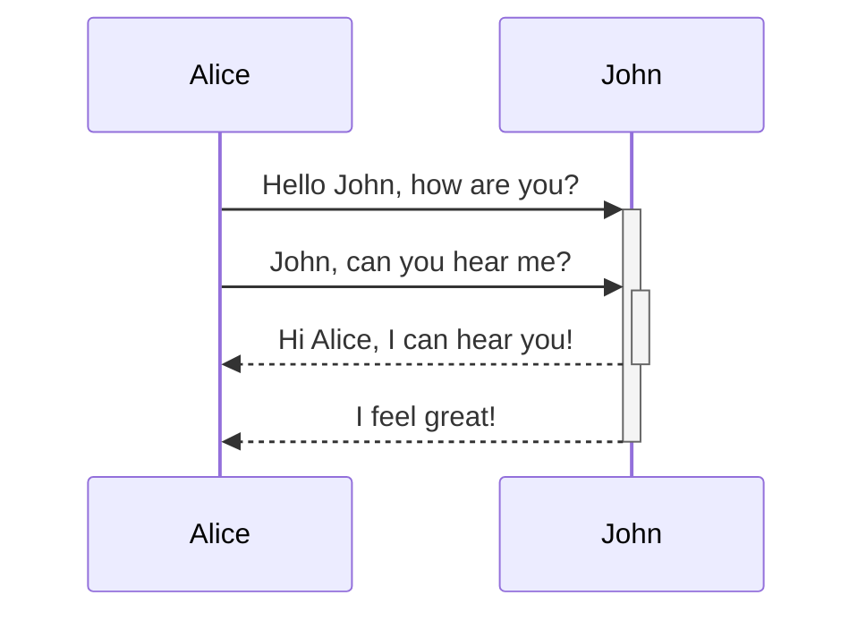

@article{templeton2024scaling,
  title={Scaling Monosemanticity: Extracting Interpretable Features from Claude 3 Sonnet},
  author={Templeton, Adly and Conerly, Tom and Marcus, Jonathan and Lindsey, Jack and Bricken, Trenton and Chen, Brian and Pearce, Adam and Citro, Craig and Ameisen, Emmanuel and Jones, Andy and Cunningham, Hoagy and Turner, Nicholas L and McDougall, Callum and MacDiarmid, Monte and Freeman, C. Daniel and Sumers, Theodore R. and Rees, Edward and Batson, Joshua and Jermyn, Adam and Carter, Shan and Olah, Chris and Henighan, Tom},
  year={2024},
  journal={Transformer Circuits Thread},
  url={https://transformer-circuits.pub/2024/scaling-monosemanticity/index.html}
}