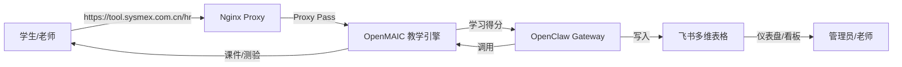

# OpenMAIC 技术架构

> [!info] 来源路径
> `raw/Openmaic/ARCHITECTURE.md`

## TL;DR
OpenMAIC 是面向教学场景的在线课程系统，采用分层设计，由 OpenMAIC 教学引擎、OpenClaw Gateway 消息网关、飞书 Bitable 数据中枢三个核心组件协作完成从课程渲染、权限控制到数据存储、业务自动化的全流程。

## 总体架构
本项目采用分层架构设计，由 **OpenMAIC (教学引擎)**、**OpenClaw Gateway (消息网关)** 和 **飞书 Bitable (数据中枢)** 三部分组成。

## 核心组件要点
| 组件 | 技术栈 | 核心职责 |
| ---- | ---- | ---- |
| OpenMAIC | Next.js | 课程内容生成、互动场景构建、学习进度本地存储 |
| OpenClaw Gateway | Node.js | 飞书生态连接、权限校验、飞书 API 封装为 AI 可调用工具 |
| 飞书 Bitable | 云端服务 | 核心用户学习数据存储、飞书原生自动化业务流 |

### 2.1 OpenMAIC (Next.js)
> [!quote] 原始证据片段
> - **教学大纲生成**: 基于豆包模型 (ark-code-latest) 生成结构化课程大纲。
> - **互动场景构建**: 将大纲项动态转化为幻灯片、测验或互动 HTML 模块。
> - **状态记录**: 每一个 Session 的学习进度记录在本地 SQLite 数据库中。

### 2.2 OpenClaw Gateway (Node.js)
> [!quote] 原始证据片段
> - **飞书连接器**: 负责 WebSocket 长连接，实时监听群聊消息和 Bitable 表单提交事件。
> - **权限校验**: 通过 API Token 认证，确保只有授权用户能访问课堂。
> - **工具调用**: 将 Bitable 的 API 封装为 AI 可直接调用的 Tool (feishu_bitable_record_update)。

### 2.3 飞书 Bitable (云端数据库)
> [!quote] 原始证据片段
> - **数据结构**: 存储包含 OpenID、姓名、课程 ID、得分、完成状态等核心字段。
> - **自动化流**: 飞书原生的自动化流程用于触发“报名成功通知”和“证书自动生成”。

## 关键交互逻辑

### 3.1 测验得分同步流 (Quiz Sync Flow)
> [!quote] 原始证据片段
> 1. 学生在 OpenMAIC 前端提交测验。
> 2. OpenMAIC 后端计算分数后，通过 Webhook/API 通知 OpenClaw。
> 3. OpenClaw 查找该学生的飞书 ID。
> 4. 调用 `feishu_bitable_record_update` 更新 Bitable 中对应的成绩行。

### 3.2 邀请入会流 (Invitation Flow)
> [!quote] 原始证据片段
> 1. 学生填写飞书表单。
> 2. OpenClaw 监听到 `Bitable.RecordCreated` 事件。
> 3. OpenClaw 调用 OpenMAIC 生成一个临时的 `access_token`。
> 4. OpenClaw 将课堂链接通过飞书私聊推送到学生。

## 冲突标注
当前文档无已知外部冲突。
