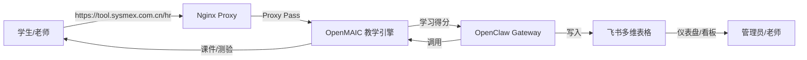

# OpenMAIC 技术架构设计
## 摘要
本文档为OpenMAIC教学项目的官方技术架构说明，项目采用分层架构设计，由OpenMAIC教学引擎、OpenClaw消息网关、飞书Bitable数据中枢三大核心组件构成，覆盖课程生成、互动学习、数据同步、权限管控、自动化通知等核心业务能力。
## 关键要点
### 总体架构
项目整体采用三层服务架构，用户访问经Nginx代理转发，数据流贯穿教学引擎、消息网关与云端数据中枢全链路，整体拓扑如下：

### 核心组件定义
1. **OpenMAIC（Next.js 教学引擎）**：
   - 基于豆包模型（ark-code-latest）生成结构化教学大纲
   - 支持将大纲项动态转化为幻灯片、测验或互动HTML模块
   - 采用本地SQLite数据库存储每个Session的学习进度
2. **OpenClaw Gateway（Node.js 消息网关）**：
   - 作为飞书连接器维护WebSocket长连接，实时监听群聊消息与Bitable表单提交事件
   - 通过API Token实现权限校验，仅授权用户可访问课堂
   - 封装飞书Bitable API为AI可直接调用的工具`feishu_bitable_record_update`
3. **飞书Bitable（云端数据中枢）**：
   - 核心存储字段包含OpenID、姓名、课程ID、得分、完成状态等
   - 依托飞书原生自动化流程触发「报名成功通知」「证书自动生成」等操作
### 核心业务交互流程
1. **测验得分同步流（Quiz Sync Flow）**：
   学生提交OpenMAIC测验→后端计算分数后通知OpenClaw→OpenClaw匹配学生飞书ID→调用工具更新Bitable成绩记录
2. **邀请入会流（Invitation Flow）**：
   学生提交飞书报名表单→OpenClaw监听到Bitable记录创建事件→调用OpenMAIC生成临时`access_token`→通过飞书私聊推送带权限的课堂链接
## 证据来源
本页面所有内容均提取自项目官方架构设计文档 `raw/Openmaic/ARCHITECTURE.md`
