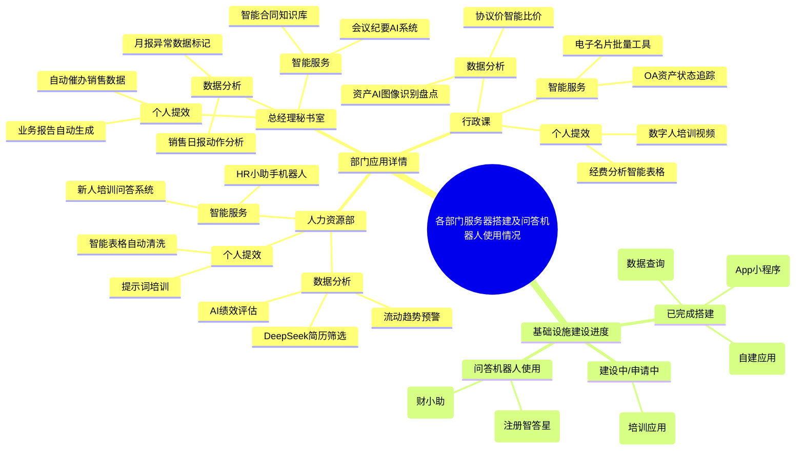

# 各部门服务器搭建及问答机器人使用情况（2025年12月-2026年1月）
> 来源路径：`raw/02_项目文档/AI培训与学习系统/12月到1月AI使用情况收集.md`
> 标签：`AI` `Report` `Usage`
> 更新日期：2026-01-19

---

## TL;DR
本次统计覆盖公司核心部门AI应用落地与基础设施建设情况，多个部门已完成AI工具落地，在事务性工作提效、成本控制、决策效率优化方面取得明确收益；基础设施层面，客服、学术、供应链已完成/推进服务器搭建，HR与行政的培训类AI应用处于申请建设阶段，注册法规部、财务部已独立部署专属问答机器人。

> [!WARNING] 冲突：原始资料思维导图中标记供应链部门为「已完成搭建」，但正文基础设施部分描述为「正在搭建 AI 服务器」，二者表述不一致。

---

## 核心要点
### 1. 各部门AI应用落地收益
| 部门 | 核心业务场景 | 量化收益 |
|------|--------------|----------|
| 人力资源部 | 简历筛选、绩效评估、人力流失预警、员工咨询、新人培训、数据处理 | 简历匹配准确率+40%，决策效率+60%，事务咨询量-45%，报告生成时间压缩83% |
| 总经理秘书室 | 销售动作分析、异常数据识别、会议纪要、合同管理、报告生成 | 重点客户跟进效率+25%，风险识别速度提升8倍，会后执行闭环率从62%升至89%，报告制作时间节省80% |
| 行政课 | 固定资产盘点、差旅比价、资产查询、名片处理、经费报表、课件制作 | 盘点错误率从12%降至3%，年度差旅成本降低134万元，200人名片更新从1天压缩至10分钟，课件制作周期缩短79% |

### 2. 基础设施建设进度
- 已完成服务器搭建：客服部门（提供App/小程序）、学术各部门（支撑自建AI应用）
- 建设中：供应链部门（搭建数据查询类AI服务）、HR及行政部门（申请服务器，搭建培训类AI应用）
- 未独立搭建服务器，已部署专属问答机器人：注册法规部（「注册智答星」）、财务部（「财小助」）

---

## 原始引用证据片段

### 部门应用全景思维导图

### 各部门应用详情
> [!info] 人力资源部
> **数据分析**
> - **招聘场景**：借助 DeepSeek 达成简历智能筛选，岗位匹配准确率提高 40%。
> - **绩效评估**：运用 AI 模型整合胜任力数据（70% 客观指标与 30% 主观评价相结合），使人员优化决策效率提升 60%。
> - **预警系统**：构建人力流动趋势预测模型，能够提前 30 天触发关键岗位流失预警。
>
> **智能服务**
> - 部署 HR 小助手机器人，可 7×24 小时响应入离职、考勤咨询，事务性咨询量降低 45%。
> - 新人培训启用 AI 问答系统，员工手册查询响应时间从 15 分钟缩短为即时响应。
>
> **个人提效**
> - AI 提示词培训覆盖全部 HR 员工，报告生成时间从 3 小时压缩至 30 分钟。
> - 利用智能表格自动清洗考核数据，MBO 出数周期从 5 天变为实时更新。

> [!abstract] 总经理秘书室
> **数据分析**
> - 销售日报通过 AI 分析模型识别动作与目标关联度，重点客户跟进效率提升 25%。
> - 月报预警系统自动标记异常数据，风险识别速度相比人工提升 8 倍。
>
> **智能服务**
> - 会议纪要 AI 系统实现语音转文本并进行任务追踪，会后执行闭环率从 62% 提高到 89%。
> - 搭建智能知识库，合同模板调取时间从 20 分钟减少至 1 分钟。
>
> **个人提效**
> - 智能表格自动催办销售数据提交，盯催时间减少 70%。
> - AI 自动生成业务报告，周报 / 月报制作时间节省 80%。

> [!success] 行政课
> **数据分析**
> - 采用固定资产 AI 图像识别盘点，错误率由 12% 降至 3%，盘点周期缩短 50%。
> - 酒店协议价智能比价系统，年度差旅成本降低 134 万元。
>
> **智能服务**
> - OA 系统集成资产状态追踪功能，查询响应速度从小时级优化至秒级。
> - 电子名片 AI 批量修改工具，将 200 人信息更新工作从 1 天压缩至 10 分钟。
>
> **个人提效**
> - 智能表格处理经费分析，月度报表制作效率提升 65%。
> - 利用数字人自动生成培训视频，课件制作周期由 3 周缩短至 3 天。

### 基础设施建设进度原文
## 2. 基础设施建设进度

### 已搭建 AI 服务器及相关应用
- **客服部门**：已完成 AI 服务器搭建，并提供 app 小程序。
- **学术各部门**：自建应用服务器，搭建 AI 应用。
- **供应链部门**：正在搭建 AI 服务器，构建数据查询服务。

### 申请服务器并搭建培训应用
- **HR 和行政部门**：已申请服务器，现阶段先搭建与培训相关的应用。

### 未搭建服务器但使用问答机器人
- **注册法规部**：搭建 “注册智答星” 问答机器人，并共享相关经验。
- **财务部**：搭建 “财小助” 问答机器人。

## 相关资源
![[AI_Resources.base]]
