> [!INFO]
> 来源路径：`raw/02_项目文档/AI培训与学习系统/Training_Reinforcement_Plan.md`
> 来源类型：图片转录
> 创建日期：2026-01-13
> 标签：`HR` `Training` `Mentorship` `Flowchart`

# 培训强化三大板块与学分制带教计划

## TL;DR
本文件定义了公司新员工完整培训带教体系，分为**培训强化三大板块**和**学分制带教计划**两部分：新员工完成三天入职培训后，主管及以上层级需额外参加小灶培训，所有新员工均需参加新员工训练营，之后进入通用技能、专业知识、岗位实操三阶段学分制带教，每阶段考核通过方可进入下一阶段，全部考核通过后正式录用。

## 要点
### 体系整体结构
1. 培训强化三大板块（橙色区域）：入职初期的基础入职培训、主管及以上专属小灶培训、全层级新员工训练营
2. 学分制带教计划（蓝色区域）：分通用技能、专业知识、岗位实操三个阶段递进带教，学分制考核通过后方可正式录用

### 培训强化三大板块流程
#### 第一板块：入职培训三天
| 负责角色 | 培训内容 |
|---------|---------|
| 新员工 | 完成报到 |
| HR | 公司制度、合同、员工手册 |
| 直属上司 | MBO、责任田、经销商、业务框架、政策、产品、月会规则 |
| 助理 | CRM操作、报销流程、会议规范、战略报告要求 |
| 全流程收尾 | 公司参观 + HR总监面谈 |

#### 身份判定节点
- 若为**主管及以上一线员工**：进入第二板块「小灶培训」
- 若为非主管层级：直接进入学分制带教计划第一阶段

#### 第二板块：小灶培训（仅限主管及以上）
培训内容：渠道管理、市场政策、招标数字管理、客户管理、团队管理、逻辑与批判性思维，完成后进入学分制带教计划第一阶段

#### 第三板块：新员工训练营
流程：扫盲考自学并通过前置考试 → 3天集中训练营课程 → 结业考试 + 收集反馈

---

### 学分制带教计划（三阶段）
#### 阶段 1：通用技能培训
1. 由上司（生免条线）/大客户负责人带教
2. 学习企业文化
3. 参加通识扫盲考
4. 考核规则：
   - 得分≥80分：进入阶段2 专业知识培训
   - 得分<80分：导师补强后重考

#### 阶段 2：专业知识培训
1. 由上司（生免条线）/大客户负责人带教
2. 学习产品知识与标准解读
3. 提交知识测试
4. 考核规则：
   - 得分≥80分：确认阶段完成，进入阶段3 岗位实操
   - 得分<80分：额外辅导后重考

#### 阶段 3：岗位实操
1. 安排对应岗位实操任务
2. 新员工独立实践操作
3. 导师现场指导
4. 提交实训报告
5. 考核规则：
   - 考核通过：正式录用
   - 考核不通过：终止录用流程

---

## 完整流程图

```mermaid
graph TD
    %% 样式定义
    classDef orange fill:#fff5e6,stroke:#ffcc80,color:#333;
    classDef blue fill:#e6f2ff,stroke:#80b3ff,color:#333;
    classDef diamond fill:#fff,stroke:#333,color:#333;

    %% 培训强化三大板块
    subgraph Training_Blocks [培训强化三大板块]
        direction TB
        Step1_Start(新员工报到) --> Step1_HR(HR: 公司制度/合同/手册)
        Step1_HR --> Step1_Boss(上司: MBO/责任田/经销商/框架/政策/产品/月会)
        Step1_Boss --> Step1_Assist(助理: CRM/报销/会议/战略报告)
        Step1_Assist --> Step1_Tour(参观+HR总监面谈)
        
        Step1_Tour --> Decision_Role{身份是主管以上的一线员工?}
        
        %% 小灶培训
        Decision_Role -- 是 --> Step2_Start(渠道管理)
        Step2_Start --> Step2_Market(市场政策)
        Step2_Market --> Step2_Bid(招标数字管理)
        Step2_Bid --> Step2_Client(客户管理)
        Step2_Client --> Step2_Team(团队管理)
        Step2_Team --> Step2_Logic(逻辑与批判性思维)
        Step2_Logic --> Link_To_Phase1(进入通用技能培训)
        
        Decision_Role -- 否 --> Link_To_Phase1
        
        %% 新员工训练营 (独立板块)
        Step3_Start(扫盲考自学+考试通过) --> Step3_Camp(新人训练营课程3天集训)
        Step3_Camp --> Step3_End(结业考试+反馈)
    end

    %% 学分制带教计划
    subgraph Mentorship_Plan [学分制带教计划]
        direction TB
        
        %% 阶段1
        Link_To_Phase1 --> Phase1_Start(上司 生免 / 大客户带教)
        Phase1_Start --> Phase1_Culture(学习企业文化)
        Phase1_Culture --> Phase1_Exam(通识扫盲考)
        Phase1_Exam --> Phase1_Check{≥80分?}
        Phase1_Check -- 是 --> Phase1_Pass(进入专业知识培训)
        Phase1_Check -- 否 --> Phase1_Fail(导师补强)
        Phase1_Fail --> Phase1_Exam
        
        %% 阶段1 -> 阶段2 衔接
        Phase1_Pass --> Link_Phase1_End(第一段结束)
        Link_Phase1_End --> Link_Phase2_Start(衔接第一段结束)
        
        %% 阶段2
        Link_Phase2_Start --> Phase2_Start(上司 生免 / 大客户带教)
        Phase2_Start --> Phase2_Product(产品&标准解读)
        Phase2_Product --> Phase2_Test(提交知识测试)
        Phase2_Test --> Phase2_Check{≥80分?}
        Phase2_Check -- 是 --> Phase2_Pass(通知阶段完成)
        Phase2_Check -- 否 --> Phase2_Fail(额外辅导)
        Phase2_Fail --> Phase2_Test
        
        %% 阶段2 -> 阶段3 衔接
        Phase2_Pass --> Link_Phase2_End(衔接第二段结束)
        
        %% 阶段3
        Link_Phase2_End --> Phase3_Start(安排实操任务)
        Phase3_Start --> Phase3_Action(实践操作)
        Phase3_Action --> Phase3_Guide(现场指导)
        Phase3_Guide --> Phase3_Report(提交实训报告)
        Phase3_Report --> Phase3_Check{考核通过?}
        Phase3_Check -- 是 --> Phase3_Pass(正式录用)
        Phase3_Check -- 否 --> Phase3_Fail(终止)
        Phase3_Pass --> Phase3_End(第三段结束)
    end
    
    %% 应用样式
    class Step1_Start,Step1_HR,Step1_Boss,Step1_Assist,Step1_Tour,Step2_Start,Step2_Market,Step2_Bid,Step2_Client,Step2_Team,Step2_Logic,Step3_Start,Step3_Camp,Step3_End orange;
    class Phase1_Start,Phase1_Culture,Phase1_Exam,Phase1_Pass,Phase1_Fail,Phase2_Start,Phase2_Product,Phase2_Test,Phase2_Pass,Phase2_Fail,Phase3_Start,Phase3_Action,Phase3_Guide,Phase3_Report,Phase3_Pass,Phase3_Fail blue;
    class Decision_Role,Phase1_Check,Phase2_Check,Phase3_Check diamond;
```

## 引用原始证据片段
> 本文件记录了公司新员工培训流程（三大板块）及学分制带教计划的详细流程。
> 
> 流程主要分为两个部分：
> 1.  **培训强化三大板块**（左侧橙色背景）：涵盖入职初期的基础培训、针对主管级以上的小灶培训以及新员工训练营。
> 2.  **学分制带教计划**（右侧蓝色
