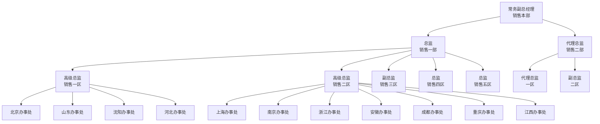
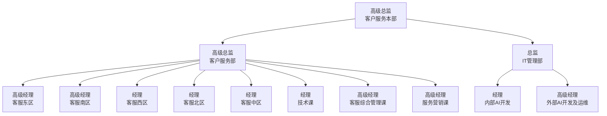
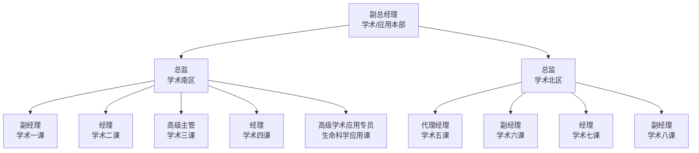
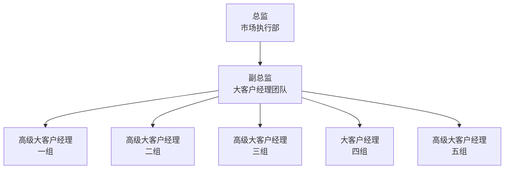

# 希森美康（中国）组织架构

> [!TIP] TL;DR
> 本页整理自希森美康内部公开组织架构图，为希森美康（SCH）现行正式组织架构，最高管理岗为总经理，下辖16个一级部门/机构，本架构仅包含部门层级与岗位设置，不含人员具体任免信息。

---

## 要点
### 顶层架构
最高负责人为**总经理（希森美康/SCH）**，直接管理16个一级部门/直属机构，一级部门负责人职级从主管到常务副总经理不等：
| 一级部门名称               | 负责人职级       |
|----------------------------|------------------|
| 销售本部                   | 常务副总经理     |
| 市场营销部                 | 高级总监         |
| 客户服务本部               | 高级总监         |
| 学术/应用本部              | 副总经理         |
| BD事业开发部               | BD副总监         |
| 注册法规&品保本部          | 总监             |
| 生化免疫事业部             | 总监             |
| 市场执行部                 | 总监             |
| 财务本部                   | 总监             |
| 人力资源行政部             | 总监             |
| 战略分析管理部             | 总监             |
| 法务合规部                 | 主管             |
| 供应链管理部               | 总监             |
| 监察室                     | 总监             |
| 经营企画室                 | 总监             |
| 总经理秘书室               | -                |

---

### 各部门二级及以下架构
#### 1. 销售本部


#### 2. 市场营销部
市场营销部（高级总监）下设3个产品课：
- 血液体液课：高级经理
- 凝血产品课：高级经理
- 综合产品课：经理

#### 3. 客户服务本部


#### 4. 学术/应用本部


#### 5. 注册法规&品保本部
注册法规&品保本部（总监）下设2个二级部门：
- 注册法规部
- 品保部

#### 6. 市场执行部


#### 7. 财务本部
财务本部（总监）下设3个课：
- 财务分析课：高级专员
- 应收账款/信控课：经理
- 财务会计课：一般员工

#### 8. 人力资源行政部
人力资源行政部（总监）下设2个课：
- 人事课：高级专员
- 行政课：高级经理

#### 9. 供应链管理部
供应链管理部（总监）下设3个课：
- 计划与采购管理课：经理
- 进出口与订单管理课：经理
- 物流课：经理

#### 10. 战略分析管理部
战略分析管理部（总监）下设2个课：
- 战略分析课：一般员工
- 商务管理课：经理

#### 11. 其他一级部门
以下一级部门无下属部门记录在原始资料中：
- BD事业开发部
- 生化免疫事业部
- 法务合规部
- 监察室
- 经营企画室
- 总经理秘书室

---

> [!WARNING] 冲突说明
> 本资料仅包含部门架构与对应职级，未包含具体人员任职信息，若其他来源存在人员任职、部门层级调整类差异，属于正常更新差异，本页仅保留原始架构记录。

---

## 引用证据片段
**来源路径**：`raw/org_chart.md`

完整原始架构图：
```mermaid
graph TD
    %% 顶层
    CEO[总经理<br/>希森美康/SCH]
    
    %% 一级部门
    CEO --> Sales[常务副总经理<br/>销售本部]
    CEO --> Mkt[高级总监<br/>市场营销部]
    CEO --> Service[高级总监<br/>客户服务本部]
    CEO --> Academic[副总经理<br/>学术/应用本部]
    CEO --> BD[BD副总监<br/>BD事业开发部]
    CEO --> RA[总监<br/>注册法规&品保本部]
    CEO --> Bio[总监<br/>生化免疫事业部]
    CEO --> Exec[总监<br/>市场执行部]
    CEO --> Finance[总监<br/>财务本部]
    CEO --> HR[总监<br/>人力资源行政部]
    CEO --> Strategy[总监<br/>战略分析管理部]
    CEO --> Legal[主管<br/>法务合规部]
    CEO --> Supply[总监<br/>供应链管理部]
    CEO --> Audit[总监<br/>监察室]
    CEO --> Planning[总监<br/>经营企画室]
    CEO --> Admin[总经理秘书室]
    
    %% 销售本部下设
    Sales --> Sales1[总监<br/>销售一部]
    Sales --> Sales2[代理总监<br/>销售二部]
    
    %% 销售一部下设
    Sales1 --> Area1[高级总监<br/>销售一区]
    Sales1 --> Area2[高级总监<br/>销售二区]
    Sales1 --> Area3[副总监<br/>销售三区]
    Sales1 --> Area4[总监<br/>销售四区]
    Sales1 --> Area5[总监<br/>销售五区]
    
    %% 销售二部下设
    Sales2 --> Div1[代理总监<br/>一区]
    Sales2 --> Div2[副总监<br/>二区]
    
    %% 销售一区下设办事处
    Area1 --> BJ[北京办事处]
    Area1 --> SD[山东办事处]
    Area1
