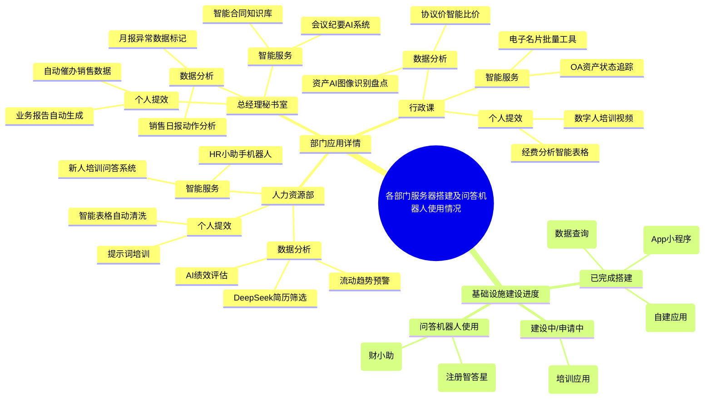

# 各部门服务器搭建及问答机器人使用情况
---
tags:
  - AI
  - Report
  - Usage
date: 2026-01-19
---

## 摘要
本报告为2025年12月-2026年1月公司AI使用情况汇总，覆盖各部门AI应用落地场景、AI基础设施建设进度及问答机器人部署情况，包含各场景效率提升量化数据，为后续公司AI工具推广、基础设施规划提供参考依据。

## 核心概览

## 1. 部门应用详情
> [!info] 人力资源部
> **数据分析**
> - **招聘场景**：借助 DeepSeek 达成简历智能筛选，岗位匹配准确率提高 40%。
> - **绩效评估**：运用 AI 模型整合胜任力数据（70% 客观指标与 30% 主观评价相结合），使人员优化决策效率提升 60%。
> - **预警系统**：构建人力流动趋势预测模型，能够提前 30 天触发关键岗位流失预警。
>
> **智能服务**
> - 部署 HR 小助手机器人，可 7×24 小时响应入离职、考勤咨询，事务性咨询量降低 45%。
> - 新人培训启用 AI 问答系统，员工手册查询响应时间从 15 分钟缩短为即时响应。
>
> **个人提效**
> - AI 提示词培训覆盖全部 HR 员工，报告生成时间从 3 小时压缩至 30 分钟。
> - 利用智能表格自动清洗考核数据，MBO 出数周期从 5 天变为实时更新。

> [!abstract] 总经理秘书室
> **数据分析**
> - 销售日报通过 AI 分析模型识别动作与目标关联度，重点客户跟进效率提升 25%。
> - 月报预警系统自动标记异常数据，风险识别速度相比人工提升 8 倍。
>
> **智能服务**
> - 会议纪要 AI 系统实现语音转文本并进行任务追踪，会后执行闭环率从 62% 提高到 89%。
> - 搭建智能知识库，合同模板调取时间从 20 分钟减少至 1 分钟。
>
> **个人提效**
> - 智能表格自动催办销售数据提交，盯催时间减少 70%。
> - AI 自动生成业务报告，周报 / 月报制作时间节省 80%。

> [!success] 行政课
> **数据分析**
> - 采用固定资产 AI 图像识别盘点，错误率由 12% 降至 3%，盘点周期缩短 50%。
> - 酒店协议价智能比价系统，年度差旅成本降低 134 万元。
>
> **智能服务**
> - OA 系统集成资产状态追踪功能，查询响应速度从小时级优化至秒级。
> - 电子名片 AI 批量修改工具，将 200 人信息更新工作从 1 天压缩至 10 分钟。
>
> **个人提效**
> - 智能表格处理经费分析，月度报表制作效率提升 65%。
> - 利用数字人自动生成培训视频，课件制作周期由 3 周缩短至 3 天。

## 2. 基础设施建设进度
### 已搭建/搭建中 AI 服务器及相关应用
- **客服部门**：已完成 AI 服务器搭建，并提供 App 小程序 AI 服务。
- **学术各部门**：已完成自建应用服务器搭建，用于部署自研 AI 应用。
- **供应链部门**：正在搭建 AI 服务器，用于构建数据查询类 AI 服务。

### 建设中/申请中 AI 应用
- **HR 及行政部门**：已提交服务器申请，现阶段优先搭建培训相关 AI 应用。

### 未搭建服务器但已部署问答机器人
- **注册法规部**：已搭建垂直领域问答机器人「注册智答星」，并共享落地经验。
- **财务部**：已搭建垂直领域问答机器人「财小助」。

## 相关资源
![[AI_Resources.base]]
