# 培训流程图表
## 摘要
本文档通过流程图形式完整梳理了企业新员工从报到到正式录用的全链路培训体系，整体分为「培训强化三大板块」和「学分制带教计划」两大模块，包含分级培训路径、多节点考核机制及不合格处理流程，明确了不同岗位层级员工的差异化培训要求。

## 元数据
- 文档日期：2024-01-01
- 关联标签：#培训流程 #图表

## 核心流程框架
### 第一模块：培训强化三大板块
1. **第一步：入职培训（3天）**：覆盖新员工报到、HR制度宣贯、直属上级业务交底、行政助理操作指引、参观及HR总监面谈5个环节。
2. **分支判断**：入职培训结束后判断员工身份是否为「主管以上的一线员工」：
   - 是：进入「小灶培训」环节，依次学习渠道管理、市场政策、招标数字管理、客户管理、团队管理、逻辑与批判性思维6项内容
   - 否：直接进入学分制带教计划
3. **新员工训练营**：包含扫盲考自学及考试、3天集训、结业考试及反馈3个环节，完成后进入学分制带教计划。

### 第二模块：学分制带教计划
共分为3个阶段，各阶段均设置带教、学习、考核环节，考核不达标需进行补强/辅导，合格后方可进入下一阶段：
1. **阶段1：通用技能培训**：由上司（生免）/大客户带教，学习企业文化后参加通识扫盲考，≥80分进入专业知识培训，未达标由导师补强后重考。
2. **阶段2：专业知识培训**：由上司（生免）/大客户带教，学习产品及标准解读后提交知识测试，≥80分完成本阶段，未达标接受额外辅导后重考。
3. **阶段3：岗位实操**：安排实操任务，经实践、现场指导后提交实训报告，考核通过则正式录用，未达标则终止流程。

## 流程可视化代码

```mermaid
graph TD
    %% Define styles
    classDef orange fill:#fff5e6,stroke:#ffb366,stroke-width:2px;
    classDef blue fill:#e6f2ff,stroke:#66b3ff,stroke-width:2px;
    classDef diamond fill:#ffffff,stroke:#333,stroke-width:2px;

    subgraph "培训强化三大板块"
        direction TB

        %% Step 1
        subgraph Step1["第一步 入职培训三天"]
            S1_1["新员工报到"]
            S1_2["HR: 公司制度/合同/手册"]
            S1_3["上司: MBO·责任田·经销商·框架·政策·产品·月会"]
            S1_4["助理: CRM/报销/会议/战略报告"]
            S1_5["参观+HR总监面谈"]

            S1_1 --> S1_2
            S1_2 --> S1_3
            S1_3 --> S1_4
            S1_4 --> S1_5
        end

        %% Decision
        Decision1{"身份是主管以上的一线员工?"}
        S1_5 --> Decision1

        %% Step 2 (Small Stove)
        subgraph Step2["第二步 小灶培训"]
            S2_1["渠道管理"]
            S2_2["市场政策"]
            S2_3["招标数字管理"]
            S2_4["客户管理"]
            S2_5["团队管理"]
            S2_6["逻辑与批判性思维"]

            S2_1 --> S2_2
            S2_2 --> S2_3
            S2_3 --> S2_4
            S2_4 --> S2_5
            S2_5 --> S2_6
        end

        %% Step 3 (Training Camp)
        subgraph Step3["第三步 新员工训练营"]
            S3_1["扫盲考自学+考试通过"]
            S3_2["新人训练营课程3天集训"]
            S3_3["结业考试+反馈"]

            S3_1 --> S3_2
            S3_2 --> S3_3
        end

        %% Connections for Left Side
        Decision1 -- 是 --> S2_1
        Decision1 -- 否 --> Phase1_Start
        S2_6 --> Phase1_Start
        S3_3 --> Connection1[衔接第一段结束]
        Connection1 --> Phase1_Start
    end

    subgraph "学分制带教计划"
        direction TB

        %% Phase 1
        subgraph Phase1["阶段1_通用技能培训"]
            Phase1_Start["上司（生免）/大客户带教"]
            P1_2["学习企业文化"]
            P1_3["通识扫盲考"]
            P1_Decision{"≥80分?"}

            Phase1_Start --> P1_2
            P1_2 --> P1_3
            P1_3 --> P1_Decision

            P1_Decision -- 是 --> P1_Yes["进入专业知识培训"]
            P1_Decision -- 否 --> P1_No["导师补强"]
            P1_No --> P1_3
        end

        P1_Yes --> Phase2_End[第二段结束]
        Phase2_End --> Phase2_Start

        %% Phase 2
        subgraph Phase2["阶段2_专业知识培训"]
            Phase2_Start["上司（生免）/大客户带教"]
            P2_2["产品&标准解读"]
            P2_3["提交知识测试"]
            P2_Decision{"≥80分?"}

            Phase2_Start --> P2_2
            P2_2 --> P2_3
            P2_3 --> P2_Decision

            P2_Decision -- 是 --> P2_Yes["通知阶段完成"]
            P2_Decision -- 否 --> P2_No["额外辅导"]
            P2_No --> P2_3
        end

        P2_Yes --> Phase3_Start

        %% Phase 3
        subgraph Phase3["阶段3_岗位实操"]
            Phase3_Start["安排实操任务"]
            P3_2["实践操作"]
            P3_3["现场指导"]
            P3_4["提交实训报告"]
            P3_Decision{"考核通过?"}

            Phase3_Start --> P3_2
            P3_2 --> P3_3
            P3_3 --> P3_4
            P3_4 --> P3_Decision

            P3_Decision -- 是 --> P3_Yes["正式录用"]
            P3_Decision -- 否 --> P3_No["终止"]
        end

        P3_Yes --> Phase3_End[第三段结束]
    end

    %% Apply Styles
    class Step1,Step2,Step3 orange;
    class Phase1,Phase2,Phase3 blue;
    class Decision1,P1_Decision,P2_Decision,P3_Decision diamond;
```

