# 培训强化三大板块与学分制带教计划
## 摘要
本文件为公司新员工从报到到正式录用全流程的培训与带教官方规范，整体分为「培训强化三大板块（入职初期基础培训）」与「学分制带教计划（转正阶梯考核）」两大核心模块，明确了不同岗位层级员工的培训路径与考核标准。

## 基本信息
- 关联标签：`HR`、`Training`、`Mentorship`、`Flowchart`
- 文档生成日期：2026-01-13
- 来源类型：图片转录（Image_Transcription）

## 核心流程框架
整体流程分为两大并行关联的体系：
1.  **培训强化三大板块**：覆盖入职初期的分层基础培训
2.  **学分制带教计划**：覆盖转正前的三阶段阶梯式带教考核

## 培训强化三大板块详解
### 1. 第一板块：3天入职培训（全员必参加）
新员工报到后依次完成以下环节：
- HR讲解：公司制度、劳动合同、员工手册
- 直属上级讲解：MBO、责任田、经销商规则、业务框架、政策、产品知识、月会机制
- 行政助理讲解：CRM系统使用、报销流程、会议安排、战略报告规范
- 公司参观 + HR总监面谈

### 2. 岗位身份分流判定
完成3天入职培训后触发判定：
> 身份是否为主管及以上的一线员工？
> - 是：进入「第二板块：小灶培训」
> - 否：直接进入学分制带教计划的「阶段1：通用技能培训」

### 3. 第二板块：小灶培训（仅限主管及以上一线员工）
培训内容包含：渠道管理、市场政策、招标数字管理、客户管理、团队管理、逻辑与批判性思维，完成所有内容后进入学分制带教计划的「阶段1：通用技能培训」。

### 4. 第三板块：新员工训练营（全员必参加）
培训流程：
1.  扫盲考自学并通过考试
2.  参加3天新人训练营集中课程
3.  完成结业考试 + 提交培训反馈

## 学分制带教计划详解
带教计划共分为3个递进阶段，采用达标制考核，未达标需补训后重考：
### 阶段1：通用技能培训
- 带教主体：直属上级（生免）/ 大客户带教
- 核心内容：学习企业文化、参加通识扫盲考
- 考核规则：得分≥80分则进入下一阶段；未通过由导师针对性补强后重考

### 阶段2：专业知识培训
- 带教主体：直属上级（生免）/ 大客户带教
- 核心内容：学习产品与标准解读、提交知识测试
- 考核规则：得分≥80分则通知阶段完成，进入下一阶段；未通过安排额外辅导后重考

### 阶段3：岗位实操
- 核心流程：安排实操任务 → 员工实践操作 → 带教人员现场指导 → 提交实训报告
- 考核规则：考核通过则正式录用；未通过则终止录用流程

## 全流程可视化

```mermaid
graph TD
    %% 样式定义
    classDef orange fill:#fff5e6,stroke:#ffcc80,color:#333;
    classDef blue fill:#e6f2ff,stroke:#80b3ff,color:#333;
    classDef diamond fill:#fff,stroke:#333,color:#333;

    %% 培训强化三大板块
    subgraph Training_Blocks [培训强化三大板块]
        direction TB
        Step1_Start(新员工报到) --> Step1_HR(HR: 公司制度/合同/手册)
        Step1_HR --> Step1_Boss(上司: MBO/责任田/经销商/框架/政策/产品/月会)
        Step1_Boss --> Step1_Assist(助理: CRM/报销/会议/战略报告)
        Step1_Assist --> Step1_Tour(参观+HR总监面谈)
        
        Step1_Tour --> Decision_Role{身份是主管以上的一线员工?}
        
        %% 小灶培训
        Decision_Role -- 是 --> Step2_Start(渠道管理)
        Step2_Start --> Step2_Market(市场政策)
        Step2_Market --> Step2_Bid(招标数字管理)
        Step2_Bid --> Step2_Client(客户管理)
        Step2_Client --> Step2_Team(团队管理)
        Step2_Team --> Step2_Logic(逻辑与批判性思维)
        Step2_Logic --> Link_To_Phase1(进入通用技能培训)
        
        Decision_Role -- 否 --> Link_To_Phase1
        
        %% 新员工训练营 (独立板块)
        Step3_Start(扫盲考自学+考试通过) --> Step3_Camp(新人训练营课程3天集训)
        Step3_Camp --> Step3_End(结业考试+反馈)
    end

    %% 学分制带教计划
    subgraph Mentorship_Plan [学分制带教计划]
        direction TB
        
        %% 阶段1
        Link_To_Phase1 --> Phase1_Start(上司 生免 / 大客户带教)
        Phase1_Start --> Phase1_Culture(学习企业文化)
        Phase1_Culture --> Phase1_Exam(通识扫盲考)
        Phase1_Exam --> Phase1_Check{≥80分?}
        Phase1_Check -- 是 --> Phase1_Pass(进入专业知识培训)
        Phase1_Check -- 否 --> Phase1_Fail(导师补强)
        Phase1_Fail --> Phase1_Exam
        
        %% 阶段1 -> 阶段2 衔接
        Phase1_Pass --> Link_Phase1_End(第一段结束)
        Link_Phase1_End --> Link_Phase2_Start(衔接第一段结束)
        
        %% 阶段2
        Link_Phase2_Start --> Phase2_Start(上司 生免 / 大客户带教)
        Phase2_Start --> Phase2_Product(产品&标准解读)
        Phase2_Product --> Phase2_Test(提交知识测试)
        Phase2_Test --> Phase2_Check{≥80分?}
        Phase2_Check -- 是 --> Phase2_Pass(通知阶段完成)
        Phase2_Check -- 否 --> Phase2_Fail(额外辅导)
        Phase2_Fail --> Phase2_Test
        
        %% 阶段2 -> 阶段3 衔接
        Phase2_Pass --> Link_Phase2_End(衔接第二段结束)
        
        %% 阶段3
        Link_Phase2_End --> Phase3_Start(安排实操任务)
        Phase3_Start --> Phase3_Action(实践操作)
        Phase3_Action --> Phase3_Guide(现场指导)
        Phase3_Guide --> Phase3_Report(提交实训报告)
        Phase3_Report --> Phase3_Check{考核通过?}
        Phase3_Check -- 是 --> Phase3_Pass(正式录用)
        Phase3_Check -- 否 --> Phase3_Fail(终止)
        Phase3_Pass --> Phase3_End(第三段结束)
    end
    
    %% 应用样式
    class Step1_Start,Step1_HR,Step1_Boss,Step1_Assist,Step1_Tour,Step2_Start,Step2_Market,Step2_Bid,Step2_Client,Step2_Team,Step2_Logic,Step3_Start,Step3_Camp,Step3_End orange;
    class Phase1_Start,Phase1_Culture,Phase1_Exam,Phase1_Pass,Phase1_Fail,Phase2_Start,Phase2_Product,Phase2_Test,Phase2_Pass,Phase2_Fail,Phase3_Start,Phase3_Action,Phase3_Guide,Phase3_Report,Phase3_Pass,Phase3_Fail blue;
    class Decision_Role,Phase1_Check,Phase2_Check,Phase3_Check diamond;
```

