<wiki>
# 希森美康（SCH）组织架构
## 摘要
本文档记录希森美康（SCH）的内部组织架构全景，明确从顶层管理到各级业务、职能部门的层级关系、岗位配置及下属分支设置。

## 架构层级定义
本组织架构共分为5个层级，对应样式标识如下：
| 层级 | 样式标识 | 说明 |
|------|----------|------|
| 顶层 | 红色填充 | 最高管理层（总经理） |
| 一级部门 | 蓝色填充 | 直接向总经理汇报的核心本部/部门 |
| 二级部门 | 绿色填充 | 一级部门下设的分部/管理部门 |
| 三级部门 | 橙色填充 | 二级部门下设的业务课/团队 |
| 办事处/基层单元 | 灰色填充 | 区域落地分支机构 |

## 架构全景（Mermaid 可视化）

```mermaid
graph TD
    %% 顶层
    CEO[总经理<br/>希森美康/SCH]
    
    %% 一级部门
    CEO --> Sales[常务副总经理<br/>销售本部]
    CEO --> Mkt[高级总监<br/>市场营销部]
    CEO --> Service[高级总监<br/>客户服务本部]
    CEO --> Academic[副总经理<br/>学术/应用本部]
    CEO --> BD[BD副总监<br/>BD事业开发部]
    CEO --> RA[总监<br/>注册法规&品保本部]
    CEO --> Bio[总监<br/>生化免疫事业部]
    CEO --> Exec[总监<br/>市场执行部]
    CEO --> Finance[总监<br/>财务本部]
    CEO --> HR[总监<br/>人力资源行政部]
    CEO --> Strategy[总监<br/>战略分析管理部]
    CEO --> Legal[主管<br/>法务合规部]
    CEO --> Supply[总监<br/>供应链管理部]
    CEO --> Audit[总监<br/>监察室]
    CEO --> Planning[总监<br/>经营企画室]
    CEO --> Admin[总经理秘书室]
    
    %% 销售本部下设
    Sales --> Sales1[总监<br/>销售一部]
    Sales --> Sales2[代理总监<br/>销售二部]
    
    %% 销售一部下设
    Sales1 --> Area1[高级总监<br/>销售一区]
    Sales1 --> Area2[高级总监<br/>销售二区]
    Sales1 --> Area3[副总监<br/>销售三区]
    Sales1 --> Area4[总监<br/>销售四区]
    Sales1 --> Area5[总监<br/>销售五区]
    
    %% 销售二部下设
    Sales2 --> Div1[代理总监<br/>一区]
    Sales2 --> Div2[副总监<br/>二区]
    
    %% 销售一区下设办事处
    Area1 --> BJ[北京办事处]
    Area1 --> SD[山东办事处]
    Area1 --> SY[沈阳办事处]
    Area1 --> HB[河北办事处]
    
    %% 销售二区下设办事处
    Area2 --> SH[上海办事处]
    Area2 --> NJ[南京办事处]
    Area2 --> ZJ[浙江办事处]
    Area2 --> AH[安徽办事处]
    Area2 --> CD[成都办事处]
    Area2 --> CQ[重庆办事处]
    Area2 --> JX[江西办事处]
    
    %% 市场营销部下设
    Mkt --> Blood[高级经理<br/>血液体液课]
    Mkt --> Coag[高级经理<br/>凝血产品课]
    Mkt --> Prod[经理<br/>综合产品课]
    
    %% 客户服务本部下设
    Service --> CS[高级总监<br/>客户服务部]
    Service --> IT[总监<br/>IT管理部]
    
    %% 客户服务部下设
    CS --> CSEast[高级经理<br/>客服东区]
    CS --> CSSouth[高级经理<br/>客服南区]
    CS --> CSWest[经理<br/>客服西区]
    CS --> CSNorth[经理<br/>客服北区]
    CS --> CSCentral[经理<br/>客服中区]
    CS --> CSTech[经理<br/>技术课]
    CS --> CSAdmin[高级经理<br/>客服综合管理课]
    CS --> CSMarket[高级经理<br/>服务营销课]
    
    %% IT管理部下设
    IT --> ITAI1[经理<br/>内部AI开发]
    IT --> ITAI2[高级经理<br/>外部AI开发及运维]
    
    %% 学术/应用本部下设
    Academic --> AcaSouth[总监<br/>学术南区]
    Academic --> AcaNorth[总监<br/>学术北区]
    
    %% 学术南区下设
    AcaSouth --> Aca1[副经理<br/>学术一课]
    AcaSouth --> Aca2[经理<br/>学术二课]
    AcaSouth --> Aca3[高级主管<br/>学术三课]
    AcaSouth --> Aca4[经理<br/>学术四课]
    AcaSouth --> AcaLife[高级学术应用专员<br/>生命科学应用课]
    
    %% 学术北区下设
    AcaNorth --> Aca5[代理经理<br/>学术五课]
    AcaNorth --> Aca6[副经理<br/>学术六课]
    AcaNorth --> Aca7[经理<br/>学术七课]
    AcaNorth --> Aca8[副经理<br/>学术八课]
    
    %% 注册法规&品保本部下设
    RA --> Reg[注册法规部]
    RA --> QA[品保部]
    
    %% 市场执行部下设
    Exec --> KA[副总监<br/>大客户经理团队]
    
    %% 大客户经理团队下设
    KA --> KA1[高级大客户经理<br/>一组]
    KA --> KA2[高级大客户经理<br/>二组]
    KA --> KA3[高级大客户经理<br/>三组]
    KA --> KA4[大客户经理<br/>四组]
    KA --> KA5[高级大客户经理<br/>五组]
    
    %% 财务本部下设
    Finance --> FMA[高级专员<br/>财务分析课]
    Finance --> FAR[经理<br/>应收账款/信控课]
    Finance --> FAC[一般员工<br/>财务会计课]
    
    %% 人力资源行政部下设
    HR --> HRD[高级专员<br/>人事课]
    HR --> AdminD[高级经理<br/>行政课]
    
    %% 供应链管理部下设
    Supply --> Plan[经理<br/>计划与采购管理课]
    Supply --> Trade[经理<br/>进出口与订单管理课]
    Supply --> Log[经理<br/>物流课]
    
    %% 战略分析管理部下设
    Strategy --> Strat[一般员工<br/>战略分析课]
    Strategy --> Biz[经理<br/>商务管理课]

    %% 样式定义
    classDef top fill:#e74c3c,stroke:#c0392b,stroke-width:3px,color:#fff
    classDef dept1 fill:#3498db,stroke:#2980b9,stroke-width:2px,color:#fff
    classDef dept2 fill:#2ecc71,stroke:#27ae60,stroke-width:1px,color:#fff
    classDef dept3 fill:#f39c12,stroke:#d35400,stroke-width:1px,color:#fff
    classDef office fill:#95a5a6,stroke:#7f8c8d,stroke-width:1px,color:#fff
    
    class CEO top
    class Sales,Mkt,Service,Academic,BD,RA,Bio,Exec,Finance,HR,Strategy,Legal,Supply,Audit,Planning,Admin dept1
    class Sales1,Sales2,AcaSouth,AcaNorth,CS,IT dept2
    class Area1,Area2,Area3,Area4,Area5,Div1,Div2,KA,Blood,Coag,Prod,CSEast,CSSouth,CSWest,CSNorth,CSCentral,CSTech,CSAdmin,CSMarket,ITAI1,ITAI2,Aca1,Aca2,Aca3,Aca4,AcaLife,Aca5,Aca6,Aca7,Aca8,Reg,QA,KA1,KA2,KA3,KA4,KA5,FMA,FAR,FAC,HRD,AdminD,Plan,Trade,Log,Strat,Biz dept3
```

## 核心设置要点
1. **部门矩阵**：共设置16个一级部门，分为业务线（销售、营销、客服、学术、生化免疫、BD、市场执行）与职能支持线（注册品保、财务、人力、战略、法务、供应链、监察、企画、秘书室）两大模块，覆盖全运营链路。
2. **区域化布局**：销售、客服、学术核心业务部门均按全国分区设置，配套地方办事处实现区域落地运营。
3. **数字化布局**：IT管理部独立设置内外部AI开发及运维团队，专项布局
