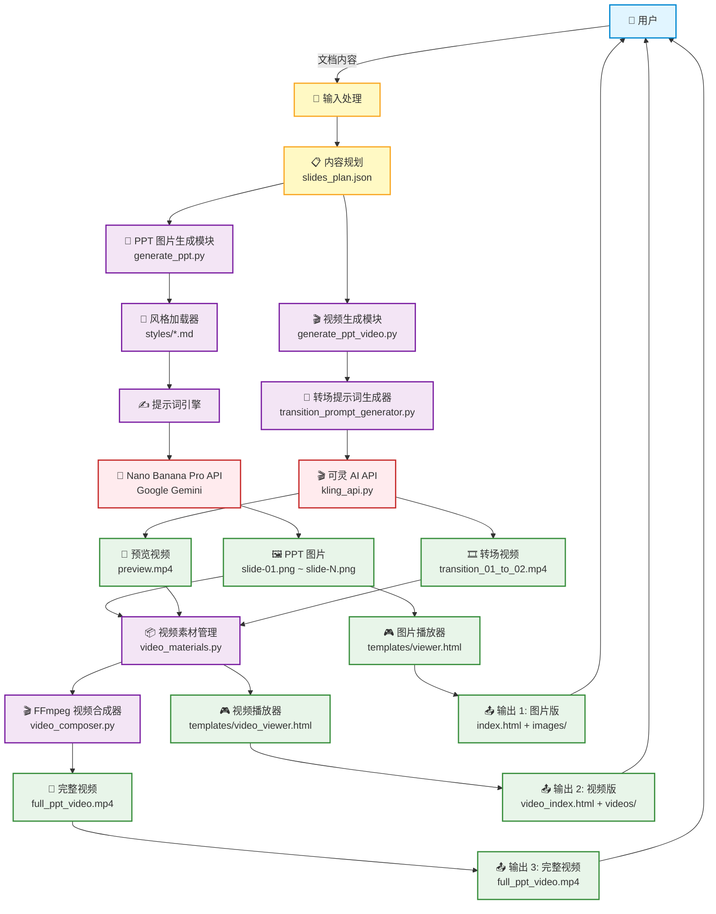

# PPT Generator Pro 架构文档
> 来源路径：`raw/05_代码与项目/NanoBanana-PPT-Skills-main/NanoBanana-PPT-Skills-main/ARCHITECTURE.md`

---

## TL;DR
PPT Generator Pro 是基于 Google Nano Banana Pro(Gemini) 和可灵 AI 实现的AI PPT生成工具，支持生成纯图片版在线PPT、带AI转场的交互式视频PPT、可直接分享的完整合成视频，整体采用模块化设计，分为核心生成、视频合成、播放器输出三层架构，依赖外部AI API完成生成能力。

---

## 系统架构图


---

## 模块架构

### 1️⃣ 核心生成模块
```
┌─────────────────────────────────────────────────────────────┐
│                    PPT Generator Pro                         │
├─────────────────────────────────────────────────────────────┤
│                                                              │
│  ┌────────────────────┐        ┌──────────────────────┐    │
│  │  图片生成模块      │        │   视频生成模块       │    │
│  │  generate_ppt.py   │        │ generate_ppt_video.py│    │
│  └────────────────────┘        └──────────────────────┘    │
│           │                              │                  │
│           ▼                              ▼                  │
│  ┌────────────────────┐        ┌──────────────────────┐    │
│  │  风格系统          │        │  转场提示词生成      │    │
│  │  styles/*.md       │        │ transition_prompt_   │    │
│  │                    │        │   generator.py       │    │
│  └────────────────────┘        └──────────────────────┘    │
│           │                              │                  │
│           ▼                              ▼                  │
│  ┌────────────────────┐        ┌──────────────────────┐    │
│  │ Nano Banana Pro    │        │   可灵 AI API        │    │
│  │ (Gemini 3 Pro)     │        │   kling_api.py       │    │
│  └────────────────────┘        └──────────────────────┘    │
│           │                              │                  │
│           ▼                              ▼                  │
│    🖼️ PPT 图片                    🎬 转场视频               │
│                                                              │
└─────────────────────────────────────────────────────────────┘
```

### 2️⃣ 视频合成模块
```
┌─────────────────────────────────────────────────────────────┐
│               FFmpeg 视频合成流程                            │
├─────────────────────────────────────────────────────────────┤
│                                                              │
│  输入素材:                                                   │
│  ├── 📷 PPT 图片 (slide-01.png ~ slide-N.png)              │
│  ├── 🔄 预览视频 (preview.mp4)                              │
│  └── 🎞️ 转场视频 (transition_XX_to_YY.mp4)                 │
│                                                              │
│  ┌────────────────────────────────────────────────┐         │
│  │     video_materials.py - 素材管理             │         │
│  │  • 收集所有素材                                │         │
│  │  • 验证文件完整性                              │         │
│  │  • 组织素材顺序                                │         │
│  └────────────────────────────────────────────────┘         │
│                       │                                      │
│                       ▼                                      │
│  ┌────────────────────────────────────────────────┐         │
│  │     video_composer.py - FFmpeg 合成器         │         │
│  │                                                │         │
│  │  步骤 1: 图片转静态视频                        │         │
│  │    • 转换为 2 秒静态视频                       │         │
│  │    • 统一分辨率 1920x1080                      │         │
│  │    • 统一帧率 24fps                            │         │
│  │                                                │         │
│  │  步骤 2: 标准化所有视频                        │         │
│  │    • 缩放到统一分辨率                          │         │
│  │    • 添加黑边保持宽高比                        │         │
│  │    • 统一帧率                                  │         │
│  │                                                │         │
│  │  步骤 3: 拼接视频序列                          │         │
│  │    预览 → 转场01-02 → 静态02 → 转场02-03...   │         │
│  │                                                │         │
│  │  步骤 4: H.264 编码输出                        │         │
│  └────────────────────────────────────────────────┘         │
│                       │                                      │
│                       ▼                                      │
│              🎥 full_ppt_video.mp4                          │
│                                                              │
└─────────────────────────────────────────────────────────────┘
```

### 3️⃣ 播放器系统
```
┌─────────────────────────────────────────────────────────────┐
│                   播放器架构                                 │
├─────────────────────────────────────────────────────────────┤
│                                                              │
│  ┌───────────────────────┐    ┌────────────────────────┐   │
│  │
