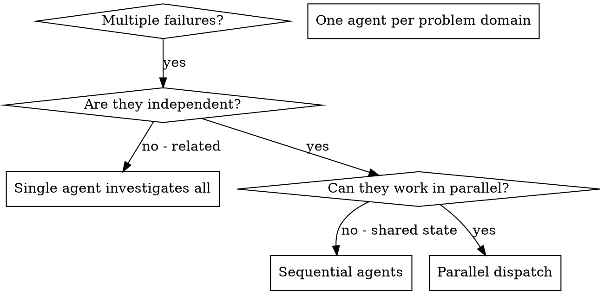

# 并行代理调度（Dispatching Parallel Agents）

## 摘要
并行代理调度是一种面向多独立问题的AI代理任务处理模式，核心思路是为每个独立问题域分配一个专属代理，让各代理并行开展工作，避免顺序处理多个独立任务浪费时间，最终提升多问题排查修复的整体效率。

## 适用场景
### 使用条件
满足以下全部条件时适合使用本方法：
- 存在2个及以上不存在共享状态、无顺序依赖的独立任务
- 典型场景：多个根因不同的测试文件失败、多个子系统独立故障、各问题无需其他问题的上下文即可独立解决、排查过程无共享状态

### 禁止使用条件
存在以下任一情况时不适合使用本方法：
- 故障之间存在关联（修复一个可能解决其他问题）
- 需要理解完整系统状态才能排查
- 属于探索式调试，尚未明确问题范围
- 任务之间存在共享状态，代理工作会相互干扰

## 核心模式步骤
1. **识别独立域**：按故障所属模块对问题分组，确保每个分组的问题相互独立，修改一个域不会影响其他域。
2. **创建聚焦的代理任务**：为每个代理分配明确的特定范围、清晰目标、约束条件和预期输出要求。
3. **并行调度**：同时启动所有代理任务并发执行。
4. **审核与集成**：读取各代理的总结、验证修改无冲突、运行完整测试集、合并所有修改。

## 关键要点
- 核心原则：为每个独立问题域调度一个代理，让它们并发工作。
- 优质代理提示词的特征：聚焦单一问题域、自带完整上下文、明确输出要求。
- 常见错误：任务范围过宽、未提供必要上下文、未设置约束、输出要求模糊。
- 核心收益：实现任务并行化、每个代理范围聚焦减少上下文负担、代理之间互不干扰、整体处理速度大幅提升，多个问题可在单个问题的处理时间内完成。
- 完成后的验证步骤：审核每个修改总结、检查代码冲突、运行完整测试、抽样检查系统性错误。

## 实际案例
2025年10月3日的一次调试会话中，大重构后3个文件共出现6个测试失败，按功能分为三个独立域后调度3个代理并行修复，各代理分别解决了超时问题、事件结构bug、异步执行等待问题，所有修改无冲突，最终全部测试通过，相比顺序处理节省了大量时间。

## 决策流程

