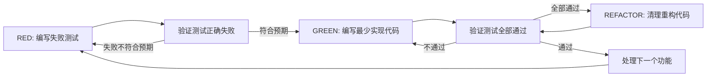

# Test-Driven Development (TDD)

## 摘要
测试驱动开发（Test-Driven Development，简称TDD）是一种软件开发实践，核心要求是在编写功能实现代码之前，先编写对应的失败测试，再编写最少的实现代码让测试通过，最后重构整理代码。本文档明确了TDD的核心原则、流程、适用场景、规范要求，并反驳了对TDD常见的误解与借口。

## 关键要点
- 核心铁律：必须先有失败的测试，才能编写生产代码，提前写好的代码需要直接删除，从零开始实现。
- 标准工作流程：红-绿-重构（Red-Green-Refactor）循环，依次为：编写失败测试（红）→ 验证测试符合预期失败 → 编写最少代码通过测试（绿）→ 验证测试全部通过 → 清理重构代码（不新增行为）→ 重复循环处理下一个功能。
- 适用场景：几乎所有新功能开发、BUG修复、重构、行为变更都需要使用TDD，仅一次性原型、生成代码、配置文件等特殊场景可例外（需确认）。
- 好测试的标准：单一行为、命名清晰、使用真实代码、展示意图，避免过度复杂或模糊。
- TDD的实践价值：提前发现BUG、防止回归、作为代码行为文档、支持安全重构，比事后写测试更可靠。

## 核心原则
- 如果没有亲眼看到测试失败，就无法确认测试是否验证了正确的逻辑。
- 违反规则字面要求，就是违反规则的核心精神。

## 适用场景
### 需要使用TDD的场景
- 新功能开发
- BUG修复
- 代码重构
- 行为变更

### 例外场景（需征得协作方同意）
- 一次性原型代码
- 生成代码
- 配置文件

## 红-绿-重构工作流程

### RED阶段：编写失败测试
要求：仅测试一个行为、命名清晰、优先使用真实代码（除非必须用mock）。

### 验证RED阶段（强制要求，不可跳过）
必须运行测试确认：测试正常失败（不是语法错误）、失败信息符合预期、失败原因确实是功能未实现。如果测试直接通过或出现错误，需要修改测试后重新运行。

### GREEN阶段：编写最少实现代码
仅编写足够让测试通过的最简单代码，禁止提前新增功能、过度工程化、修改其他代码。

### 验证GREEN阶段（强制要求）
必须运行测试确认：当前测试通过、所有原有测试仍然通过、输出无错误警告。测试不通过需要修改代码。

### REFACTOR阶段：清理重构
仅在测试全通过后进行重构：消除重复、改善命名、提取辅助工具，过程中保持测试全绿，禁止新增功能行为。

## 好测试的质量标准
| 质量维度 | 合格示例 | 不合格示例 |
|---------|---------|-----------|
| 极简 | 每个测试只测一件事，测试名包含"and"就拆分 | `test('validates email and domain and whitespace')` |
| 清晰 | 命名直接描述要测试的行为 | `test('test1')` |
| 体现意图 | 展示代码期望的调用方式 | 模糊代码的预期用途 |

## 常见反驳与回应
| 常见说法 | 现实回应 |
|--------|---------|
| 我写完代码再补测试就行 | 写完代码再写的测试会直接通过，无法证明测试能有效验证逻辑，容易漏测需求和边界 |
| 我已经手动测试过所有场景了 | 手动测试是临时的，没有测试记录、代码修改后无法重复运行、容易遗漏场景 |
| 删我写了几小时的代码太浪费了 | 属于沉没成本谬误，保留无法信任的代码才是技术债，TDD重构能带来更高的可靠性 |
| TDD太教条，灵活调整才是务实 | TDD本身就是务实的：提前找BUG、防止回归、文档化行为、支持重构，所谓的捷径最后只会导致生产环境调试，整体速度更慢 |
| 事后写测试也能达到同样目标 | 事后测试受已有实现的偏见，只会测试已经写好的内容，不会主动发现需求边界，只能得到覆盖率，得不到测试有效性的证明 |

## 危险信号（需要停止并重新开始）
出现以下任意情况都需要删除已有代码，重新用TDD开始：
- 先写了代码再补测试
- 测试写完直接通过
- 无法解释测试失败的原因
- 找借口"就这一次跳过TDD"
- 认为保留代码当参考、之后再改测试没问题
- 认为已经花了很多时间，删除是浪费

## 验证检查清单
完成工作前需要确认所有项都满足，否则需要重新开始：
- [ ] 每个新增函数/方法都有对应测试
- [ ] 每个测试都在实现前看到过失败
- [ ] 每个测试都因为预期原因（功能缺失，不是语法错误）失败过
- [ ] 只编写了让测试通过的最少代码
- [ ] 所有测试都通过
- [ ] 测试输出无错误和警告
- [ ] 测试使用真实代码（仅必要时用mock）
- [ ] 覆盖了边界场景和错误场景

## 困境处理方案
| 问题 | 解决方案 |
|---------|----------|
| 不知道怎么写测试 | 先写出你期望的API，先写断言，再求助协作方 |
| 测试太复杂 | 说明设计太复杂，简化接口 |
| 必须到处用mock | 说明代码耦合度太高，使用依赖注入解耦 |
| 测试配置太繁琐 | 提取辅助工具，还是复杂就简化设计 |

## 最终规则
生产代码必须满足：有对应测试存在，且测试先于代码编写并失败过，不满足就不是合格的TDD。未经协作方同意，没有例外。
