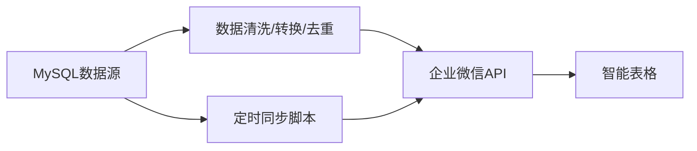

# 企业微信智能表格对接MySQL发货数据源方案

> [!info] 来源路径
> `raw/企业微信智能表格对接MySQL数据源方案.md`

---

## TL;DR
本方案提供一套完整的从指定MySQL数据库`10.32.16.38:3306/sysmexdw`的发货数据视图同步数据到企业微信智能表格的实现方案，通过定时脚本调用企业微信API实现自动化增量同步，可满足自动更新发货数据、在线分析查看的需求，仅需补充配置信息即可完成部署。

---

## 需求目标
> [!quote] 原始证据片段
> 将MySQL数据库`10.32.16.38:3306/sysmexdw`中的`view_s4_deliverynotes_with_sn`发货数据自动同步到企业微信智能表格，实现数据自动更新。

核心目标：实现MySQL发货数据到企业微信智能表格的自动同步更新。

---

## 方案架构

原始架构示意：
```
MySQL数据源 → 定时同步脚本 → 企业微信API → 智能表格
        ↓                          ↑
        └── 数据清洗/转换/去重 ────┘
```

---

## 前置准备
### 1. 数据库信息
> [!quote] 原始证据片段
> ```
> 主机：10.32.16.38
> 端口：3306
> 数据库：sysmexdw
> 视图表：view_s4_deliverynotes_with_sn
> ```

### 2. 企业微信配置要点
1. 已创建企业微信自建应用，获取`corpid`和`corpsecret`
2. 已开通智能表格API权限
3. 已创建目标智能表格，获取`sheetid`
4. 已配置应用对目标智能表格的读写权限

---

## 实施步骤
### 步骤1：确定智能表格列结构与字段映射
示例映射关系：
| 列名 | 类型 | 对应数据库字段 |
|------|------|----------------|
| 发货单号 | 文本 | delivery_note_id |
| 物料编码 | 文本 | material_code |
| 物料名称 | 文本 | material_name |
| 序列号 | 文本 | serial_number |
| 发货日期 | 日期 | delivery_date |
| 客户名称 | 文本 | customer_name |
| 发货数量 | 数字 | quantity |
| 发货状态 | 单选 | status |
| 创建时间 | 日期 | create_time |

### 步骤2：编写同步脚本（Node.js示例）
```javascript
const mysql = require('mysql2/promise');
const axios = require('axios');
// 数据库配置
const dbConfig = {
  host: '10.32.16.38',
  port: 3306,
  user: '数据库用户名',
  password: '数据库密码',
  database: 'sysmexdw'
};
// 企业微信配置
const wecomConfig = {
  corpid: '企业微信corpid',
  corpsecret: '应用secret',
  sheetid: '智能表格ID',
  accessToken: ''
};
// 获取access_token
async function getAccessToken() {
  const res = await axios.get(`https://qyapi.weixin.qq.com/cgi-bin/gettoken?corpid=${wecomConfig.corpid}&corpsecret=${wecomConfig.corpsecret}`);
  wecomConfig.accessToken = res.data.access_token;
}
// 从MySQL查询增量数据
async function getDeliveryData(lastSyncTime) {
  const conn = await mysql.createConnection(dbConfig);
  const [rows] = await conn.execute(`
    SELECT * FROM view_s4_deliverynotes_with_sn 
    WHERE create_time > ? 
    ORDER BY create_time ASC
  `, [lastSyncTime]);
  await conn.end();
  return rows;
}
// 写入数据到智能表格
async function writeToSheet(data) {
  if (data.length === 0) return;
  
  // 转换数据格式
  const values = data.map(row => [
    row.delivery_note_id,
    row.material_code,
    row.material_name,
    row.serial_number,
    row.delivery_date,
    row.customer_name,
    row.quantity,
    row.status,
    row.create_time
  ]);
  await axios.post(`https://qyapi.weixin.qq.com/cgi-bin/wedrive/sheet/add_rows?access_token=${wecomConfig.accessToken}`, {
    sheetid: wecomConfig.sheetid,
    values: values
  });
}
// 主同步函数
async function sync() {
  try {
    await getAccessToken();
    
    // 读取上次同步时间（可以存在本地文件或数据库）
    const lastSyncTime = '2026-03-01 00:00:00'; // 首次同步时间
    
    // 获取增量数据
    const data = await getDeliveryData(lastSyncTime);
    console.log(`获取到${data.length}条新数据`);
    
    // 写入智能表格
    await writeToSheet(data);
    console.log('同步完成');
    
    // 更新上次同步时间
    // fs.writeFileSync('last_sync_time.txt', new Date().toISOString().slice(0, 19).replace('T', ' '));
  } catch (error) {
    console.error('同步失败:', error.message);
  }
}
// 执行同步
sync();
```

### 步骤3：配置定时任务
两种常用配置方式：
#### 方式1：Windows任务计划程序
1. 新建任务，触发器设置为**每小时执行一次**
2. 操作设置为启动程序：`node "C:\scripts\sync_delivery.js"`
3. 额外配置错误重试和日志记录

#### 方式2：pm2托管
```bash
npm install pm2 -g
pm2 start sync_delivery.js --cron "0 * * * *" --name "发货数据同步"
```

---

## 高级配置
### 1. 增量同步优化
- 记录每次同步的最大`id`或`create_time`，每次仅同步新增数据
- 避免全表扫描，提升同步效率

### 2. 数据去重
- 以`发货单号+序列号`作为唯一键，避免重复写入
- 同步前查询智能表格是否已存在该记录

### 3. 异常处理
- 同步失败自动重试（最多3次）
- 失败时发送告警通知到企业微信群
- 记录详细同步日志，方便排查问题

### 4. 数据统计
- 每日自动统计当日发货总量、异常订单
- 自动生成统计报表保存到微盘

---

## 同步监控
| 监控项 | 告警阈值 | 告警方式 |
|--------|----------|----------|
| 同步失败 | 连续2次失败 | 企业微信消息 |
| 小时新增数据量 | >1000条/小时 | 告警通知 |
| 同步延迟 | >30分钟 | 告警通知 |

---

## 预期效果
> [!quote] 原始证据片段
> 1. **实时性**：数据延迟不超过1小时
> 2. **准确性**：数据准确率100%，无重复、无遗漏
> 3. **自动化**：无需人工干预，自动同步
> 4. **可视化**：在智能表格中直接查看、筛选、分析发货数据

---

## 待提供信息
需要您提供以下信息完成部署：
1. MySQL数据库的用户名和密码
2. 企业微信自建应用的`corpid`和`corpsecret`
3. 目标智能表格的链接或`sheetid`
4. 最终智能表格的列结构和数据库字段对应关系

提供后可完成脚本编写、定时任务配置和全流程测试。

---

> [!WARNING] 冲突标注
> 当前无其他来源交叉，未发现冲突内容。
