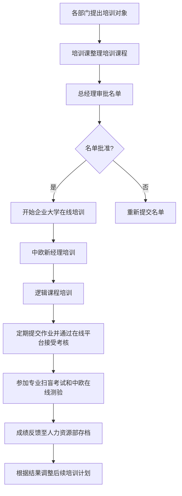

---
title: 新晋管理层培训流程文档
---

### 新晋管理层培训流程文档

## 1. 流程概述
本流程旨在对新入职的管理层员工、已入职但未曾参加过培训以及新晋升的管理人员进行系统化的培训，确保他们能够快速适应新的岗位要求并具备必要的管理技能。培训内容包括在线企业大学课程、中欧新经理培训及逻辑课程培训。

## 2. 目标
- 提升新晋管理层人员的专业知识和管理能力。
- 提高员工对企业文化的理解和认同感。
- 规范并优化原有的带教和训练营模式，使之更加高效。
- 通过专业扫盲考试和中欧在线测试评估培训效果。

## 3. 适用范围
适用于：
- 新入职的管理层员工
- 已入职但未参与过相关培训的职员
- 刚晋升或以代理身份担任经理职位的人员

## 4. 流程负责人
- **总调度**：人力资源部
- **各部分执行者**：
 - 名单审批：总经理
 - E-learning平台维护：IT部门
 - 中欧商学院对接联络员：指定的人力资源专员
 - 逻辑课安排与讲师邀请：培训与发展团队

## 5. 定义与术语
- **E-Learning企业大学**：公司内部提供的在线学习平台。
- **中欧新经理培训**：由中欧国际工商学院提供的专门针对新晋管理者的职业发展课程。
- **逻辑课程**：强化思维逻辑能力和问题解决技巧的相关讲座或研讨会。

## 6. 相关流程标准（流程接口）
- 需要与人力资源管理系统对接，以便追踪参训人员的基本信息及其完成情况。
- 与财务部门合作处理培训费用结算事宜。
- 每次培训结束后，需向总经理报告参训名单及成绩汇总。

## 7. 组织职责
- 所有参训人员应按时完成各项规定的学习任务。
- 各业务部门负责提名符合条件的候选人参加培训。
- 总经理负责最终审查并批准参训名单。
- 人力资源部门负责整个培训周期内的协调工作，包括但不限于课程设置、进度跟踪等。

## 8. 系统及操作权限
- 只有经过认证的账号才能访问特定的企业大学课程资料。
- 在线测试系统需要注册个人账号后方可进入答题界面。

## 9. 业务流程图

## 10. 流程说明
1. **依据岗位需求，各部门提出拟培养对象**：各部门根据实际需求，提名符合条件的候选人。
2. **人力资源将推荐名单提交给总经理审批**：人力资源部收集各部门提名的名单，并将其提交给总经理进行审批。
3. **获得批准后，被推荐人首先开始在企业大学平台上观看视频教程**：名单得到总经理批准后，被推荐人开始在企业大学平台上进行初步学习。
4. **完成初步学习后，参与者继续参加中欧新经理培训项目**：完成企业大学平台上的视频教程后，参与者继续参加中欧新经理培训项目。
5. **最后阶段是逻辑思维能力提升课程**：在完成中欧新经理培训后，参与者继续参加逻辑思维能力提升课程。
6. **培训期间，学员需定期提交作业并通过在线平台接受考核**：在整个培训过程中，学员需定期提交作业并通过在线平台接受考核。
7. **培训结束时，所有参训人员需参加最终的专业扫盲考试和中欧在线测验**：培训结束后，所有参训人员需参加专业扫盲考试和中欧在线测验。
8. **成绩反馈至人力资源部存档，并根据结果调整后续培训计划**：考试成绩反馈至人力资源部存档，并根据结果调整后续培训计划。

这个流程图和详细的流程说明应该能帮助你更好地理解和实施新晋管理层培训流程。如果有任何其他需求或需要进一步细化的地方，请告诉我！
